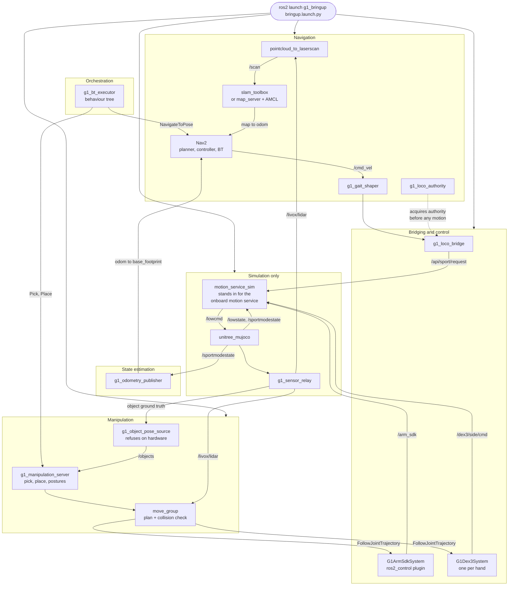

# Grove-G1

An autonomy stack for the [Unitree G1](https://www.unitree.com/g1) humanoid, built on ROS 2 Humble
and developed simulation-first against `unitree_mujoco`.

The simulator speaks the same DDS topics as the real robot, so the bridge layer, the navigation
stack and the control-authority logic all carry over to hardware without code changes. Moving to
the physical G1 is a domain-ID and interface change, not a rewrite.

## What it does today

The robot maps a facility with SLAM Toolbox, localizes against the saved map, and drives itself to
a goal pose under Nav2. Arm trajectories run through `ros2_control` onto Unitree's weight-blended
`rt/arm_sdk` interface, so the vendor's onboard controller keeps the legs balanced throughout.

MoveIt plans for either arm or both together, collision-checked against a live octomap built from
the LiDAR, and each Dex3-1 hand is its own planning group with `open` and `closed` postures.

On top of that, pick and place are served as actions, and a BehaviorTree.CPP behaviour tree
sequences them with navigation into a mission that runs end to end in the facility world: drive
to a workbench, walk the last half metre under closed-loop control, pick a cube up, carry it
across the building, and put it down on a bench. Object poses come from a source that refuses to
run on hardware, because there is no object-detection pipeline yet; a real one replaces it
without the skills changing.

Nav2 parks within 0.5 m of a goal and the arm's usable window is about 0.2 m wide, so a base
approach skill closes the gap against the measured object rather than against the map. The tree
is editable in Groot2 against a generated node palette.

Learned manipulation for unstructured scenes is the next milestone and is not built yet.

## Nav2 Demo


## MoveIt Demo


## Architecture



On hardware the whole "simulation only" group disappears, and the vendor's onboard motion service
answers `/api/sport/*` and `/arm_sdk` instead. Nothing above that line changes.

Two rules shape most of the design, and both apply in simulation so the habits transfer:

- Only one publisher ever commands a low-level channel. Control-mode ownership is explicit.
- Arm and locomotion motion goes through `rt/arm_sdk`, which blends against the onboard balance
  controller. Commanding raw `/lowcmd` means owning balance yourself.

## Packages

| Package | What it does |
|---|---|
| [`g1_bringup`](workspace/src/g1_bringup) | The entry point. Launch files, scenes and config that compose everything below. |
| [`g1_description`](workspace/src/g1_description) | Vendored G1 URDF plus the `ros2_control` xacro wrapper. |
| [`g1_hand_interface`](workspace/src/g1_hand_interface) | `ros2_control` plugin for one Dex3-1 hand, over the hand's own DDS topics. |
| [`g1_hardware_interface`](workspace/src/g1_hardware_interface) | `ros2_control` plugin bridging the 14 arm joints onto `rt/arm_sdk`. |
| [`g1_locomotion`](workspace/src/g1_locomotion) | LocoClient bridge, gait shaper and the locomotion-authority bracket. |
| [`g1_motion_service_sim`](workspace/src/g1_motion_service_sim) | Simulation stand-in for the robot's onboard motion service. |
| [`g1_manipulation`](workspace/src/g1_manipulation) | Pick and place as actions, and the object-pose source behind them. |
| [`g1_moveit_config`](workspace/src/g1_moveit_config) | MoveIt config: arm and hand planning groups, kinematics, the octomap. |
| [`g1_msgs`](workspace/src/g1_msgs) | The `SetLocoMode` action and `LocoStatus` message. |
| [`g1_navigation`](workspace/src/g1_navigation) | SLAM Toolbox mapping, AMCL localization and Nav2. |
| [`g1_orchestration`](workspace/src/g1_orchestration) | The behaviour tree that sequences navigation and manipulation into a mission. |
| [`g1_sensor_relay`](workspace/src/g1_sensor_relay) | Publishes LiDAR and depth frames sampled inside the simulator. |
| [`g1_sim`](workspace/src/g1_sim) | A separate planar perception sandbox. Not the main track. |
| [`g1_state_estimation`](workspace/src/g1_state_estimation) | Publishes `odom` to `base_footprint` and the TF chain Nav2 needs. |

## Quick start

Everything runs inside the dev container. The host is Ubuntu 24.04; the container provides the
Ubuntu 22.04 and ROS 2 Humble combination the Unitree SDK needs.

```bash
cp .env.example .env
./scripts/manage.sh start
./scripts/manage.sh exec
```

Inside the container:

```bash
cd /root/workspace
colcon build --symlink-install --cmake-args -DCMAKE_BUILD_TYPE=RelWithDebInfo -DCMAKE_EXPORT_COMPILE_COMMANDS=ON
source install/setup.bash
```

Then bring up the robot. One command covers every mode:

```bash
# Simulator only
ros2 launch g1_bringup bringup.launch.py

# Build a map, with RViz
ros2 launch g1_bringup bringup.launch.py mode:=mapping rviz:=true

# Localize against the committed map and navigate
ros2 launch g1_bringup bringup.launch.py mode:=localization nav:=true rviz:=true

# Plan for the arms and hands, with the LiDAR octomap in the planning scene
ros2 launch g1_bringup bringup.launch.py moveit:=true sensors:=true rviz:=true

# Pick and place skills, on the small test world where the object is already within reach
ros2 launch g1_bringup bringup.launch.py \
  moveit:=true manipulation:=true pin_pelvis:=true world:=manipulation \
  activate_arm:=true activate_arm_delay_s:=40.0

# Everything at once: localized, navigating, planning, skills, arms acquired, RViz up
ros2 launch g1_bringup bringup.launch.py \
  mode:=localization nav:=true moveit:=true manipulation:=true rviz:=true \
  activate_arm:=true activate_arm_delay_s:=40.0 headless:=false
```

Run a mission. The tree drives navigation and manipulation; nothing else needs starting, and
Groot2 on the host can watch it tick at `localhost:1667`:

```bash
ros2 launch g1_orchestration mission.launch.py tree:=pick_and_place_in_place.xml
```

The full navigate-pick-carry-place mission needs the facility world and a map:

```bash
ros2 launch g1_bringup bringup.launch.py \
  mode:=localization nav:=true moveit:=true manipulation:=true world:=navigation \
  rviz:=true activate_arm:=true activate_arm_delay_s:=55.0
```

```bash
ros2 launch g1_orchestration mission.launch.py tree:=pick_and_place.xml
```

With `rviz:=true` and both MoveIt and Nav2 running, this opens two RViz windows: the MoveIt one
for the arm and a second on the navigation config for the map and costmaps.

Send it somewhere:

```bash
ros2 action send_goal /navigate_to_pose nav2_msgs/action/NavigateToPose \
  "{pose: {header: {frame_id: map}, pose: {position: {x: 2.5, y: -2.5}, orientation: {w: 1.0}}}}"
```

Moving the arms or hands needs an explicit acquire step first, and a matching release. It takes
the arm and both hands together; a hand that is absent or unpowered logs and leaves the arm
usable.

```bash
ros2 launch g1_bringup activate_arm.launch.py
# plan from RViz's MotionPlanning panel, or send FollowJointTrajectory goals to
# arm_trajectory_controller, left_hand_controller or right_hand_controller
ros2 launch g1_bringup deactivate_arm.launch.py
```

## Development environment

Docker Compose is the runtime source of truth; `.devcontainer/devcontainer.json` is the VS Code
layer on top. In VS Code, use `Dev Containers: Reopen in Container`.

| Setting | Value |
|---|---|
| ROS distro | Humble, pinned. Unitree tests only Foxy and Humble. |
| Middleware | CycloneDDS, pinned to loopback |
| `ROS_DOMAIN_ID` | 1 |
| C++ standard | C++20 on GCC 11.4 |
| Workspace | `/root/workspace` |
| Shared data | `/root/data` |

The container runs `privileged` with `network_mode: host` and a `/dev` bind mount. That is
deliberate for local robotics development: DDS discovery between the bare-DDS simulator and the
ROS graph happens over loopback, and device access has to work.

Lifecycle:

```bash
./scripts/manage.sh start | stop | restart | recreate | logs | exec
```

Use `exec-as-me` instead of `exec` for anything that rewrites source files in place, such as
`clang-tidy --fix` or `clang-format -i`. It runs as your host user, so the files do not come back
owned by root.

Project dependencies belong in `.devcontainer/Dockerfile`, followed by
`./scripts/manage.sh recreate`. Do not install into a running container and forget about it.

## Tests

```bash
colcon test --packages-select g1_description g1_locomotion g1_navigation
colcon test-result --all
```

Leftover nodes from a previous run are the most productive source of phantom failures here:
several copies of the stack on one DDS graph look like bugs everywhere except where they are.
Clear them first, and note it verifies the graph rather than the process table:

```bash
./scripts/clean-stack.sh
```

Suites that launch a simulator are timing-sensitive and serialize on a shared ctest resource lock.
Run them **one package at a time**, and check nothing is left over from a previous run
(`pgrep -x unitree_mujoco`) before trusting a result: a stray simulator is the usual explanation
for a batch of failures that all pass on a clean rerun. Each package README says which of its
tests need a simulator.


## Repository layout

```
.devcontainer/     derived dev image
workspace/src/     ROS 2 packages
workspace/patches/ patches applied to vendored sources at image build
workspace/vendor/  our source compiled into the vendored simulator
scripts/           container lifecycle, and stack teardown
```
