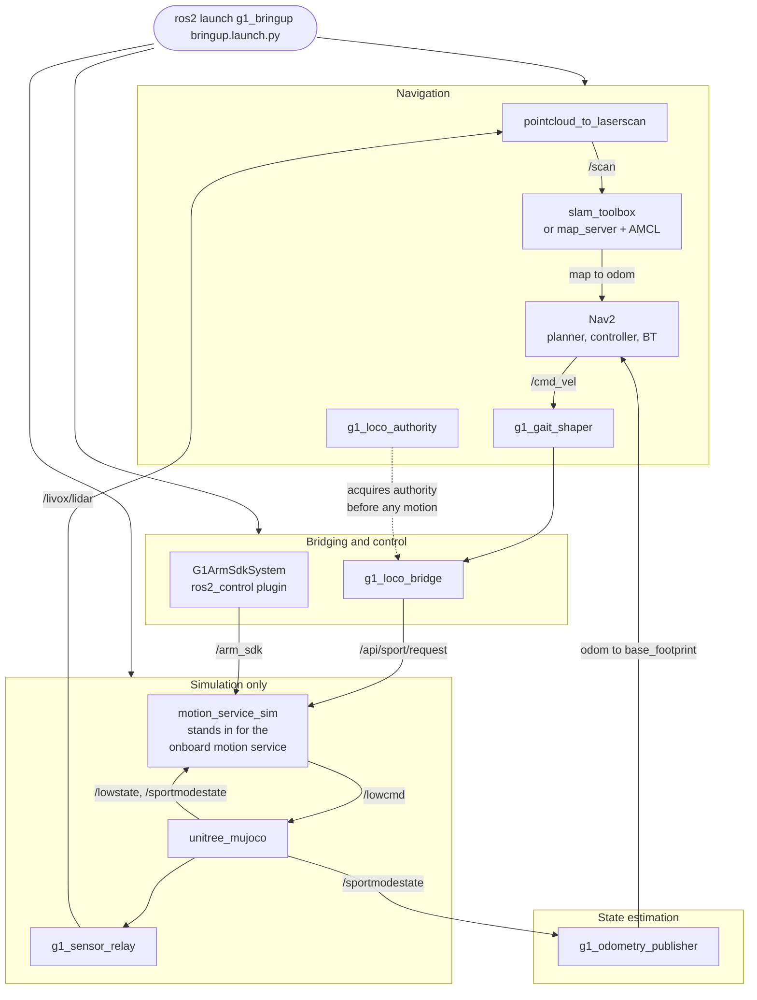

# Grove-G1

An autonomy stack for the [Unitree G1](https://www.unitree.com/g1) humanoid, built on ROS 2 Humble
and developed simulation-first against `unitree_mujoco`.

The simulator speaks the same DDS topics as the real robot, so the bridge layer, the navigation
stack and the control-authority logic all carry over to hardware without code changes. Moving to
the physical G1 is a domain-ID and interface change, not a rewrite.

## What it does today

The robot maps a facility with SLAM Toolbox, localizes against the saved map, and drives itself to
a goal pose under Nav2. Arm trajectories run through `ros2_control` onto Unitree's weight-blended
`rt/arm_sdk` interface, so the vendor's onboard controller keeps the legs balanced throughout.

Manipulation is the next milestone and is not built yet.

## Nav2 Demo


## Architecture



On hardware the whole "simulation only" group disappears, and the vendor's onboard motion service
answers `/api/sport/*` and `/arm_sdk` instead. Nothing above that line changes.

Two rules shape most of the design, and both apply in simulation so the habits transfer:

- Only one publisher ever commands a low-level channel. Control-mode ownership is explicit.
- Arm and locomotion motion goes through `rt/arm_sdk`, which blends against the onboard balance
  controller. Commanding raw `/lowcmd` means owning balance yourself.

## Packages

| Package | What it does |
|---|---|
| [`g1_bringup`](workspace/src/g1_bringup) | The entry point. Launch files, scenes and config that compose everything below. |
| [`g1_description`](workspace/src/g1_description) | Vendored G1 URDF plus the `ros2_control` xacro wrapper. |
| [`g1_hardware_interface`](workspace/src/g1_hardware_interface) | `ros2_control` plugin bridging the 14 arm joints onto `rt/arm_sdk`. |
| [`g1_locomotion`](workspace/src/g1_locomotion) | LocoClient bridge, gait shaper and the locomotion-authority bracket. |
| [`g1_motion_service_sim`](workspace/src/g1_motion_service_sim) | Simulation stand-in for the robot's onboard motion service. |
| [`g1_msgs`](workspace/src/g1_msgs) | The `SetLocoMode` action and `LocoStatus` message. |
| [`g1_navigation`](workspace/src/g1_navigation) | SLAM Toolbox mapping, AMCL localization and Nav2. |
| [`g1_sensor_relay`](workspace/src/g1_sensor_relay) | Publishes LiDAR and depth frames sampled inside the simulator. |
| [`g1_sim`](workspace/src/g1_sim) | A separate planar perception sandbox. Not the main track. |
| [`g1_state_estimation`](workspace/src/g1_state_estimation) | Publishes `odom` to `base_footprint` and the TF chain Nav2 needs. |

## Quick start

Everything runs inside the dev container. The host is Ubuntu 24.04; the container provides the
Ubuntu 22.04 and ROS 2 Humble combination the Unitree SDK needs.

```bash
cp .env.example .env
./scripts/manage.sh start
./scripts/manage.sh exec
```

Inside the container:

```bash
cd /root/workspace
colcon build --symlink-install --cmake-args -DCMAKE_BUILD_TYPE=RelWithDebInfo -DCMAKE_EXPORT_COMPILE_COMMANDS=ON
source install/setup.bash
```

Then bring up the robot. One command covers every mode:

```bash
# Simulator only
ros2 launch g1_bringup bringup.launch.py

# Build a map, with RViz
ros2 launch g1_bringup bringup.launch.py mode:=mapping rviz:=true

# Localize against the committed map and navigate
ros2 launch g1_bringup bringup.launch.py mode:=localization nav:=true rviz:=true
```

Send it somewhere:

```bash
ros2 action send_goal /navigate_to_pose nav2_msgs/action/NavigateToPose \
  "{pose: {header: {frame_id: map}, pose: {position: {x: 2.5, y: -2.5}, orientation: {w: 1.0}}}}"
```

## Development environment

Docker Compose is the runtime source of truth; `.devcontainer/devcontainer.json` is the VS Code
layer on top. In VS Code, use `Dev Containers: Reopen in Container`.

| Setting | Value |
|---|---|
| ROS distro | Humble, pinned. Unitree tests only Foxy and Humble. |
| Middleware | CycloneDDS, pinned to loopback |
| `ROS_DOMAIN_ID` | 1 |
| C++ standard | C++20 on GCC 11.4 |
| Workspace | `/root/workspace` |
| Shared data | `/root/data` |

The container runs `privileged` with `network_mode: host` and a `/dev` bind mount. That is
deliberate for local robotics development: DDS discovery between the bare-DDS simulator and the
ROS graph happens over loopback, and device access has to work.

Lifecycle:

```bash
./scripts/manage.sh start | stop | restart | recreate | logs | exec
```

Use `exec-as-me` instead of `exec` for anything that rewrites source files in place, such as
`clang-tidy --fix` or `clang-format -i`. It runs as your host user, so the files do not come back
owned by root.

Project dependencies belong in `.devcontainer/Dockerfile`, followed by
`./scripts/manage.sh recreate`. Do not install into a running container and forget about it.

## Tests

```bash
colcon test --packages-select g1_description g1_locomotion g1_navigation
colcon test-result --all
```

Suites that launch a simulator are timing-sensitive and serialize on a shared ctest resource lock.
On a loaded machine the walking suites can fail without anything being wrong, so re-run a failing
suite alone before treating it as a regression. Each package README says which of its tests need a
simulator.

## Repository layout

```
.devcontainer/     derived dev image
workspace/src/     ROS 2 packages
workspace/patches/ patches applied to vendored sources at image build
workspace/vendor/  our source compiled into the vendored simulator
scripts/           container lifecycle
```
