# Grove-G1

[](https://github.com/Adyansh04/grove-g1/actions/workflows/ci.yml)
[](LICENSE)

> The earlier Humble line, where Unitree's own internal leg policy walks the robot and this stack
> only does arm manipulation on top, is kept on
> [`humble-unitree`](https://github.com/Adyansh04/grove-g1/tree/humble-unitree).

An autonomy stack for the [Unitree G1](https://www.unitree.com/g1) humanoid, built on ROS 2 Jazzy
and developed simulation-first against `unitree_mujoco`.

The simulator speaks the same DDS channels as the real robot, so the hardware interface, the
navigation stack and the control-authority logic carry over to hardware without code changes.
Moving to the physical G1 is a domain-ID and interface change, not a rewrite.

## What it does today

The robot maps a facility with SLAM Toolbox, localizes against the saved map, and drives itself to
a goal pose under Nav2. Balance is ours: a learned locomotion policy runs at 50 Hz inside a
`ros2_control` controller and drives the legs and waist over `rt/lowcmd`, with no onboard
controller underneath. One hardware component owns all 29 body motors, and arm trajectories are an
ordinary `JointTrajectoryController` claiming the 14 arm joints on it, so MoveIt executes while the
policy keeps the robot up.

MoveIt plans for either arm or both together, collision-checked against a live octomap built from
the LiDAR, and each Dex3-1 hand is its own planning group with named postures.

Pick and place are served as actions, and a BehaviorTree.CPP tree sequences them with navigation
into a mission that runs end to end in the facility world: drive to a workbench, walk the last
half metre under closed-loop control, pick up a ball, carry it across the building, and drop it
into a box on another bench. Object poses come from the simulator by default. With
`perception:=true` they are measured from the head camera instead: objects are named in plain
text, segmented, and lifted into 3D with the aligned depth frame, and the skills take them without
changing.

Nav2 parks within 0.5 m of a goal and the arm's reach window is about 0.11 m wide, so a base
approach skill closes the gap against the measured object rather than against the map. The tree
is editable in Groot2 against a generated node palette.

Learned manipulation is wired up on top of that: a vision-language-action policy proposes joint
targets and every chunk is checked against the planning scene before it runs. The pipeline works,
but the pretrained policy does not grasp: that needs fine-tuning on demonstrations from this robot,
and there is no demonstration recorder yet.

## Nav2 demo


## MoveIt demo


## Pick and place demo


## Architecture


On hardware the simulation card becomes the physical G1 and the LiDAR front end becomes
`livox_ros_driver2`. Everything above the DDS rail is unchanged.

Two rules shape the design, and both apply in simulation so the habits transfer:

- Only one publisher ever commands `rt/lowcmd`. Control-mode ownership is explicit, and the
  hardware component leaves any joint no controller claims unpowered, so "who owns this joint" is
  also "does this joint hold".
- Commanding `rt/lowcmd` means owning balance. There is no onboard controller left underneath to
  catch a mistake.

## Packages

| Package | What it does |
|---|---|
| [`g1_bringup`](workspace/src/g1_bringup) | The entry point. Launch files, scenes and config that compose everything below. |
| [`g1_description`](workspace/src/g1_description) | Vendored G1 URDF plus the `ros2_control` xacro wrapper. |
| [`g1_hand_interface`](workspace/src/g1_hand_interface) | `ros2_control` plugin for one Dex3-1 hand, over the hand's own SDK channels. |
| [`g1_controllers`](workspace/src/g1_controllers) | The locomotion policy, its chained safety controller and the freeze controllers. |
| [`g1_hardware_interface`](workspace/src/g1_hardware_interface) | `ros2_control` plugin owning all 29 body motors over `rt/lowcmd`. |
| [`g1_locomotion`](workspace/src/g1_locomotion) | Walks the base into arm's reach of a measured object, and backs it out again. |
| [`g1_manipulation`](workspace/src/g1_manipulation) | Pick and place as actions, and the object-pose source behind them. |
| [`g1_moveit_config`](workspace/src/g1_moveit_config) | MoveIt config: arm and hand planning groups, kinematics, the octomap. |
| [`g1_msgs`](workspace/src/g1_msgs) | The stack's own interfaces: the skill actions, the policy and perception services, instance masks. |
| [`g1_navigation`](workspace/src/g1_navigation) | SLAM Toolbox mapping, AMCL localization and Nav2. |
| [`g1_orchestration`](workspace/src/g1_orchestration) | The behaviour tree that sequences navigation and manipulation into a mission. |
| [`g1_perception`](workspace/src/g1_perception) | Object poses from the camera for objects named in text, plus grasp generation and instruction grounding. |
| [`g1_sensor_relay`](workspace/src/g1_sensor_relay) | Publishes the LiDAR, camera, IMU and object poses sampled inside the simulator. |
| [`g1_state_estimation`](workspace/src/g1_state_estimation) | Publishes `odom` to `base_footprint` and the TF chain Nav2 needs. |
| [`g1_vla`](workspace/src/g1_vla) | Learned grasping: a policy's action chunks, checked against the planning scene before they run. |

## Quick start

The ROS build and runtime commands run inside the dev container, which pins the ROS 2 Jazzy and
Ubuntu 24.04 toolchain the stack is built and tested against.

### Prerequisites

Install Docker Engine with Docker Compose v2, the NVIDIA driver and the NVIDIA Container Toolkit
on the host. The simulator uses the GPU exposed by `docker-compose.yml`. For the GUI modes, run
from an X11 desktop session; `manage.sh start` grants the container local X11 access.

Install [`vcstool`](https://github.com/dirk-thomas/vcstool) on the host as well, because the
import script uses its `vcs` command before the development container exists:

```bash
sudo apt install python3-vcstool
```

### Start the development container

From the repository root, on the host:

```bash
cp .env.example .env
./scripts/import-externals.sh
./scripts/manage.sh start
./scripts/manage.sh exec
```

`import-externals.sh` pulls the third-party packages listed in `workspace.repos` into
`workspace/src` and puts the two that ship a non-standard layout into a buildable one. Run it
again whenever `workspace.repos` changes.

### Build

Inside the container:

```bash
cd /root/workspace
colcon build --symlink-install --cmake-args -DCMAKE_BUILD_TYPE=RelWithDebInfo -DCMAKE_EXPORT_COMPILE_COMMANDS=ON
source install/setup.bash
```

Then pick a demo:

| Guide | What it covers |
|---|---|
| [Navigation and arm planning](docs/guides/navigation-and-moveit.md) | Mapping, localization, Nav2 goals, and MoveIt planning against the LiDAR octomap. |
| [Pick and place](docs/guides/pick-and-place.md) | The manipulation skills and the behaviour trees that sequence them with navigation. |
| [Learned grasping](docs/guides/learned-grasping.md) | A vision-language-action policy behind the planning-scene gate. Runs; does not grasp yet. |
| [Open-vocabulary perception](docs/guides/open-vocabulary-grasping.md) | Objects named in text and measured in 3D, generated grasps, and instructions turned into phrases. |

`ros2 launch g1_bringup bringup.launch.py --show-args` prints every launch argument with its
description.

## Development environment

Docker Compose is the runtime source of truth; `.devcontainer/devcontainer.json` is the VS Code
layer on top. In VS Code, use `Dev Containers: Reopen in Container`.

| Setting | Value |
|---|---|
| ROS distro | Jazzy, pinned. |
| Middleware | `rmw_fastrtps_cpp` image-wide. The SDK carries its own CycloneDDS, pinned to loopback, and ROS must not load a second one. |
| `ROS_DOMAIN_ID` | 1 |
| Robot override | `GROVE_G1_ROS_DOMAIN_ID`, `GROVE_G1_CYCLONEDDS_URI`, `GROVE_G1_ROBOT_NIC` |
| C++ standard | C++20 on GCC 13.3 |
| Workspace | `/root/workspace` |
| Shared data | `/root/data` |

The container runs `privileged` with `network_mode: host` and a `/dev` bind mount. That is
deliberate for local robotics development: DDS discovery between the bare-DDS simulator and the
ROS graph happens over loopback, and device access has to work.

Pointing the container at a real G1 takes three variables in `.env`, not an image rebuild:
`GROVE_G1_CYCLONEDDS_URI=file:///etc/cyclonedds/cyclonedds.hardware.xml` (baked in beside the
loopback profile, differing only in the interface), `GROVE_G1_ROBOT_NIC` for the NIC that reaches
the robot, and `GROVE_G1_ROS_DOMAIN_ID` for its domain. They carry a prefix because the base
image's `/etc/profile.d/10-ros-env.sh` overwrites the plain names. `sim.launch.py` refuses to start
unless `CYCLONEDDS_URI` names a profile that pins `lo`, so the simulator cannot come up pointing
at a robot.

Lifecycle:

```bash
./scripts/manage.sh start | stop | restart | recreate | logs | exec
```

Use `exec-as-me` instead of `exec` for anything that rewrites source files in place, such as
`clang-tidy --fix` or `clang-format -i`. It runs as your host user, so the files do not come back
owned by root.

Project dependencies belong in `.devcontainer/Dockerfile`, followed by
`./scripts/manage.sh recreate`. Do not install into a running container and forget about it.

## Tests

In the container, from `/root/workspace`:

```bash
colcon test --packages-select-regex '^g1_' --executor sequential --ctest-args -LE simulator
colcon test-result --verbose
```

`^g1_` skips the vendored packages, whose lint targets fail by design. `-LE simulator` leaves out
the suites that launch a simulator. Those are timing-sensitive, so clear any leftover stack first
and run them one package at a time, which `--executor sequential` does:

```bash
./scripts/clean-stack.sh
colcon test --packages-select-regex '^g1_' --executor sequential --ctest-args -L simulator
```

`clean-stack.sh` exits non-zero unless the ROS graph is empty afterwards. Several stacks on one
DDS graph are the usual explanation for a batch of failures that pass on a clean rerun. Each
package README says which of its tests need a simulator.

## Continuous integration

Every pull request, and every push to `main`, builds the workspace and runs the tests that need no
simulator, in the image built by `.github/ci.Dockerfile`. Lint runs as part of `colcon test`, not
separately.

The simulator suites are excluded, because on a shared runner they measure the runner rather than
the stack. Run them locally before merging anything they cover.

Each run's summary prints per-package C++ coverage from those same tests, so the node and launch
layer reads low by construction. It is a signal on the pure logic, not a figure for the
repository.

## Repository layout

```
.devcontainer/     derived dev image
docs/guides/       how to run each demo
workspace/src/     ROS 2 packages
workspace/patches/ patches applied to vendored sources at image build
workspace/vendor/  our source compiled into the vendored simulator
scripts/           container lifecycle, stack teardown, and the host-side model servers
```
