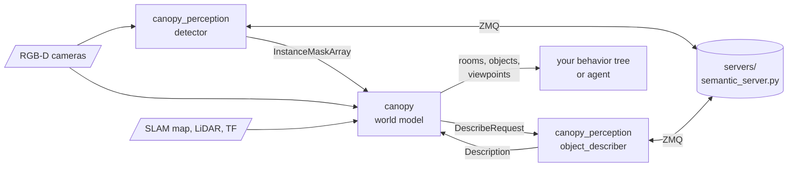

# canopy

A world model for ROS 2 robots that explore buildings: the rooms and doorways on the SLAM map, the
objects in each room, and how much of every room the robot's cameras have actually seen. It plans
the viewpoints that finish the job, and answers "where is the dustbin" and "how do I get there",
so missions name targets instead of carrying coordinates. Detection, embeddings and descriptions
come from models served on the host GPU, and the ROS messages never name a model.



| Part | What it is |
|---|---|
| [`canopy`](canopy) | The world model: room segmentation, camera coverage, the object map, the viewpoint planner, and the ROS node around them. The algorithms are ROS-free C++. |
| [`canopy_msgs`](canopy_msgs) | Its interfaces: instance masks, rooms, objects, describer requests, and the search and exploration services. |
| [`canopy_perception`](canopy_perception) | The front end: a detector and a describer that ask the model servers, and a mock detector that cuts masks from a simulator's ground truth. |
| [`servers`](servers) | The model servers for the host GPU: YOLOE-26 detection, SigLIP 2 embeddings, and Gemini or a local Qwen VLM for names and room types. Not a ROS package. |

Built for ROS 2 Jazzy (Ubuntu 24.04), C++20.

## Building

In a colcon workspace:

```bash
cd ~/ws/src && git clone https://github.com/Adyansh04/canopy.git
cd ~/ws && rosdep install --from-paths src --ignore-src -y
pip install msgpack-numpy==0.4.8            # no rosdep key; the Python nodes need it
colcon build --symlink-install
```

The model servers run outside ROS, on the host's GPU:

```bash
cd ~/ws/src/canopy
./servers/setup.sh                            # a uv virtualenv under ~/.local/share/canopy
./servers/start-vlm.sh start                  # optional: the offline describer
~/.local/share/canopy/.venv/bin/python servers/semantic_server.py
```

## Running it on a robot

```bash
ros2 launch canopy world_model.launch.py world_dir:=/data/worlds/home rviz:=true \
  cameras:=head=/camera odom_topic:=/odom cloud_topic:=/lidar/points \
  detector:=true describe:=true params_file:=my_robot_canopy.yaml
```

The robot needs a latched `/map`, TF from `map` to its base and to each camera, RGB-D cameras that
publish as a RealSense driver does, a LiDAR point cloud, and something to walk it through the
exploration loop that [`canopy`](canopy) describes: Nav2's `NavigateToPose` and `Spin` are enough.
`params_file` carries the robot's own values: its footprint radius, walking and turning speeds,
and how long to dwell for the detector.

## How well it does

Measured on a simulated Unitree G1 exploring a six-room flat with 43 objects a standing robot
can see, from no map, with a head and a chest camera ([grove-g1](https://github.com/Adyansh04/grove-g1),
where canopy began):

| Detector | Rooms | Walls seen | Objects found | Boxes (median IoU) | Time |
|---|---|---|---|---|---|
| Ground-truth masks | 6 of 6 | 97-99 % | 100 % | 0.76-0.80 | 30-34 min |
| YOLOE-26 + SigLIP 2 + describer | 6 of 6 | 95-99 % | 72-79 % | 0.82-0.83 | 37-42 min |

On the simulator's renders YOLOE confuses furniture of one material (desk, cabinet, TV stand) and
misses mugs and bowls on tables, while the describer names most of them correctly.

## Credits

The world model reimplements ideas from Hydra, ConceptGraphs, OVO, DynaMem, VLFM, FUEL, TARE and
Bormann et al.; [`canopy`](canopy#credits) links each. The models the servers run are credited in
[`servers`](servers#models-and-libraries).

BSD 3-Clause; see [LICENSE](LICENSE).
