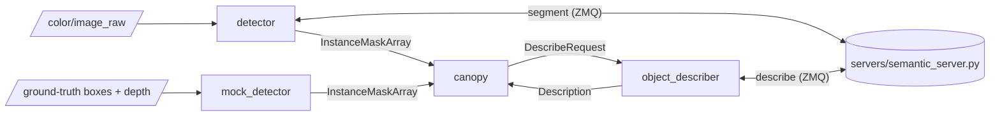

# canopy_perception

The world model's perception front end. A detector asks a host model server what is in each
camera frame and publishes instance masks; a describer asks the same server to name objects and
rooms; a mock detector cuts the masks a detector would publish out of a simulator's ground truth.
Nothing here knows which model answered.



```bash
colcon build --symlink-install --packages-select canopy_perception
```

## Nodes

| Node | Does |
|---|---|
| `detector` | Sends the newest camera frame and the phrase list to the model server and publishes the masks it answers with, one call per `detect_rate_hz`. With `embed` it also asks for an image embedding per instance. |
| `object_describer` | Sends each `DescribeRequest` to the server's `describe` endpoint, one at a time, and publishes the answer. A refusal is logged and dropped: the world model asks again. |
| `mock_detector` | Cuts masks out of ground-truth boxes against the rendered depth: every pixel whose depth lands inside a box. No GPU, no server. Simulation only. A phrase matches every numbered body of its class: "chair" finds `chair_1` to `chair_5`. |

## Interfaces

| Direction | Name | Type |
|---|---|---|
| Sub | `color/image_raw` (detector) | `sensor_msgs/Image`, best effort, depth 1 |
| Sub | `object_poses`, `depth/image_raw`, `camera_info` (mock) | `vision_msgs/Detection3DArray` in the camera frame, `sensor_msgs/Image`, `sensor_msgs/CameraInfo` |
| Pub | `~/instance_masks` (both detectors) | `canopy_msgs/InstanceMaskArray`, reliable, stamped with the image's own stamp |
| Sub | `describe_requests` (describer) | `canopy_msgs/DescribeRequest` |
| Pub | `~/descriptions` (describer) | `canopy_msgs/Description` |

`phrases` is the detector's whole control interface: an empty list idles it, and
`ros2 param set /detector phrases "['chair', 'mug']"` changes it while it runs. An entry may be
`name=phrase`, asking for the wording that separates an object best and publishing the short name.

## Configuration

`config/detector.yaml` is keyed `/**`, so a detector per camera reads it whatever its name:

| Parameter | Default | Meaning |
|---|---|---|
| `server_address` | `tcp://127.0.0.1:5561` | The model server. |
| `detect_rate_hz` | 1.0 | How soon after an answer the next question is asked. |
| `max_image_age_s` | 2.5 | Frames older than this are not asked about. Sized for a simulator sharing the GPU with the models. |
| `box_threshold` | 0.30 | Detections under this score are dropped. |
| `embed` | true | Ask for an image embedding per instance. |
| `phrases` | 128 indoor words | One name per kind of object, which the world model's room table is keyed on. |

`config/mock_detector.yaml` sets the mock's latency, rate, box margin and minimum mask size.

## Library

`canopy_perception_core`, for any node that pairs masks with depth:

- `DepthHistory` keeps recent frames, so a mask that arrives seconds late is paired with the frame
  it was cut from rather than the newest one.
- `DepthView` and `Intrinsics` read a 32FC1 depth image and its pinhole parameters.
- `slugify` turns a phrase into the id it is published under: "Red Block" is `red_block`.

## Why two nodes are Python

`detector` and `object_describer` are ZMQ and msgpack clients. The models need torch and CUDA,
which the robot's image need not carry, so they run on the host (`servers/`) and these nodes speak
their wire protocol. The socket handling lives in `canopy_perception/host_clients.py`.

## Running

Start the server first (`servers/README.md`), then one detector per camera:

```bash
ros2 run canopy_perception detector --ros-args \
  --params-file $(ros2 pkg prefix canopy_perception)/share/canopy_perception/config/detector.yaml \
  -r color/image_raw:=/camera/color/image_raw
```

## Tests

| Test | Covers |
|---|---|
| `test_depth_history` | Pairing a late mask with its own frame, refusing one outside the tolerance, and dropping frames past the window or the frame cap. |
| `test_phrase` | Phrases as ids. |
| `test_detector` | The detector against a stub server: the request encoding, the mask message, the image's own stamp, and a phrase list that is re-read rather than cached. |
