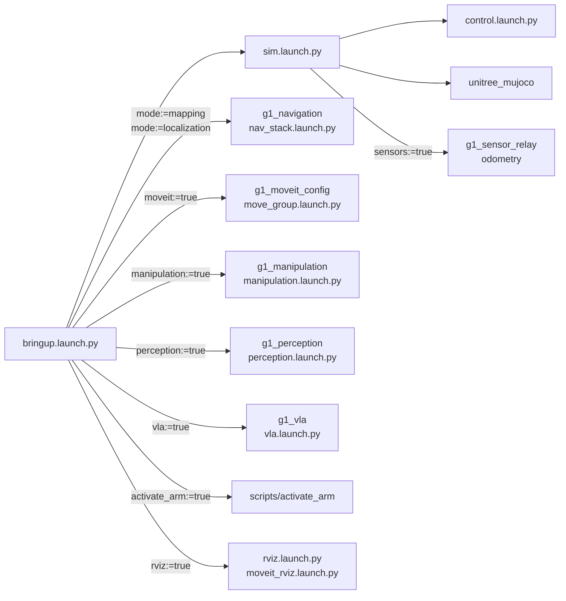

# g1_bringup

The entry point for the G1 stack in simulation. `bringup.launch.py` stages one `unitree_mujoco`
world and the ros2_control stack, then composes navigation, MoveIt, manipulation, perception and
the VLA grasp beside them as asked. The package also holds the MJCF scenes, the simulator's sensor
config, and two Python scripts that acquire and release the arms: one-shot sequencing well under
1 Hz, so not C++. No compiled code.



## Launch files

| File | Purpose |
|---|---|
| `bringup.launch.py` | What an operator runs. Stages exactly one simulator and composes the optional stacks beside it; none of them starts a simulator of its own. |
| `sim.launch.py` | `unitree_mujoco` and `control.launch.py`, plus the sensor relay and odometry with `sensors:=true`. Checks the DDS environment first. Works standalone. |
| `control.launch.py` | `robot_state_publisher`, `ros2_control_node` and the spawners. No simulator, so it carries to hardware unchanged. `joint_state_broadcaster` publishes all 29 body joints. |
| `rviz.launch.py` | RViz on a caller-supplied config. |
| `activate_arm.launch.py` | Runs `scripts/activate_arm`. |
| `deactivate_arm.launch.py` | Runs `scripts/deactivate_arm`. |

## Arguments

`bringup.launch.py`, stack and simulator:

| Argument | Default | Meaning |
|---|---|---|
| `mode` | `none` | `none` is the simulator alone. `mapping` adds the scan pipeline and slam_toolbox, `localization` adds `map_server` and AMCL. |
| `nav` | `false` | Nav2 and the base-approach skill. Needs `mode:=localization`. |
| `moveit` | `false` | `move_group`, in any mode. Executing a plan still needs the arm acquired. |
| `activate_arm` | `false` | Run `activate_arm` automatically. Only with `moveit:=true`. |
| `activate_arm_delay_s` | `25.0` | Seconds before that. Too early and it fails, because the component is not loaded or state is not flowing yet. |
| `rviz` | `false` | Open RViz for what is running: MoveIt's own window with `moveit:=true`, plus `g1_navigation.rviz` if `nav:=true`. Without MoveIt, `g1_navigation.rviz` in the navigation modes and `g1_sensors.rviz` otherwise. |
| `visualization` | empty | Everything drawn only for RViz: the annotated camera image, ground truth, `/object_markers` and the grasp plan. Empty follows `rviz`; an RViz opened by hand later needs `true`. |
| `sensors` | `false` | LiDAR, IMU and camera, the relay and the `odom` to `base_footprint` chain. Forced on by the navigation modes, `manipulation` and `perception`. |
| `odometry` | `fast_lio` | What publishes `odom` to `base_footprint`: `fast_lio`, the LiDAR-inertial pipeline the robot runs, or `ground_truth`, the simulator's exact pose, for ruling the odometry out. |
| `world` | `navigation` | `navigation`, `perception`, `manipulation`, `tabletop` or `lio`. Staged only with sensors on; otherwise the bare floor. Localization converges only in `navigation`, the facility the committed map was built from. |
| `headless` | `true` | `false` shows the MuJoCo viewer. See the viewer warning below. |
| `pin_pelvis` | `false` | Weld the robot in place and freeze the legs instead of running the policy, to exercise the arms alone. `mode:=none` only. |
| `sim_start_delay_s` | empty | Seconds to delay the simulator. Empty means 2.0, or 4.0 when navigation or MoveIt starts alongside it. |

`bringup.launch.py`, manipulation, perception and VLA:

| Argument | Default | Meaning |
|---|---|---|
| `manipulation` | `false` | The pick and place servers and the object-pose source. Needs `moveit:=true`. |
| `object_source` | `sim_ground_truth` | Where `/objects` comes from: `sim_ground_truth`, or `hardware`, which refuses to configure. `perception:=true` overrides it. |
| `perception` | `false` | Detect objects from the camera instead of reading them from the simulator. Needs `manipulation:=true`. |
| `detector` | `mock` | `mock` cuts masks from simulator ground truth and needs no GPU; `vision` asks the host vision server. |
| `phrases` | `red block,blue block,green cylinder,blue sphere,yellow box,white cup,brown box` | Comma-separated objects the detector looks for. |
| `grounding` | `false` | Run the instruction grounder beside the detector. Needs the host vision server started with `--vlm`. |
| `mock_latency_s` | `0.0` | How far the mock detector's masks lag the camera. |
| `mock_rate_hz` | `10.0` | How often the mock detector answers. |
| `mock_margin_m` | `0.005` | How far past an object's box the mock's mask may spill. |
| `grasp_source` | `fixed_top_down` | `fixed_top_down`, or `generated`, which needs a `grasp_engine` that answers. |
| `grasp_engine` | `none` | `none`, `mock` (no GPU) or `graspgen` (the GraspGenX server on the host). |
| `grasp_offset` | `[0.0, 0.0, 0.0, 0.0, 0.0, 0.0]` | The grasp generator's gripper frame to this robot's grasp frame, xyz then rpy. |
| `only_from_below` | `false` | Test aid: the mock generator offers only grasps from under the table, which the filter must refuse. |
| `vla` | `false` | The learned-grasp skill and its policy engine. Needs `manipulation:=true`. |
| `vla_engine` | `mock` | `mock` needs no model; `groot` talks to a policy server outside the container. |
| `vla_execution_mode` | `trajectory` | `trajectory`, or `servo`, which streams validated chunks through MoveIt Servo and starts a `servo_node`. |

`sim.launch.py` takes `headless`, `world`, `sensors`, `odometry`, `pin_pelvis` and
`sim_start_delay_s` (default `2.0`) with the meanings above, plus `rviz` to open
`g1_sensors.rviz` with sensors on. `rviz.launch.py` takes `rviz_config` (required) and
`node_name` (`rviz2`). `control.launch.py` takes `pin_pelvis`, which `sim.launch.py` sets.

## Running in simulation

```bash
ros2 launch g1_bringup bringup.launch.py                                      # simulator only
ros2 launch g1_bringup bringup.launch.py mode:=mapping rviz:=true             # build a map
ros2 launch g1_bringup bringup.launch.py mode:=localization nav:=true rviz:=true
ros2 launch g1_bringup bringup.launch.py moveit:=true pin_pelvis:=true rviz:=true
ros2 launch g1_bringup bringup.launch.py mode:=localization nav:=true moveit:=true
ros2 launch g1_bringup bringup.launch.py world:=manipulation pin_pelvis:=true \
  moveit:=true manipulation:=true activate_arm:=true activate_arm_delay_s:=40.0
ros2 launch g1_bringup sim.launch.py                                          # standalone
```

## Operating notes

- `sim.launch.py` refuses to start unless `RMW_IMPLEMENTATION=rmw_fastrtps_cpp`,
  `ROS_DOMAIN_ID=1` and `CYCLONEDDS_URI` names a config pinned to the `lo` interface. The
  container sets all three. FastDDS because the hardware component reaches the robot through
  unitree_sdk2's own CycloneDDS, and a second CycloneDDS in the process corrupts the heap. `lo`
  so the simulator's `rt/lowcmd` never reaches a robot on the LAN.
- With the viewer open, restart the simulator rather than resetting it. Reset (Backspace)
  re-applies the startup welds and nothing releases them again. Reload with sensors on stops the
  sensors for good and can crash the simulator.
- `pin_pelvis` is not needed for the robot to stand: the simulator holds it up until the control
  stack drives every motor, then releases its startup weld and the policy balances.
- The `tabletop` and `manipulation` scenes spawn the arms held out, clear of the table. The fingers
  have contact geometry, and a hand spawned inside a prop throws it across the room.

## Arms and hands

```bash
ros2 launch g1_bringup activate_arm.launch.py
# send FollowJointTrajectory goals to arm_trajectory_controller,
# left_hand_controller or right_hand_controller
ros2 launch g1_bringup deactivate_arm.launch.py
```

`activate_arm` swaps `arm_freeze_controller` for `arm_trajectory_controller` in one switch,
because a joint `G1LowCmdSystem` sees unclaimed is left unpowered. It then activates each Dex3,
component before controller, best-effort: a missing hand logs a warning and leaves the arm usable.
Last, it ramps both arms straight out to the sides over four seconds without planning. Where they
hang at bring-up is inside the octomap of any table in front, and MoveIt will not plan from a
start state in collision. If that move fails the step exits non-zero.

`deactivate_arm` releases the hands, then swaps the freeze back in, again in one switch.

## Walking by hand

The policy balances the robot and takes `/cmd_vel` directly:

```bash
ros2 run teleop_twist_keyboard teleop_twist_keyboard --ros-args \
  -p speed:=0.35 -p turn:=0.6
```

Linear commands below about 0.15 m/s fall in the gait's deadband and do not move the robot. Do not
teleop while Nav2 or the base approach is driving; they publish `/cmd_vel` too.

## Packages included but not depended on

`bringup.launch.py` reaches `g1_navigation`, `g1_moveit_config`, `g1_manipulation`,
`g1_perception` and `g1_vla` by path lookup, and `package.xml` declares none of them: each already
depends on `g1_bringup`, directly or through another, so the reverse edge would be a colcon cycle.
A package is looked up only when its argument asks for it, and a missing one fails with the
command that builds it. A renamed launch file in one of them is caught by that package's own
tests: `test_launch_threading` in `g1_navigation` and `g1_moveit_config`, the launch suites in the
others.

## Configuration

| Path | Contents |
|---|---|
| `config/sim_sensors.yaml` | LiDAR, IMU and camera parameters read by the patched simulator, the bodies that publish ground-truth poses, and the grasp weld for scenes that declare one. |
| `config/g1_sensors.rviz` | RViz without navigation. Fixed frame `odom`. |
| `mjcf/*.xml` | One scene per world and a pinned variant of each (`lio` has none), plus the flat, walk and pinned overlays. Staged next to the vendored model at launch and removed on shutdown. |

Controller configuration lives in `g1_controllers/config/lowcmd_controllers.yaml`, which
`control.launch.py` loads.

## Tests

```bash
colcon test --packages-select g1_bringup
colcon test-result --verbose
colcon test --packages-select g1_bringup --ctest-args -LE simulator   # what CI runs
```

| Test | Needs a simulator | Covers |
|---|---|---|
| `test_lidar_geometry` | yes | The LiDAR measures the room it is in. |
| `test_fastlio_odometry` | yes | FAST-LIO's `odom` against the simulator's pelvis pose, standing and walking. |
| `test_agile_walk` | yes | The AGILE policy stands the robot unpinned and walks it on `/cmd_vel` without the safety controller latching. |
| `xmllint_scenes_g1_bringup` | no | The MJCF scenes are valid XML, which MuJoCo's parser does not enforce. |
| `ruff_check_g1_bringup` | no | Lints the launch files, tests and scripts. |

The simulator suites serialise on a shared resource lock, with a `sim_settle_gap` pause to let
DDS drain. MuJoCo syncs to CPU time while the policy runs on a wall timer, so on a loaded machine
the robot can topple. Re-run a failing suite alone before calling it a regression:

```bash
colcon test --packages-select g1_bringup --ctest-args -R test_agile_walk
```

They live here rather than beside the code they exercise because those packages are dependencies
of this one.
