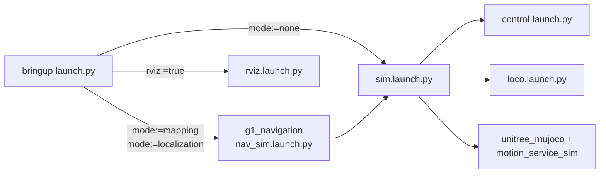

# g1_bringup

The entry point for the whole stack. Launch files, scenes, config and two ordering scripts. No
compiled code of its own.

`ament_cmake`, Python launch files and integration tests.



## Launch files

| File | Purpose |
|---|---|
| `bringup.launch.py` | What an operator runs. Routes to bare simulator or the navigation stack. |
| `sim.launch.py` | Starts `unitree_mujoco`, `motion_service_sim`, `control.launch.py` and `loco.launch.py`. Checks the DDS environment first. Works standalone. |
| `control.launch.py` | `robot_state_publisher`, `ros2_control_node` and the spawners. No simulator, so it carries to hardware unchanged. |
| `loco.launch.py` | Starts `g1_loco_bridge` and drives it from configure to active. |
| `rviz.launch.py` | Starts RViz on a caller-supplied `rviz_config` path. |
| `activate_arm.launch.py` | Runs `scripts/activate_arm`, the ordered acquire step. |
| `deactivate_arm.launch.py` | Runs `scripts/deactivate_arm`, the ordered release step. |

## Arguments

All of these belong to `bringup.launch.py`.

| Argument | Default | Meaning |
|---|---|---|
| `mode` | `none` | `none` is the simulator alone. `mapping` adds the scan pipeline and slam_toolbox. `localization` adds `map_server` and AMCL. |
| `nav` | `false` | Start Nav2, the gait shaper and the authority bracket. Needs `mode:=localization`. |
| `rviz` | `false` | Open RViz on the config that matches the mode. |
| `sensors` | `false` | LiDAR, the relay and the `odom` to `base_footprint` chain. The navigation modes turn this on themselves. |
| `world` | `navigation` | Which scene to stage. `navigation` is the facility the committed map was built from. |
| `headless` | `true` | `false` shows the MuJoCo viewer. |
| `pin_pelvis` | `false` | Welds the pelvis and disables the walking policy, for exercising the arm bridge alone. `mode:=none` only. |
| `sim_start_delay_s` | branch default | Seconds to delay the simulator. Empty means 2.0 for `mode:=none`, 4.0 for the navigation modes. |

## Running

```bash
ros2 launch g1_bringup bringup.launch.py                                      # simulator only
ros2 launch g1_bringup bringup.launch.py mode:=mapping rviz:=true             # build a map
ros2 launch g1_bringup bringup.launch.py mode:=localization nav:=true rviz:=true
```

Arms, in order. The order is mandatory: Humble ties command-interface availability to hardware
component state, so activating the controller before the component can fail the switch.

```bash
ros2 launch g1_bringup activate_arm.launch.py
# send a FollowJointTrajectory goal to arm_trajectory_controller
ros2 launch g1_bringup deactivate_arm.launch.py
```

`deactivate_arm.launch.py` blocks for about two seconds while the blend weight ramps to zero. That
is the ramp, not a hang. Ctrl-C is also safe.

Walking by hand needs FSM `Start` first:

```bash
ros2 action send_goal /g1_loco_bridge/set_mode g1_msgs/action/SetLocoMode "{fsm_id: 4}"
ros2 action send_goal /g1_loco_bridge/set_mode g1_msgs/action/SetLocoMode "{fsm_id: 500}"
ros2 run teleop_twist_keyboard teleop_twist_keyboard --ros-args \
  -r /cmd_vel:=/g1_loco_bridge/cmd_vel -p speed:=0.6 -p turn:=1.57
```

Both teleop overrides matter. The defaults sit inside the gait's dead zone and the robot will not
move. See `g1_motion_service_sim` for the measured thresholds.

## g1_navigation is referenced but not depended on

`bringup.launch.py` includes launch files and an RViz config from `g1_navigation`, and
`package.xml` says nothing about it. That is deliberate. `g1_navigation` already depends on
`g1_bringup`, so declaring the reverse makes colcon refuse to order the workspace at all.

The reference is a launch-time path lookup. This package builds and runs with `g1_navigation`
absent; only the two navigation modes name it, and their absence is reported as an actionable
message. Nothing will warn you if `g1_navigation` renames a launch file, so `test_launch_threading`
in that package is the compensating check.

## Configuration

| File | Contents |
|---|---|
| `config/controllers.yaml` | `controller_manager` at 200 Hz. `G1ArmSdkSystem` starts inactive, `joint_state_broadcaster` active. |
| `config/sim_sensors.yaml` | LiDAR and camera parameters read by the patched simulator. |
| `config/g1_sensors.rviz` | RViz for `mode:=none`. Fixed frame `odom`. |
| `mjcf/*.xml` | Six scene overlays. Staged next to the vendored model at launch and removed on shutdown. |

Hand joints stay inert. The URDF includes the DEX3 joints for kinematic structure, but they get no
`ros2_control` interfaces and the simulator's model has no hand joints.

## Tests

| Test | Needs a simulator | Covers |
|---|---|---|
| `test_sim_bringup` | yes | Bring-up topics, rates, controller and component states. |
| `test_arm_command` | yes | Ordered activation, weight ramp, closed-loop trajectory, slew clamp. |
| `test_loco` | yes | LocoClient protocol end to end over DDS. |
| `test_walk_stand` | yes | The policy stands the robot up unwelded and holds it. |
| `test_walk_teleop` | yes | Rejection before `Start`, the dead-man, Damp release, randomized sequences. |
| `test_walk_and_arm` | yes | Walking under `cmd_vel` while an arm trajectory converges. |
| `test_lidar_geometry` | yes | The LiDAR measures the room it is in. |
| `ruff_check_g1_bringup` | no | Python lint and import order. |

```bash
colcon test --packages-select g1_bringup
colcon test-result --verbose
```

Every suite here starts a real `unitree_mujoco` and they serialize on a shared resource lock. The
simulator syncs to CPU time while the walking policy runs on a wall timer, so on a loaded machine
the two drift and the robot can topple. Re-run a failing suite alone before calling it a
regression:

```bash
colcon test --packages-select g1_bringup --ctest-args -R test_walk_stand
```

The launch suites live here rather than with the node sources they exercise because they all
include this package's `sim.launch.py`, and hosting them elsewhere would be a dependency cycle.
