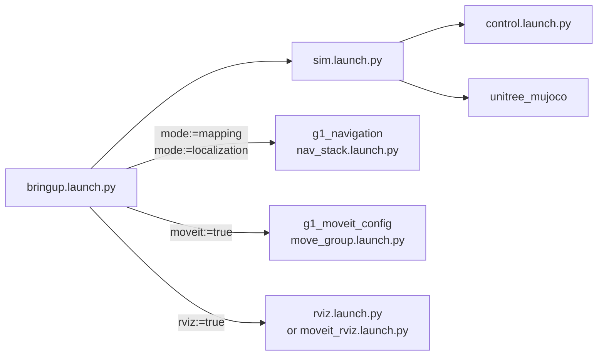

# g1_bringup

The entry point for the whole stack. Launch files, scenes, config and two ordering scripts. No
compiled code of its own.

`ament_cmake`, Python launch files and integration tests.



The simulator edge is unconditional: this file stages exactly one, and the optional stacks are
composed beside it rather than wrapped around it. Neither `nav_stack.launch.py` nor
`move_group.launch.py` stages a simulator of its own.

## Launch files

| File | Purpose |
|---|---|
| `bringup.launch.py` | What an operator runs. Stages the simulator and composes the navigation stack and MoveIt onto it as asked. |
| `sim.launch.py` | Starts `unitree_mujoco` and `control.launch.py`. Checks the DDS environment first and refuses to start on the wrong middleware. Works standalone. |
| `control.launch.py` | `robot_state_publisher`, `ros2_control_node` and the spawners. No simulator, so it carries to hardware unchanged. `joint_state_broadcaster` covers all 29 joints from the component, so nothing else has to fill `/joint_states`. |
| `rviz.launch.py` | Starts RViz on a caller-supplied `rviz_config` path. |
| `activate_arm.launch.py` | Runs `scripts/activate_arm`, the ordered acquire step. |
| `deactivate_arm.launch.py` | Runs `scripts/deactivate_arm`, the ordered release step. |

## Arguments

All of these belong to `bringup.launch.py`.

| Argument | Default | Meaning |
|---|---|---|
| `mode` | `none` | `none` is the simulator alone. `mapping` adds the scan pipeline and slam_toolbox. `localization` adds `map_server` and AMCL. |
| `nav` | `false` | Start Nav2 and the base-approach skill. Needs `mode:=localization`. |
| `moveit` | `false` | Start `move_group` for arm planning. Works with any mode. Planning is immediate; executing still needs `activate_arm`. |
| `rviz` | `false` | Open RViz on the config that matches what is running. `moveit:=true` wins, because only MoveIt's launcher passes the panel its parameters. |
| `sensors` | `false` | LiDAR, the relay and the `odom` to `base_footprint` chain. The navigation modes turn this on themselves. |
| `odometry` | `fast_lio` | What publishes `odom` to `base_footprint`. `fast_lio` runs the LiDAR-inertial pipeline the robot uses, over the simulated Mid360, and drifts like the estimate it is; `ground_truth` is the simulator's exact pelvis pose, over the sensor socket, for isolating a fault to "not the odometry". |
| `world` | `navigation` | Which scene to stage. `navigation` is the facility the committed map was built from. |
| `headless` | `true` | `false` shows the MuJoCo viewer. |
| `pin_pelvis` | `false` | Welds the pelvis and disables the walking policy, for exercising the arms alone. `mode:=none` only. |
| `waist_hold_rad` | `""` | Sim only. Three comma-separated radians (yaw,roll,pitch) to stand the waist at. Needs `pin_pelvis:=true`. |
| `sim_start_delay_s` | branch default | Seconds to delay the simulator. Empty means 2.0 bare, 4.0 whenever navigation or MoveIt starts alongside it. |

### Running the simulator by hand

```bash
ros2 launch g1_bringup sim.launch.py
```

The image runs `rmw_fastrtps_cpp`, and `sim.launch.py` refuses to start on anything else: the
hardware component reaches the robot wire through the SDK's own CycloneDDS, and a second one in
the same process corrupts the heap.

`pin_pelvis` is not needed here. The simulator holds the robot up only until the control stack
drives every motor, then releases the pelvis weld its scene declares and the policy balances.

## Running

```bash
ros2 launch g1_bringup bringup.launch.py                                      # simulator only
ros2 launch g1_bringup bringup.launch.py mode:=mapping rviz:=true             # build a map
ros2 launch g1_bringup bringup.launch.py mode:=localization nav:=true rviz:=true
ros2 launch g1_bringup bringup.launch.py moveit:=true pin_pelvis:=true rviz:=true
ros2 launch g1_bringup bringup.launch.py mode:=localization nav:=true moveit:=true
```

`moveit:=true` also turns on the non-arm joint states MoveIt needs, without being asked: the arms
hang off three waist joints `joint_state_broadcaster` does not own, and `move_group` will not plan
until every joint it models has a state.

Arms and hands, in order. The order is mandatory: command-interface availability is tied to
hardware component state, so activating the controller before the component can fail the switch.

```bash
ros2 launch g1_bringup activate_arm.launch.py
# send a FollowJointTrajectory goal to arm_trajectory_controller,
# left_hand_controller or right_hand_controller
ros2 launch g1_bringup deactivate_arm.launch.py
```

The hardware component is already active and holding the arms through `arm_freeze_controller`, so
acquiring trades the freeze for `arm_trajectory_controller` in a single switch. It has to be one
switch, because a joint that component sees unclaimed is a joint it leaves unpowered.

The same step acquires both Dex3 hands, but only best-effort: a hand that is absent, unpowered or
not publishing state logs a warning and leaves the arm usable. The arm is the part that fails the
whole acquire.

Walking by hand needs no mode change — the policy is already balancing the robot and takes
velocity directly:

```bash
ros2 run teleop_twist_keyboard teleop_twist_keyboard --ros-args \
  -p speed:=0.35 -p turn:=0.6
```

Both overrides matter. The defaults sit inside the gait's dead zone -- below roughly 0.15 m/s
nothing moves at all -- and the robot will not respond. See `g1_controllers` for the measured
envelope.

## g1_navigation and g1_moveit_config are referenced but not depended on

`bringup.launch.py` includes launch files from both, and an RViz config from `g1_navigation`, and
`package.xml` says nothing about either. That is deliberate. Both already depend on `g1_bringup`,
so declaring the reverse makes colcon refuse to order the workspace at all.

Both references are launch-time path lookups. This package builds and runs with either absent:
only `mode:=mapping` and `mode:=localization` name `g1_navigation`, only `moveit:=true` names
`g1_moveit_config`, and each absence is reported as an actionable message rather than a search-path
dump. Nothing will warn you if either package renames a launch file, so `test_launch_threading` in
*each* of them is the compensating check. Neither suite can live here, for the same reason the
dependency cannot.

## Configuration

| File | Contents |
|---|---|
| `config/lowcmd_controllers.yaml` | Lives in `g1_controllers`: `controller_manager` at 200 Hz, the policy, the safety and freeze controllers, and the arm and hand trajectory controllers. |
| `config/sim_sensors.yaml` | LiDAR and camera parameters read by the patched simulator. |
| `config/g1_sensors.rviz` | RViz for `mode:=none`. Fixed frame `odom`. |
| `mjcf/*.xml` | Six scene overlays. Staged next to the vendored model at launch and removed on shutdown. |

`config/sim_sensors.yaml` additionally
configures two simulation-only things the patched simulator reads: which bodies publish
ground-truth poses, and the grasp weld that stands in for finger contact.

## Tests

| Test | Needs a simulator | Covers |
|---|---|---|
| `test_lidar_geometry` | yes | The LiDAR measures the room it is in. |
| `test_fastlio_odometry` | yes | FAST-LIO's `odom` against the simulator's own pelvis pose, standing and walking. |
| `test_agile_walk` | yes | The lowcmd stack under the AGILE policy: stands with an unpinned pelvis, then walks on `/cmd_vel` without the safety controller latching. |
| `ruff_check_g1_bringup` | no | Python lint and import order. |

```bash
colcon test --packages-select g1_bringup
colcon test-result --verbose
```

Every suite here starts a real `unitree_mujoco` and they serialize on a shared resource lock. The
simulator syncs to CPU time while the walking policy runs on a wall timer, so on a loaded machine
the two drift and the robot can topple. Re-run a failing suite alone before calling it a
regression:

```bash
colcon test --packages-select g1_bringup --ctest-args -R test_walk_stand
```

The launch suites live here rather than with the node sources they exercise because they all
include this package's `sim.launch.py`, and hosting them elsewhere would be a dependency cycle.
