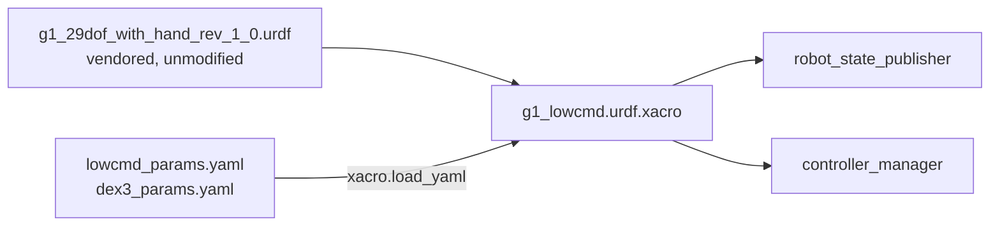

# g1_description

The Unitree G1 robot description: a vendored, kinematics-only URDF plus the xacro wrappers that add
the `ros2_control` blocks for the body motors and the two hands.

`ament_cmake`, no compiled code.



## Contents

| File | Purpose |
|---|---|
| `urdf/g1_29dof_with_hand_rev_1_0.urdf` | The vendored upstream description, unmodified. |
| `urdf/g1_lowcmd.urdf.xacro` | Includes the below and adds the body component's `<ros2_control>` block. |
| `urdf/g1_common.xacro` | The vendored body, the sensor and grasp frames, and both hand components. Loaded on its own by consumers that need the geometry without the body component. |
| `config/lowcmd_params.yaml` | Body-component tunables and the per-joint position-only gains. |
| `config/dex3_params.yaml` | Hand-component tunables and the per-finger limits. |
| `meshes/` | Vendored visual meshes, installed at configure time so the model renders in RViz. |

Parameters are loaded with `xacro.load_yaml` and expanded into `<param>` tags because
`ros2_control` hardware plugins only ever receive parameters that way, never from
`controller_manager`'s own YAML.

## Scope: the whole robot

The xacro emits three `<ros2_control>` blocks: all 29 body motors on `G1LowCmdSystem`, and seven
finger joints per hand on a `G1Dex3System` each. Legs and waist are ours now — there is no onboard
controller underneath, so claiming them here is claiming balance, which the locomotion policy
provides.

One component per hand, separate from the body, because the Dex3 is a separate device on its own
channels with its own control authority, and because a hand fault should not take the arms down
with it.

## Parameters

`config/lowcmd_params.yaml`:

| Parameter | Default | Meaning |
|---|---|---|
| `domain_id` | 1 | The SDK's own DDS domain. `dex3_params.yaml` must agree: `ChannelFactory` is per process and only its first `Init` applies. |
| `network_interface` | `""` | MUST stay empty. A non-empty value makes the SDK build an inline CycloneDDS config that discards `CYCLONEDDS_URI`. |
| `lowstate_timeout_ms` | 100 ms | `rt/lowstate` age beyond this errors the component while active. |
| `release_ramp_s` | 0.5 s | Stiffness fades to zero over this on deactivate. |
| `release_kd` | 2.0 | Damping held flat across the release, so it outlives the stiffness. |
| `release_motion_mode` | false | Whether to ask the onboard motion service to hand over the motors. No such service in the simulator; hardware must set it true. |

It also carries the per-joint `position_only_kp`/`kd`, used only when a controller claims position
without supplying gains. Joint order is the Unitree DDS wire order and is not ours to renumber.

## Inspecting the model

```bash
xacro workspace/src/g1_description/urdf/g1_lowcmd.urdf.xacro > /tmp/g1.urdf
check_urdf /tmp/g1.urdf
```

For actual geometry, use the MuJoCo viewer once `g1_bringup` launches the simulator, or RViz with
`rviz:=true`.

## Tests

```bash
colcon test --packages-select g1_description
```

`test_lowcmd_xacro` expands the xacro, validates it with `check_urdf`, and asserts the
`<ros2_control>` blocks: all 29 body motors on the body component, the Dex3 wire order on each
hand, and that both hands carry the body component's `domain_id`. `test_motor_order` cross-checks
the component's own joint table against the URDF. No simulator needed.
