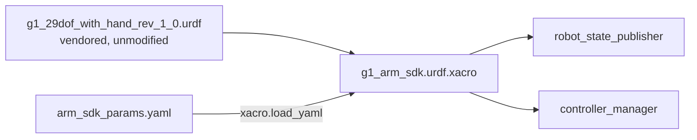

# g1_description

The Unitree G1 robot description: a vendored, kinematics-only URDF plus a xacro wrapper that adds
the `ros2_control` block for the arms.

`ament_cmake`, no compiled code.



## Contents

| File | Purpose |
|---|---|
| `urdf/g1_29dof_with_hand_rev_1_0.urdf` | The vendored upstream description, unmodified. |
| `urdf/g1_arm_sdk.urdf.xacro` | Includes the vendored URDF and appends a `<ros2_control>` block for the arms only. |
| `config/arm_sdk_params.yaml` | Every hardware-plugin tunable. |
| `meshes/` | Vendored visual meshes, installed at configure time so the model renders in RViz. |

Parameters are loaded with `xacro.load_yaml` and expanded into `<param>` tags because Humble
hardware plugins only receive parameters that way.

## Scope: arms and hands, not legs

The xacro emits three `<ros2_control>` blocks: the 14 arm joints on `G1ArmSdkSystem`, and seven
finger joints per hand on a `G1Dex3System` each. Legs and waist belong to the onboard controller,
which is what keeps the robot balanced; claiming them here would mean owning balance.

One component per hand, separate from the arm, because the Dex3 is a separate device on its own
topics with its own authority (`docs/CONTROL_MODES.md`), and because a hand fault should not take
the arms down with it.

## Parameters

`config/arm_sdk_params.yaml`:

| Parameter | Default | Meaning |
|---|---|---|
| `command_publish_rate` | 100.0 Hz | `/arm_sdk` publish rate, independent of the controller manager's update rate. |
| `blend_ramp_up_s` | 2.0 s | Weight eases 0 to 1 on activate. |
| `blend_ramp_down_s` | 2.0 s | Weight eases 1 to 0 on a clean deactivate. |
| `emergency_ramp_down_s` | 0.5 s | Faster ramp on stale feedback or shutdown. Must fit inside the launch stack's SIGTERM window. |
| `max_joint_velocity_rad_s` | 1.0 rad/s | Slew clamp on every commanded joint. |
| `lowstate_timeout_ms` | 100 ms | `/lowstate` age beyond this trips the emergency ramp. |

The file also carries the per-joint motor index and gains. Motor indices are the Unitree DDS wire
order and are not ours to renumber.

## Inspecting the model

```bash
xacro workspace/src/g1_description/urdf/g1_arm_sdk.urdf.xacro > /tmp/g1.urdf
check_urdf /tmp/g1.urdf
```

For actual geometry, use the MuJoCo viewer once `g1_bringup` launches the simulator, or RViz with
`rviz:=true`.

## Tests

```bash
colcon test --packages-select g1_description
```

`test_arm_sdk_xacro` expands the xacro, validates it with `check_urdf`, and asserts the
`<ros2_control>` block holds exactly the 14 arm joints. No simulator needed.
