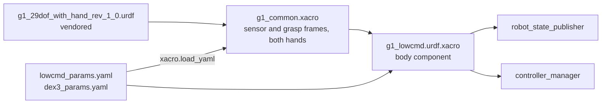

# g1_description

The Unitree G1 robot description: a vendored, kinematics-only URDF plus the xacro wrappers that
add the `ros2_control` blocks for the body motors and the two hands.

`ament_cmake`, no compiled code.



## Contents

| Path | Purpose |
|---|---|
| `urdf/g1_29dof_with_hand_rev_1_0.urdf` | Unitree's description, byte-for-byte except mesh paths rewritten to `package://`. |
| `urdf/g1_common.xacro` | Includes the vendored URDF, adds the sensor and grasp frames and both hand components. Loaded on its own by consumers that want the geometry without the body component. |
| `urdf/g1_lowcmd.urdf.xacro` | Includes `g1_common.xacro` and adds the body component's `<ros2_control>` block. This is the entry point. |
| `config/lowcmd_params.yaml` | Body-component tunables and the per-joint position-only gains. |
| `config/dex3_params.yaml` | Hand-component tunables and the per-finger limits. |

Visual meshes are not committed. CMake copies them at configure time from
`/opt/unitree_robotics/unitree_mujoco/unitree_robots/g1/meshes`, overridable with the
`G1_VENDOR_MESHES` cache variable. If that directory is missing, the build warns and RViz shows no
robot model.

Parameters are loaded with `xacro.load_yaml` and expanded into `<param>` tags, because
`ros2_control` hardware plugins only ever receive parameters that way, never from
`controller_manager`'s own YAML.

## Scope

The xacro emits three `<ros2_control>` blocks: all 29 body motors on `G1LowCmdSystem`, and seven
finger joints per hand on a `G1Dex3System` each. That includes the legs and waist, so no onboard
controller runs underneath. Claiming those joints means owning balance, which the locomotion
policy provides.

One component per hand, separate from the body, because each Dex3 is its own device on its own
channels, and a hand fault should not take the arms down with it.

## Parameters

`config/lowcmd_params.yaml`:

| Parameter | Default | Meaning |
|---|---|---|
| `domain_id` | 1 | The SDK's own DDS domain. `dex3_params.yaml` must agree: `ChannelFactory` is per process and only its first `Init` applies. |
| `network_interface` | `""` | Must stay empty. A non-empty value makes the SDK build an inline CycloneDDS config that discards `CYCLONEDDS_URI`. |
| `lowstate_timeout_ms` | 100 | `rt/lowstate` older than this errors the component while active. |
| `release_ramp_s` | 0.5 | Stiffness fades to zero over this on deactivate. |
| `release_kd` | 2.0 | Damping held flat across the release, so it outlives the stiffness. |
| `motor_temp_warn_threshold` | 120 | Degrees C. Warns on `/diagnostics`. |
| `release_motion_mode` | false | Whether to ask the onboard motion service to hand over the motors. The simulator has no such service; hardware must set it true. |

The same file carries the per-joint `position_only_kp` and `position_only_kd`, used only when a
controller claims position without supplying gains: 10/1 on the legs and waist, 300/4 on the
shoulders and elbows, 150/3 on the wrists. Check the arm gains against the motor limits before
running on hardware. Joint order is the Unitree DDS wire order and is not ours to renumber.

`config/dex3_params.yaml`, shared by both hands:

| Parameter | Default | Meaning |
|---|---|---|
| `domain_id`, `network_interface` | 1, `""` | Must match `lowcmd_params.yaml`. |
| `kp`, `kd` | 2.3, 0.25 | Finger gains. kp lets a thumb stalled short of its target press at the joint's 1.4 Nm rating. |
| `command_publish_rate` | 100.0 | Hz. |
| `max_joint_velocity_rad_s` | 3.0 | Slew clamp on every finger command. |
| `state_timeout_ms` | 200.0 | `HandState` older than this errors the component once active. |
| `state_topic_prefix`, `state_topic_suffix` | `rt/dex3/`, `/state` | The side goes between them. |

Per-finger `min` and `max` follow, copied from the URDF; the component clamps commands to them.

## Inspecting the model

```bash
xacro workspace/src/g1_description/urdf/g1_lowcmd.urdf.xacro > /tmp/g1.urdf
check_urdf /tmp/g1.urdf
```

For geometry, use the MuJoCo viewer once `g1_bringup` launches the simulator, or RViz with
`rviz:=true`.

## Tests

```bash
colcon test --packages-select g1_description
```

No simulator needed for any of them.

| Test | Checks |
|---|---|
| `test_lowcmd_xacro` | Expands the xacro, validates it with `check_urdf`, and asserts the `<ros2_control>` blocks: all 29 body motors on the body component, the Dex3 wire order on each hand, and that both hands carry the body component's `domain_id` and `network_interface`. |
| `test_motor_order` | Cross-checks the body component's own joint table against the URDF. |
| `test_sensor_mounts` | Cross-checks the sensor mount poses against the simulator's compile-time copy of the same four numbers, which cannot ask TF where the sensors are. |
| `xmllint_description_g1_description` | Every URDF and xacro is well-formed XML, which xacro does not enforce. |
