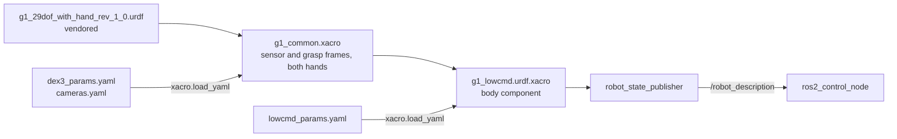

# g1_description

The Unitree G1 robot description: a vendored, kinematics-only URDF plus the xacro wrappers that
add the `ros2_control` blocks for the body motors and the two hands. `ament_cmake`, no compiled
code.


```mermaid
flowchart LR
    V["g1_29dof_with_hand_rev_1_0.urdf<br/>vendored"] --> C
    D["dex3_params.yaml<br/>cameras.yaml"] -- "xacro.load_yaml" --> C
    C["g1_common.xacro<br/>sensor and grasp frames, both hands"] --> X["g1_lowcmd.urdf.xacro<br/>body component"]
    L["lowcmd_params.yaml"] -- "xacro.load_yaml" --> X
    X --> RSP["robot_state_publisher"] -- "/robot_description" --> CM["ros2_control_node"]
```

## Contents

| Path | Purpose |
|---|---|
| `urdf/g1_29dof_with_hand_rev_1_0.urdf` | Unitree's description from [unitree_ros](https://github.com/unitreerobotics/unitree_ros), byte for byte except mesh paths rewritten to `package://`. |
| `urdf/g1_common.xacro` | Includes the vendored URDF, adds the sensor and grasp frames and both hand components. Loaded on its own by consumers that want the geometry without the body component. |
| `urdf/g1_lowcmd.urdf.xacro` | Includes `g1_common.xacro` and adds the body component's `<ros2_control>` block. This is the entry point. |
| `config/lowcmd_params.yaml` | The body component's parameters and its per-joint position-only gains. |
| `config/dex3_params.yaml` | The hand components' parameters, shared by both hands, and the per-finger limits. |
| `config/cameras.yaml` | Where each camera mounts. The URDF builds the chest camera's frames from it and the simulator renders every camera from it, so a camera moves in this file alone. The head entry mirrors Unitree's `d435_joint`. |

Visual meshes are not committed. CMake copies them at configure time from
`/opt/unitree_robotics/unitree_mujoco/unitree_robots/g1/meshes`, overridable with the
`G1_VENDOR_MESHES` cache variable. If that directory is missing, the build warns and RViz shows no
robot model.

The YAML files are loaded with `xacro.load_yaml` and expanded into `<param>` tags, because
`ros2_control` hardware plugins only receive parameters that way, never from `controller_manager`'s
own YAML.

## Components and frames

The xacro emits three `<ros2_control>` blocks:

| Component | Plugin | Joints |
|---|---|---|
| `G1LowCmdSystem` | `g1_hardware_interface/G1LowCmdSystem` | All 29 body motors, legs and waist included, plus the `imu` sensor. |
| `G1Dex3SystemLeft`, `G1Dex3SystemRight` | `g1_hand_interface/G1Dex3System` | Seven finger joints each. |

It also adds frames to Unitree's URDF:

| Frame | Parent | Purpose |
|---|---|---|
| `camera_depth_optical_frame`, `camera_color_optical_frame` | `d435_link` | REP 103 optical frames of the head camera. |
| `chest_camera_link` and its two optical frames | `torso_link` | The chest camera, placed by `cameras.yaml`. |
| `mid360_imu` | `mid360_link` | The Mid360's built-in IMU, FAST-LIO's body frame. |
| `left_hand_grasp_frame`, `right_hand_grasp_frame` | `*_hand_palm_link` | Where the Dex3 closes. Pose goals target it rather than the palm origin. |
| `d435_visual`, `chest_camera_visual`, `mid360_visual` | their sensor links | Bodies for RViz. Visual only, so they stay out of MoveIt's planning scene. |

## Parameters

`config/lowcmd_params.yaml` sets the body component's parameters, described in
[g1_hardware_interface](../g1_hardware_interface/README.md#parameters), and a
`position_only_kp` and `position_only_kd` per joint. `config/dex3_params.yaml` sets the hand
parameters, described in [g1_hand_interface](../g1_hand_interface/README.md#parameters), and each
finger's `min` and `max`, copied from the URDF. The hands' `domain_id` and `network_interface` must
equal the body component's.

## Inspecting the model

```bash
./scripts/manage.sh exec xacro src/g1_description/urdf/g1_lowcmd.urdf.xacro -o /tmp/g1.urdf
./scripts/manage.sh exec check_urdf /tmp/g1.urdf
```

RViz (`rviz:=true` on `bringup.launch.py`) draws the model. The MuJoCo viewer shows the simulator's
own MJCF instead.

## Tests

```bash
./scripts/manage.sh test g1_description   # none of these needs a simulator
```

| Test | Checks |
|---|---|
| `test_lowcmd_xacro` | Expands the xacro, validates it with `check_urdf`, and asserts the `<ros2_control>` blocks: all 29 body joints in SDK order, each with the five command interfaces and its `position_only_*` gains; the Dex3 wire order on each hand; and that both hands carry the body component's `domain_id` and `network_interface`. |
| `test_motor_order` | `kG1JointNames` in `g1_hardware_interface` lists the 29 motors in SDK order and names only joints the vendored URDF has. |
| `test_sensor_mounts` | The simulator's compile-time LiDAR mount (`kMountXyz`, `kMountRpy` in `sensor_publisher.cc`) matches the URDF's `mid360_joint`, and the head entry in `config/cameras.yaml` matches `d435_joint`. The simulator links no ROS, so it cannot ask TF where a sensor is. |
| `xmllint_description_g1_description` | Every URDF and xacro is well-formed XML, which xacro does not enforce. |
