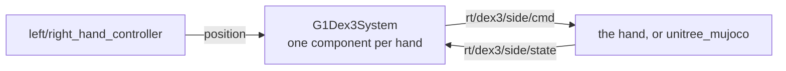

# g1_hand_interface

`G1Dex3System`: the `ros2_control` `SystemInterface` for one Unitree Dex3-1 hand, over the hand's
own `unitree_sdk2` channels. One component per hand. `ament_cmake`, C++20.

Not sim-specific: it speaks Unitree's published Dex3 contract, and `unitree_mujoco` answers the same
channels.



Separate from `g1_hardware_interface` so a hand fault cannot take the arms down with it. Like that
component, it reaches the wire through the SDK's own CycloneDDS, with `DT_RPATH` pinned at the
SDK's `lib/` so ROS's CycloneDDS, same SONAME and different ABI, is never bound in its place.
`domain_id` and `network_interface` must match `g1_hardware_interface`'s, because `ChannelFactory`
is per process and only its first `Init` takes effect.

## Interfaces

| Interface | Kind | Source |
|---|---|---|
| `position` | command | clamped to the joint limits, then slewed |
| `position`, `velocity`, `effort` | state | `motor_state[i].q` / `.dq` / `.tau_est` |

| Channel | Direction | Type |
|---|---|---|
| `rt/dex3/<side>/cmd` | out | `unitree_hg::msg::dds_::HandCmd_` |
| `rt/dex3/<side>/state` | in | `unitree_hg::msg::dds_::HandState_` (`state_topic`) |

These are SDK channels, not ROS topics, so they carry the SDK's own QoS and do not appear in
`ros2 topic list`.

## Parameters

Values are in `g1_description/config/dex3_params.yaml`.

| Parameter | Default | Meaning |
|---|---|---|
| `side` | required | `left` or `right`. Picks the channels and the joint prefix. |
| `domain_id` | required | SDK DDS domain. Must match `g1_hardware_interface`'s. |
| `network_interface` | `""` | Must stay empty: a non-empty value makes the SDK discard `CYCLONEDDS_URI`. |
| `kp` / `kd` | 1.5 / 0.2 | Finger PD gains, sent in every driven frame. Must be positive. |
| `command_publish_rate` | 100.0 | Hz. What Unitree's own teleop uses. |
| `max_joint_velocity_rad_s` | 3.0 | Slew clamp on the commanded position. |
| `state_timeout_ms` | 200.0 | State older than this errors the component while active. |
| `state_topic` | `rt/dex3/<side>/state` | State channel. The YAML gives a prefix and suffix that the xacro joins around the side. |
| `min` / `max` | required, per joint | Position limits in rad. Commands are clamped to them. |

Activation waits up to 5 s for a first `HandState` and fails without one.

The robot carries a full-rate `rt/dex3/<side>/state` and a lower-rate `rt/lf/dex3/<side>/state`,
and Unitree's own code disagrees about which to read. The full-rate one is the default because this
is a control loop with a freshness gate; `state_topic` switches it without a rebuild.

## Wire format notes

- `motor_cmd` is an unbounded sequence, not a fixed array. Unresized, DDS accepts the message and
  nothing moves. `on_init` resizes the preallocated frame once, so the write path never allocates.
- Joint order is positional and matches the URDF: thumb_0, thumb_1, thumb_2, middle_0, middle_1,
  index_0, index_1, for both hands. `on_init` refuses any other order, since the failure is a hand
  that closes the wrong fingers. Unitree's `Dex3_1_Right_JointIndex` enum lists index before
  middle; do not copy it.
- There is no blend weight: the first write takes full authority. The component seeds its command
  from the measured position on activate and slews toward the target.
- The motors' own timeout is armed only in the release frame. While driving, the controller is the
  heartbeat, and arming it would stop the fingers a second after any hiccup in the control loop.
- Limits are the URDF's, which match Unitree's published spec. Their SDK example allows a wider
  `thumb_1` (0.724 rad against 0.611), so the conservative pair wins.

## In simulation

`unitree_mujoco` answers the same two channels, so this component is not swapped out for sim. The
responder is `dex3_handler.cc`, registered by vendor patch 004, on finger joints added by patch
003. It runs the hardware's PD from the `kp` and `kd` in the command and clamps to the URDF's effort
limits.

- The fingers are driven through `qfrc_applied`, not MuJoCo actuators: the vendored SDK bridge
  sizes itself from the actuator count and indexes a fixed 35-slot `LowCmd`, which 29 body motors
  plus 14 fingers would overrun.
- `status = Lock` holds the finger where it is rather than going limp, as on hardware. The same
  applies before any command arrives, and one second after the last one.
- Finger contact exists only where a scene opts in. Patch 008 gives the palm and fingers collision
  capsules on their own contact bit, which only the manipulation scenes' props and tables share.

## Tests

```bash
colcon test --packages-select g1_hand_interface
```

`test_wire_contract` pins the mode byte's bit layout, the per-motor index, the joint order, and the
release and driven frames. It also loads the plugin through pluginlib, the path `controller_manager`
uses. No simulator needed.

## Not yet verified on hardware

The real `HandState` publish rate, and which `thumb_1` limit the hand itself enforces.
