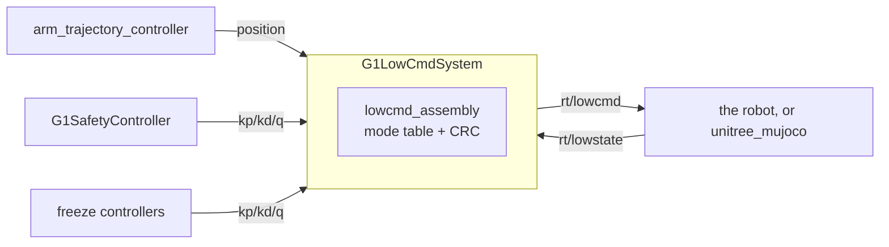

# g1_hardware_interface

`G1LowCmdSystem`: the `ros2_control` `SystemInterface` that owns all 29 G1 body motors over
`rt/lowcmd`, with no onboard balance running underneath. Adapted from NVIDIA's
`unitree_g1_ros2_control` (Apache-2.0) and kept close to it, so their controllers bind unchanged:
same SDK joint order, same `kp`/`kd` command-interface names, same mode branches, same IMU sensor
interface names.

`ament_cmake`, C++20. Not sim-specific: the same component targets the physical G1 and
`unitree_mujoco`.



It reaches the wire through unitree_sdk2's own CycloneDDS, not through ROS. `CMakeLists.txt` pins
`DT_RPATH` at the SDK's `lib/` because ROS's CycloneDDS has the same SONAME and a different ABI,
and binding both in one process corrupts the heap. ROS itself runs `rmw_fastrtps_cpp` image-wide
for the same reason.

## Layout

| File | Contents |
|---|---|
| `g1_lowcmd_system.{hpp,cpp}` | The plugin: parameters, lifecycle, SDK channels, mode switching, release ramp, diagnostics. |
| `lowcmd_assembly.{hpp,cpp}` | The `rt/lowcmd` mode table and per-motor packing. Pure, so the branches unit-test. |
| `motor_crc_hg.{hpp,cpp}` | Vendored CRC, byte-exact against Unitree's. |
| `g1_hardware_interface.xml` | pluginlib export. |

## Interfaces

Per joint: `position`, `velocity`, `effort`, `kp`, `kd` as commands; `position`, `velocity`,
`effort` as state. Plus an `imu` sensor with the ten fields `imu_sensor_broadcaster` expects.

Which command interfaces a controller claims decides the joint's mode. Earlier rows win:

| Claimed | Mode | What goes out |
|---|---|---|
| `kp` + `kd` | impedance | q, dq, tau, kp, kd all from the controller |
| `effort` | effort | q pinned to the measurement, kp forced to 0 |
| `position` | position | q from the controller, gains from `position_only_*` |
| nothing, or `velocity` alone | disabled | motor unpowered |

A non-finite command or measured position disables the motor for that tick rather than reaching
the wire.

**An unclaimed joint is unpowered, never held.** Holding is `g1_controllers/G1FreezeController`, a
runtime controller switch rather than component behaviour. That is why acquiring the arm has to be
one `switch_controller` call: two calls would leave the arm joints unclaimed in between, and the
arms would drop.

| Channel | Direction | Type |
|---|---|---|
| `rt/lowstate` | in | `unitree_hg::msg::dds_::LowState_` |
| `rt/lowcmd` | out | `unitree_hg::msg::dds_::LowCmd_` |
| `/diagnostics` | out | `diagnostic_msgs/msg/DiagnosticArray`, motor temperatures at 2 Hz |

The first two are SDK channels, not ROS topics, so they do not appear in `ros2 topic list`.

## Parameters

`<param>` tags on the `<ros2_control>` block, the only way a hardware plugin receives parameters.
Values are in `g1_description/config/lowcmd_params.yaml`.

| Parameter | Default | Meaning |
|---|---|---|
| `domain_id` | required | SDK DDS domain. Must match the simulator's and the hand components'. |
| `network_interface` | `""` | Must stay empty: a non-empty value makes the SDK discard `CYCLONEDDS_URI`. |
| `lowstate_timeout_ms` | required | `rt/lowstate` older than this errors the component while active. |
| `release_ramp_s` | required | Seconds over which stiffness fades to zero on release. |
| `release_kd` | required | Damping held through the release ramp. |
| `release_motion_mode` | `false` | Ask the onboard motion service to release the motors on activate. Hardware needs `true`, or `rt/lowcmd` is ignored. |
| `motor_temp_warn_threshold` | 120 | Winding temperature in °C at which `/diagnostics` reports WARN. |
| `position_only_kp` / `position_only_kd` | required, per joint | Gains for the position-only branch. |

Only the 14 arm joints reach the position-only branch, because `arm_trajectory_controller` claims
position alone: shoulders and elbows run 300/4, wrists 150/3. Nothing compensates gravity, so this
stiffness is what holds the arm up.

## Safety model

- Entry is a software call, not the L2+R2 debug mode: with `release_motion_mode`,
  `MotionSwitcherClient::ReleaseMode()` is retried until `CheckMode` reports no active mode, and
  activation fails if one survives.
- Activation waits up to 10 s for a first `rt/lowstate` and fails without one. Commands are seeded
  at the measured position with zero gains, so nothing moves until a controller supplies stiffness.
- State older than `lowstate_timeout_ms` errors the component while active, rather than commanding
  blind.
- Deactivate runs a damped release ramp, stiffness to zero over `release_ramp_s` with `release_kd`
  held, then sends a disabled frame. `on_error` and `on_shutdown` run the same path, because
  `controller_manager` does not guarantee `on_deactivate` runs before the process exits.

## Deviations from upstream

- Lock-free state path: a `realtime_tools::RealtimeBuffer` instead of a `shared_mutex` in
  `write()`, plus the staleness check.
- One preallocated `LowCmd_`, zeroed once, because the checksum covers the struct's padding.
- `std::bit_cast` into the checksum rather than a `uint32_t*` cast, which GCC 13 at `-O2`
  miscompiles by dropping `mode_pr` and `mode_machine` from the sum. The robot rejects those frames.
- The damped release ramp, where upstream drops the channel.
- Per-joint position-only gains from the URDF, where upstream hardcodes 10/1.
- The hands stay on `G1Dex3System`, one component per hand, so a hand fault cannot take the body
  down with it. Upstream folds them into this component.

## What simulation does not validate

- The `MotionSwitcherClient` handover: `release_motion_mode` is false in sim, and MuJoCo has no
  motion service.
- Handing control back to the onboard service afterwards. Assume it needs a reboot.
- Real motor temperatures.

## Tests

```bash
colcon test --packages-select g1_hardware_interface
```

None of these need a simulator.

| Test | Covers |
|---|---|
| `test_pluginlib_loading` | pluginlib discovery through the ament index, the path `controller_manager` uses. Also the canary for the SDK's `DT_RPATH`, since it dlopens the library. |
| `test_lowcmd_assembly` | Every mode branch: which fields each writes, the gains it substitutes, and the release frame. |
| `test_motor_crc_hg` | Which bytes the checksum covers, including `mode_pr`, `mode_machine` and the last motor slot, and that the CRC field itself is excluded. |

`g1_description`'s `test_motor_order` asserts this package's motor table still agrees with the
URDF, and `test_lowcmd_xacro` that the description hands it the parameters it requires.
End-to-end validation against a live simulator lives in `g1_bringup`'s `test_agile_walk` and
`g1_moveit_config`'s `test_moveit_lowcmd`.
