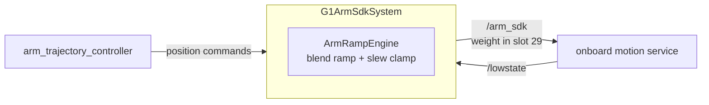

# g1_hardware_interface

Two `ros2_control` `SystemInterface` plugins, one per control mode. Exactly one may be loaded at
a time; `control_stack` in `g1_bringup` picks.

| Plugin | Channel | Owns |
|---|---|---|
| `G1LowCmdSystem` | `rt/lowcmd` | all 29 body motors, no onboard balance underneath |
| `G1ArmSdkSystem` | `rt/arm_sdk` | 14 arm joints + 3 waist, balance stays onboard |

`G1LowCmdSystem` is where the stack is heading; `G1ArmSdkSystem` is the path being replaced.
Also ships `g1_lowstate_joint_states`, which puts the legs and waist on `/joint_states` on the
arm_sdk path, because no controller owns them there.

`ament_cmake`, C++20. This is real hardware code and runs unchanged against the physical G1.



Commanding `rt/arm_sdk` rather than raw `/lowcmd` is what keeps the onboard controller balancing
the legs. The weight in motor slot 29 tells it how much of the arm command to honour.

## Layout

| File | Contents |
|---|---|
| `arm_ramp_engine.{hpp,cpp}` | Blend-weight ramping, per-joint slew clamping, motor-index validation, stale-feedback escalation. Pure and ROS-free, so it unit-tests directly. |
| `g1_arm_sdk_system.{hpp,cpp}` | The plugin: parameters, lifecycle, DDS I/O, `LowCmd` assembly, threading. |
| `lowstate_joint_states.{hpp,cpp}` | `LowState` motors 0-14 to `JointState`. Pure, so it tests without a graph. |
| `g1_lowstate_joint_states_node.cpp` | The node around it. See below. |
| `motor_crc_hg.{hpp,cpp}` | Vendored CRC, byte-exact against Unitree's. |
| `g1_lowcmd_system.{hpp,cpp}` | The whole-body plugin: SDK channels, mode switching, release ramp, diagnostics. |
| `lowcmd_assembly.{hpp,cpp}` | The `rt/lowcmd` mode table and per-motor packing. Pure, so the branches unit-test. |
| `g1_hardware_interface.xml` | pluginlib export for both plugins. |

## Interfaces

| Interface | Kind | Source |
|---|---|---|
| `position` | command | Position only. Velocity mode is reserved for a later Servo path. |
| `position` | state | `motor_state[i].q` |
| `velocity` | state | `motor_state[i].dq` |
| `effort` | state | `motor_state[i].tau_est` |

| Topic | Direction | Type | QoS |
|---|---|---|---|
| `/lowstate` | in | `unitree_hg/msg/LowState` | best-effort, keep-last(1), volatile |
| `/arm_sdk` | out | `unitree_hg/msg/LowCmd` | reliable, keep-last(1), volatile |
| `/joint_states` | out | `sensor_msgs/msg/JointState` | reliable, keep-last(1). `g1_lowstate_joint_states` only. |

## Parameters

| Parameter | Meaning |
|---|---|
| `command_publish_rate` | `/arm_sdk` publish rate, independent of `controller_manager`'s update rate. |
| `blend_ramp_up_s` | Weight eases 0 to 1 on activate. |
| `blend_ramp_down_s` | Weight eases 1 to 0 on a clean deactivate. |
| `emergency_ramp_down_s` | Faster ramp on stale feedback, error or shutdown. |
| `max_joint_velocity_rad_s` | Slew clamp per joint, independent of the weight ramp. |
| `lowstate_timeout_ms` | `/lowstate` age beyond this counts as stale. Blocks activation, and while active triggers the emergency ramp. |
| `waist_kp`, `waist_kd` | Gains the three waist motors are held at while the blend is up. Unitree's 4x-the-arms ratio applied to ours; unmeasured, see below. |

Values live in `g1_description/config/arm_sdk_params.yaml`.

## Running

The plugin loads through `controller_manager`, so it comes up with the stack:

```bash
ros2 launch g1_bringup bringup.launch.py
ros2 launch g1_bringup activate_arm.launch.py
```

Acquire and release order is mandatory. ros2_control ties command-interface availability to
hardware component state, so activating the controller before the component can fail the switch or
strand a controller claiming interfaces. The `activate_arm` and `deactivate_arm` scripts encode the order.

## Safety model

The component starts inactive and never commands anything until something activates it. Weight
ramps rather than snapping, in both directions, and a mid-ramp reversal is handled rather than
restarted. Every commanded joint is slew-clamped independently of the weight, so a large trajectory
step cannot become a large motion.

Stale `/lowstate` blocks activation outright, and while active it escalates to the emergency ramp.
The escalation is idempotent, so a flapping feedback stream cannot restart the ramp repeatedly.

The CRC is vendored to match Unitree's implementation bit for bit, pinned by a `static_assert` on
the message size. It computes exactly what the robot validates against, so it is not a place to
tidy up.

## The waist comes with the arms

`assembleLowCmd` writes the 14 arm motors, the 3 waist motors and the weight slot. The waist is
**held, not planned**: the component latches motors 12-14 at their measured position when the
blend engages, and commands that position at `waist_kp`/`waist_kd` for as long as it has
authority. No planning group changes; MoveIt never sees these joints.

`rt/arm_sdk` owns the arms *and* the waist. Unitree's own example
(`unitree_ros2` `example/src/src/g1/high_level/g1_arm_sdk_dds_example.cpp`) commands seventeen
motors -- its `G1Arm7JointIndex` list ends WAIST_YAW, WAIST_ROLL, WAIST_PITCH -- at four times
the arm gains, seeded from the measured `motor_state[idx].q` at the first LowState. This mirrors
that.

Leaving them out, which this used to do, sent `q=0, kp=0, kd=0` on those slots every tick. At
`weight = 1` that is a limp waist displacing whatever the onboard controller was holding, and it
matches what real-G1 users report: the robot "bending forward at the waist" when arms move under
`arm_sdk` (unitree_sdk2_python issues #146 and #173, the latter fixed by adding a waist command).

**Simulation still cannot prove this one, and the sim-side blend was deliberately not changed to
let it.** `g1_motion_service_sim`'s `assembleSimLowCmd` blends motors 15-28 only; 0-14 come whole
from the walking policy or the stiff-hold pose, so the simulator never reads the waist slots this
component now writes. Extending it would mean two owners for the waist in sim -- the policy drives
it through tens of degrees while walking -- and would change the gait to test a hardware-only
path. So the asymmetry stands: on the robot `/arm_sdk` hands the waist over, in simulation the
policy keeps it, and only the robot can show whether these gains are right. They are Unitree's
ratio applied to ours, not a measured value.

## Threading

| Thread | Does |
|---|---|
| `controller_manager` real-time thread | `read()` and `write()` only. `read()` drains the `/lowstate` buffer; `write()` throttles to `command_publish_rate` while ramp and slew state advance every tick from the real elapsed period. |
| Node executor thread | The `/lowstate` subscription. |
| `RealtimePublisher` thread | The DDS publish, decoupled by trylock, copy, publish. |

The real-time path does not allocate, block or throw.

## g1_lowstate_joint_states

A separate executable publishing `/joint_states` for the twelve leg joints and the three waist
joints, from `/lowstate`, at `publish_rate_hz` (100 Hz default, throttled on elapsed time
because `/lowstate` arrives at ~500 Hz on the robot and nearer 1 kHz in simulation).

`joint_state_broadcaster` only knows joints a `ros2_control` component exports, which on this
robot is the arms and the hands. Motors 0-14 belong to the onboard controller, so nothing
publishes them — and `robot_state_publisher` emits no transform at all for a joint it has never
received. The TF tree then comes up in two disconnected halves, `pelvis` in one and `torso_link`
in the other, taking `mid360_link`, `mid360_imu`, `d435_link` **and both arms** with it.

That is not cosmetic. `g1_state_estimation`'s LiDAR-inertial source looks up
`mid360_imu -> pelvis` on every sample, precisely because the waist moves; with the chain broken
the lookup fails forever and the source publishes no odometry at all. The Mid360's cloud stops
being transformable, so both Nav2 costmaps go blind, and MoveIt's `CurrentStateMonitor` never
sees a complete state.

Its own node rather than three more state interfaces on `G1ArmSdkSystem`, because the transform
has to exist for navigation with no arm component loaded. `robot_state_publisher` merges
`/joint_states` by joint name and the two joint sets are disjoint, so this and
`joint_state_broadcaster` coexist rather than compete.

**Hardware bring-up must run it**, not only the LiDAR-odometry launch that happens to start it
today. In simulation the same fifteen motors come from `g1_motion_service_sim`'s
`publish_non_arm_joint_states`, so running both there would double-publish — which is why
`control.launch.py` does not stage it and this has to be wired in deliberately.

```bash
ros2 run g1_hardware_interface g1_lowstate_joint_states
```

## Tests

None of these need a simulator.

| Test | Covers |
|---|---|
| `test_pluginlib_loading` | pluginlib discovery. |
| `test_arm_ramp_engine` | Weight monotonicity and slope both directions including a mid-ramp reversal, emergency ramp duration, slew clamp at the boundary, seed-from-measured, motor-index validation, idempotent staleness escalation. |
| `test_assemble_low_cmd` | Arm slots get exactly `q`/`kp`/`kd`, waist slots get the latched hold at the waist gains, the weight lands on slot 29, legs and hands stay zero, mode fields untouched. Also the round trip: the slots `waistHoldFrom` reads are the ones the command writes. |
| `test_lowstate_joint_states` | The `/lowstate` to `/joint_states` mapping: names in DDS motor order, positions off the matching slots, and that it stops at the waist rather than reaching joints `joint_state_broadcaster` owns. |

`g1_description`'s `test_motor_order` asserts this package's motor table still agrees with the
simulator's and that every name is a joint the URDF has.

```bash
colcon test --packages-select g1_hardware_interface
```

End-to-end validation against a live simulator lives in `g1_bringup`'s `test_sim_bringup` and
`test_arm_command`.


## G1LowCmdSystem

Adapted from NVIDIA's `unitree_g1_ros2_control`, and deliberately close to it so their controllers
bind unchanged: same SDK joint order, same `kp`/`kd` command-interface names, same mode branches,
same IMU sensor interface names.

### Interfaces

Per joint: `position`, `velocity`, `effort`, `kp`, `kd` as commands; `position`, `velocity`,
`effort` as state. Plus an `imu` sensor with the ten fields `imu_sensor_broadcaster` expects.

**`kp` and `kd` being command interfaces is the point.** Which ones a controller claims decides
the joint's mode for that tick:

| Claimed | Mode | What goes out |
|---|---|---|
| `kp` + `kd` | impedance | q, dq, tau, kp, kd all from the controller |
| `position` only | position | q from the controller, gains from `position_only_*` in the URDF |
| `effort` | effort | q pinned to the measurement, kp forced to 0 |
| nothing | disabled | motor unpowered |

An unclaimed joint is unpowered, never held. Holding is `g1_controllers/G1FreezeController`, so
the choice is a runtime controller switch rather than behaviour baked into the component.

### Where we differ from NVIDIA

- **Lock-free state path.** They take a `shared_mutex` in `write()`; we copy through a
  `realtime_tools::RealtimeBuffer`, and error out when `rt/lowstate` goes stale, which they do
  not check at all.
- **One preallocated `LowCmd_`, zeroed once.** The checksum covers the struct's padding, so their
  per-tick stack object checksums whatever the stack held.
- **`domain_id` 1 and an empty `network_interface`.** A non-empty interface makes the SDK discard
  `CYCLONEDDS_URI`, which is what pins the sim to loopback.
- **A damped release ramp on deactivate** rather than dropping the channel.
- **The Dex3 stays on `G1Dex3System`**, one component per hand, so a hand fault cannot take the
  body down with it. NVIDIA fold the hands into this component.

### What sim does not validate

The `MotionSwitcherClient` handover (`release_motion_mode` is false in sim, since MuJoCo has no
motion service), real motor temperatures, and whether control can be handed *back* to the onboard
service afterwards. Assume it cannot without a reboot.
