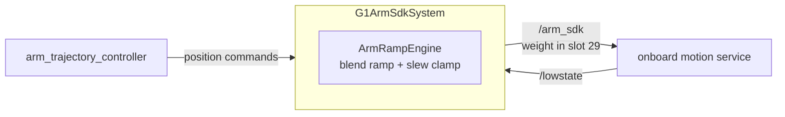

# g1_hardware_interface

A `ros2_control` `SystemInterface` plugin that bridges standard joint command and state interfaces
onto Unitree's weight-blended `rt/arm_sdk` DDS topic. Covers the 14 arm joints.

`ament_cmake`, C++20. This is real hardware code and runs unchanged against the physical G1.



Commanding `rt/arm_sdk` rather than raw `/lowcmd` is what keeps the onboard controller balancing
the legs. The weight in motor slot 29 tells it how much of the arm command to honour.

## Layout

| File | Contents |
|---|---|
| `arm_ramp_engine.{hpp,cpp}` | Blend-weight ramping, per-joint slew clamping, motor-index validation, stale-feedback escalation. Pure and ROS-free, so it unit-tests directly. |
| `g1_arm_sdk_system.{hpp,cpp}` | The plugin: parameters, lifecycle, DDS I/O, `LowCmd` assembly, threading. |
| `motor_crc_hg.{hpp,cpp}` | Vendored CRC, byte-exact against Unitree's. |
| `g1_hardware_interface.xml` | pluginlib export. |

## Interfaces

| Interface | Kind | Source |
|---|---|---|
| `position` | command | Position only. Velocity mode is reserved for a later Servo path. |
| `position` | state | `motor_state[i].q` |
| `velocity` | state | `motor_state[i].dq` |
| `effort` | state | `motor_state[i].tau_est` |

| Topic | Direction | Type | QoS |
|---|---|---|---|
| `/lowstate` | in | `unitree_hg/msg/LowState` | best-effort, keep-last(1), volatile |
| `/arm_sdk` | out | `unitree_hg/msg/LowCmd` | reliable, keep-last(1), volatile |

## Parameters

| Parameter | Meaning |
|---|---|
| `command_publish_rate` | `/arm_sdk` publish rate, independent of `controller_manager`'s update rate. |
| `blend_ramp_up_s` | Weight eases 0 to 1 on activate. |
| `blend_ramp_down_s` | Weight eases 1 to 0 on a clean deactivate. |
| `emergency_ramp_down_s` | Faster ramp on stale feedback, error or shutdown. |
| `max_joint_velocity_rad_s` | Slew clamp per joint, independent of the weight ramp. |
| `lowstate_timeout_ms` | `/lowstate` age beyond this counts as stale. Blocks activation, and while active triggers the emergency ramp. |

Values live in `g1_description/config/arm_sdk_params.yaml`.

## Running

The plugin loads through `controller_manager`, so it comes up with the stack:

```bash
ros2 launch g1_bringup bringup.launch.py
ros2 launch g1_bringup activate_arm.launch.py
```

Acquire and release order is mandatory. Humble ties command-interface availability to hardware
component state, so activating the controller before the component can fail the switch or strand a
controller claiming interfaces. The `activate_arm` and `deactivate_arm` scripts encode the order.

## Safety model

The component starts inactive and never commands anything until something activates it. Weight
ramps rather than snapping, in both directions, and a mid-ramp reversal is handled rather than
restarted. Every commanded joint is slew-clamped independently of the weight, so a large trajectory
step cannot become a large motion.

Stale `/lowstate` blocks activation outright, and while active it escalates to the emergency ramp.
The escalation is idempotent, so a flapping feedback stream cannot restart the ramp repeatedly.

The CRC is vendored to match Unitree's implementation bit for bit, pinned by a `static_assert` on
the message size. It computes exactly what the robot validates against, so it is not a place to
tidy up.

## The waist comes with the arms

`assembleLowCmd` writes the 14 arm motors, the 3 waist motors and the weight slot. The waist is
**held, not planned**: the component latches motors 12-14 at their measured position when the
blend engages, and commands that position at `waist_kp`/`waist_kd` for as long as it has
authority. No planning group changes; MoveIt never sees these joints.

`rt/arm_sdk` owns the arms *and* the waist. Unitree's own example
(`unitree_ros2` `example/src/src/g1/high_level/g1_arm_sdk_dds_example.cpp`) commands seventeen
motors -- its `G1Arm7JointIndex` list ends WAIST_YAW, WAIST_ROLL, WAIST_PITCH -- at four times
the arm gains, seeded from the measured `motor_state[idx].q` at the first LowState. This mirrors
that.

Leaving them out, which this used to do, sent `q=0, kp=0, kd=0` on those slots every tick. At
`weight = 1` that is a limp waist displacing whatever the onboard controller was holding, and it
matches what real-G1 users report: the robot "bending forward at the waist" when arms move under
`arm_sdk` (unitree_sdk2_python issues #146 and #173, the latter fixed by adding a waist command).

**Simulation still cannot prove this one, and the sim-side blend was deliberately not changed to
let it.** `g1_motion_service_sim`'s `assembleSimLowCmd` blends motors 15-28 only; 0-14 come whole
from the walking policy or the stiff-hold pose, so the simulator never reads the waist slots this
component now writes. Extending it would mean two owners for the waist in sim -- the policy drives
it through tens of degrees while walking -- and would change the gait to test a hardware-only
path. So the asymmetry stands: on the robot `/arm_sdk` hands the waist over, in simulation the
policy keeps it, and only the robot can show whether these gains are right. They are Unitree's
ratio applied to ours, not a measured value.

## Threading

| Thread | Does |
|---|---|
| `controller_manager` real-time thread | `read()` and `write()` only. `read()` drains the `/lowstate` buffer; `write()` throttles to `command_publish_rate` while ramp and slew state advance every tick from the real elapsed period. |
| Node executor thread | The `/lowstate` subscription. |
| `RealtimePublisher` thread | The DDS publish, decoupled by trylock, copy, publish. |

The real-time path does not allocate, block or throw.

## Tests

None of these need a simulator.

| Test | Covers |
|---|---|
| `test_pluginlib_loading` | pluginlib discovery. |
| `test_arm_ramp_engine` | Weight monotonicity and slope both directions including a mid-ramp reversal, emergency ramp duration, slew clamp at the boundary, seed-from-measured, motor-index validation, idempotent staleness escalation. |
| `test_assemble_low_cmd` | Non-arm slots stay zero, arm slots get exactly `q`/`kp`/`kd`, the weight lands on slot 29, mode fields untouched. |

```bash
colcon test --packages-select g1_hardware_interface
```

End-to-end validation against a live simulator lives in `g1_bringup`'s `test_sim_bringup` and
`test_arm_command`.
