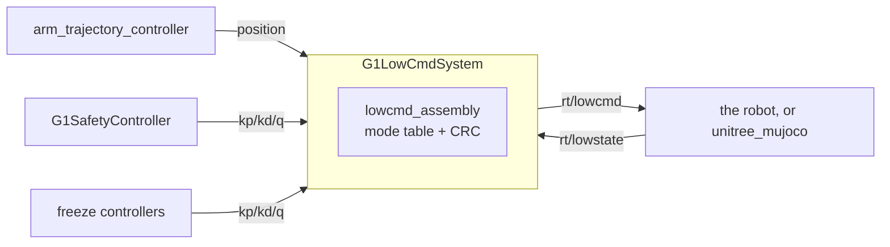

# g1_hardware_interface

`G1LowCmdSystem`: the `ros2_control` `SystemInterface` that owns all 29 G1 body motors over
`rt/lowcmd`, with **no onboard balance running underneath**. Adapted from NVIDIA's
`unitree_g1_ros2_control` (Apache-2.0), and deliberately close to it so their controllers bind
unchanged: same SDK joint order, same `kp`/`kd` command-interface names, same mode branches, same
IMU sensor interface names.

`ament_cmake`, C++20. This is real hardware code and runs unchanged against the physical G1.



It reaches the wire through **unitree_sdk2's own CycloneDDS**, not through ROS. That is why
`CMakeLists.txt` pins `DT_RPATH` at the SDK's `lib/`: ROS ships a newer CycloneDDS under the same
SONAME, and binding both in one process corrupts the heap. ROS itself runs `rmw_fastrtps_cpp`
image-wide for the same reason.

## Layout

| File | Contents |
|---|---|
| `g1_lowcmd_system.{hpp,cpp}` | The plugin: parameters, lifecycle, SDK channels, mode switching, release ramp, diagnostics. |
| `lowcmd_assembly.{hpp,cpp}` | The `rt/lowcmd` mode table and per-motor packing. Pure, so the branches unit-test. |
| `motor_crc_hg.{hpp,cpp}` | Vendored CRC, byte-exact against Unitree's. |
| `g1_hardware_interface.xml` | pluginlib export. |

## Interfaces

Per joint: `position`, `velocity`, `effort`, `kp`, `kd` as commands; `position`, `velocity`,
`effort` as state. Plus an `imu` sensor with the ten fields `imu_sensor_broadcaster` expects.

**`kp` and `kd` being command interfaces is the point.** Which ones a controller claims decides
the joint's mode for that tick:

| Claimed | Mode | What goes out |
|---|---|---|
| `kp` + `kd` | impedance | q, dq, tau, kp, kd all from the controller |
| `position` only | position | q from the controller, gains from `position_only_*` in the URDF |
| `effort` | effort | q pinned to the measurement, kp forced to 0 |
| nothing | disabled | motor unpowered |

**An unclaimed joint is unpowered, never held.** Holding is `g1_controllers/G1FreezeController`,
so the choice is a runtime controller switch rather than behaviour baked into the component. This
is why acquiring the arm has to be one `switch_controller` call: two calls would leave the arm
joints unclaimed in between, and the arms would drop.

| Channel | Direction | Type |
|---|---|---|
| `rt/lowstate` | in | `unitree_hg::msg::dds_::LowState_` |
| `rt/lowcmd` | out | `unitree_hg::msg::dds_::LowCmd_` |
| `/diagnostics` | out | `diagnostic_msgs/msg/DiagnosticArray`, motor temperatures |

These are SDK channels, not ROS topics, so they do not appear in `ros2 topic list`.

## Parameters

From `<param>` tags on the `<ros2_control>` block, which is the only way a hardware plugin ever
receives them. Values live in `g1_description/config/lowcmd_params.yaml`.

| Parameter | Meaning |
|---|---|
| `domain_id` | The SDK's own DDS domain. `dex3_params.yaml` must agree: `ChannelFactory` is per process and only its first `Init` applies. |
| `network_interface` | MUST stay empty. A non-empty value makes the SDK build an inline CycloneDDS config that discards `CYCLONEDDS_URI`, which is what pins the sim to loopback. |
| `lowstate_timeout_ms` | `rt/lowstate` age beyond this blocks activation, and errors the component while active. |
| `release_ramp_s` | Stiffness fades to zero over this on deactivate. |
| `release_kd` | Damping held flat across the release, so it outlives the stiffness. |
| `release_motion_mode` | Whether to ask the onboard motion service to hand over the motors. False in sim; hardware must set it true or `rt/lowcmd` is ignored. |
| `motor_temp_warn_threshold` | Degrees C, warned on `/diagnostics`. |

Per joint, `position_only_kp` / `position_only_kd` are used only on the position-only branch. The
14 arm joints are the ones that reach it, because `arm_trajectory_controller` claims position
alone; 10 was measured leaving them sagging ~0.4 rad under a lifting trajectory, so shoulders and
elbows run 40 and the lighter wrists 25.

## Safety model

- **Entry is a software call, not the L2+R2 debug mode.** `MotionSwitcherClient::ReleaseMode()` in
  a retry loop until `CheckMode` reports no active mode.
- **Refuses to activate without fresh feedback.** No `rt/lowstate` inside the timeout and
  `on_activate` fails rather than commanding from a stale measurement.
- **Errors out when state goes stale while active**, rather than continuing to command blind.
- **A damped release ramp on deactivate**: stiffness to zero over `release_ramp_s` with damping
  held, rather than dropping the channel and letting the robot fall.
- `on_error` and `on_shutdown` run the same shutdown path, because `controller_manager` does not
  guarantee `on_deactivate` runs before the process goes away and this is the only channel
  holding the robot up.

## Where we differ from NVIDIA

- **Lock-free state path.** They take a `shared_mutex` in `write()`; we copy through a
  `realtime_tools::RealtimeBuffer`, and error out when `rt/lowstate` goes stale, which they do
  not check at all.
- **One preallocated `LowCmd_`, zeroed once.** The checksum covers the struct's padding, so their
  per-tick stack object checksums whatever the stack held.
- **`std::bit_cast` into the checksum, not a `uint32_t*` cast.** GCC 13 at `-O2` acts on the
  aliasing violation and silently drops `mode_pr` and `mode_machine` from the covered range;
  `mode_machine` carries 5 on this robot, so every frame would be rejected. `test_motor_crc_hg`
  pins it.
- **A damped release ramp on deactivate** rather than dropping the channel.
- **The Dex3 stays on `G1Dex3System`**, one component per hand, so a hand fault cannot take the
  body down with it. NVIDIA fold the hands into this component.

## What sim does not validate

The `MotionSwitcherClient` handover (`release_motion_mode` is false in sim, since MuJoCo has no
motion service), real motor temperatures, and whether control can be handed *back* to the onboard
service afterwards. **Assume it cannot without a reboot.**

## Tests

None of these need a simulator.

| Test | Covers |
|---|---|
| `test_pluginlib_loading` | pluginlib discovery through the ament index, the path `controller_manager` uses. |
| `test_lowcmd_assembly` | Every mode branch: which fields each one writes, the gains it substitutes, and the release frame. |
| `test_motor_crc_hg` | Which bytes the checksum covers, including the two the strict-aliasing bug dropped, the last motor slot, and that the CRC field itself is excluded. |

`g1_description`'s `test_motor_order` asserts this package's motor table still agrees with the
URDF, and `test_lowcmd_xacro` that the description hands it the parameters it requires.

```bash
colcon test --packages-select g1_hardware_interface
```

End-to-end validation against a live simulator lives in `g1_bringup`'s `test_agile_walk` and
`g1_moveit_config`'s `test_moveit_lowcmd`.
