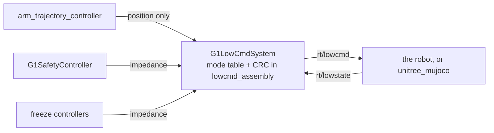

# g1_hardware_interface

`G1LowCmdSystem`: the `ros2_control` `SystemInterface` that owns all 29 G1 body motors over
`rt/lowcmd`, with no onboard balance running underneath. Adapted from NVIDIA's
`unitree_g1_ros2_control` ([isaac_ros_robots](https://github.com/NVIDIA-ISAAC-ROS/isaac_ros_robots),
Apache-2.0) and kept close to it, so their controllers bind unchanged: same SDK joint order, same
`kp`/`kd` command-interface names, same mode branches, same IMU interface names.

`ament_cmake`, C++20. Not sim-specific: the same component targets the physical G1 and
`unitree_mujoco`.


```mermaid
flowchart LR
    JTC["arm_trajectory_controller"] -- "position only" --> P["G1LowCmdSystem<br/>mode table + CRC in lowcmd_assembly"]
    SAFE["G1SafetyController"] -- "impedance" --> P
    FRZ["freeze controllers"] -- "impedance" --> P
    P -- "rt/lowcmd" --> R["the robot, or unitree_mujoco"]
    R -- "rt/lowstate" --> P
```

It reaches the wire through unitree_sdk2's own CycloneDDS, not through ROS. `CMakeLists.txt` pins
`DT_RPATH` at the SDK's `lib/` because ROS's CycloneDDS has the same SONAME and a different ABI.
ROS itself runs `rmw_fastrtps_cpp` image-wide for the same reason.

## Layout

| File | Contents |
|---|---|
| `g1_lowcmd_system.{hpp,cpp}` | The plugin: parameters, lifecycle, SDK channels, mode switching, release ramp, diagnostics. |
| `lowcmd_assembly.{hpp,cpp}` | The `rt/lowcmd` mode table and per-motor packing. Pure, so the branches unit-test. |
| `motor_crc_hg.{hpp,cpp}` | Unitree's CRC32 loop from [unitree_ros2](https://github.com/unitreerobotics/unitree_ros2) (BSD-3-Clause), vendored with the algorithm unchanged. |
| `g1_hardware_interface.xml` | pluginlib export. |

## Interfaces

Per joint: `position`, `velocity`, `effort`, `kp`, `kd` as commands; `position`, `velocity`,
`effort` as state. Plus an `imu` sensor with the ten fields `imu_sensor_broadcaster` expects.

Which command interfaces a controller claims decides the joint's mode. Earlier rows win:

| Claimed | Mode | What goes out |
|---|---|---|
| `kp` + `kd` | impedance | q, dq, tau, kp, kd all from the controller |
| `effort` | effort | q pinned to the measurement, kp forced to 0 |
| `position` | position | q from the controller, gains from `position_only_*` |
| nothing, or `velocity` alone | disabled | motor unpowered |

A non-finite command or measured position disables the motor for that tick rather than reaching
the wire.

Only this component writes `rt/lowcmd`. Ownership goes through controller claims, one controller
per joint, and a joint no controller claims is unpowered, never held. Holding is
`g1_controllers/G1FreezeController`, a controller switch rather than component behaviour, so
acquiring the arm has to be one `switch_controller` call: two would leave the arm joints unclaimed
in between, and the arms would drop.

| Channel | Direction | Type |
|---|---|---|
| `rt/lowstate` | in | `unitree_hg::msg::dds_::LowState_` |
| `rt/lowcmd` | out | `unitree_hg::msg::dds_::LowCmd_` |
| `/diagnostics` | out | `diagnostic_msgs/msg/DiagnosticArray`, one status per joint with its surface and winding temperature, at 2 Hz |

The first two are SDK channels, not ROS topics, so they do not appear in `ros2 topic list`.

## Parameters

`<param>` tags in the URDF's `<ros2_control>` block, expanded from
`g1_description/config/lowcmd_params.yaml`. `on_init` fails on a missing required value, or a
timeout, ramp or damping that is not above zero.

| Parameter | Default | Shipped | Meaning |
|---|---|---|---|
| `domain_id` | required | 1 | SDK DDS domain. Must match the simulator's and the hand components'. |
| `network_interface` | `""` | `""` | Must stay empty: a non-empty value makes the SDK discard `CYCLONEDDS_URI`. |
| `lowstate_timeout_ms` | required | 100 | `rt/lowstate` older than this errors the component while active. |
| `release_ramp_s` | required | 0.5 | Seconds over which stiffness fades to zero on release. |
| `release_kd` | required | 2.0 | Damping held through the release ramp. |
| `release_motion_mode` | `false` | `false` | Ask the onboard motion service to release the motors on activate. Hardware needs `true`, or `rt/lowcmd` is ignored. |
| `motor_temp_warn_threshold` | 120 | 120 | Winding temperature in °C at which `/diagnostics` reports WARN. |
| `position_only_kp` / `position_only_kd` | required, per joint | kp/kd 10/1 legs and waist, 300/4 shoulders and elbows, 150/3 wrists | Gains for the position-only branch. |

Only the 14 arm joints reach the position-only branch, because `arm_trajectory_controller` claims
position alone. Nothing compensates gravity, so their stiffness is what holds the arm up. On
hardware, 0.1 rad of error asks 30 Nm of a shoulder and 15 Nm of a wrist, above the URDF's 25 Nm
and 5 Nm (wrist pitch and yaw) limits: check them before running on the robot.

## Safety model

- Entry is a software call, not the L2+R2 debug mode: with `release_motion_mode`,
  `MotionSwitcherClient::ReleaseMode()` is retried until `CheckMode` reports no active mode, and
  activation fails if one survives.
- Activation waits up to 10 s for a first `rt/lowstate` and fails without one. Commands are seeded
  at the measured position with zero gains, so nothing moves until a controller supplies
  stiffness.
- Deactivate runs a damped release ramp, stiffness to zero over `release_ramp_s` with `release_kd`
  held, then sends a disabled frame. `on_error` and `on_shutdown` run the same path, because
  `controller_manager` does not guarantee `on_deactivate` runs before the process exits.

## Deviations from upstream

- A `RealtimeBuffer` instead of a `shared_mutex` in `write()`, plus a staleness check.
- One preallocated `LowCmd_`, zeroed once, because the checksum covers the struct's padding.
- `std::bit_cast` into the checksum rather than a `uint32_t*` cast: at `-O2`, GCC 13 treats the
  cast as non-aliasing and drops `mode_pr` and `mode_machine` from the sum, and the firmware
  ignores a frame with a wrong checksum.
- The damped release ramp, where upstream drops the channel.
- Per-joint position-only gains from the URDF, where upstream hardcodes 10/1.
- The hands are separate `G1Dex3System` components, one per hand
  ([g1_hand_interface](../g1_hand_interface/README.md)); upstream folds them into this one.

## Running

```bash
ros2 launch g1_bringup sim.launch.py
```

`control.launch.py` loads the component from `g1_lowcmd.urdf.xacro`, and `unitree_mujoco` answers
`rt/lowstate` and `rt/lowcmd` as the robot does. `ros2 control list_hardware_components` shows
`G1LowCmdSystem` active.

## What simulation does not validate

- The `MotionSwitcherClient` handover: `release_motion_mode` is false, and MuJoCo has no motion
  service.
- Handing control back to the onboard service afterwards. Assume it needs a reboot.
- Real motor temperatures, which the simulator does not report.

## Tests

```bash
./scripts/manage.sh test g1_hardware_interface   # none of these needs a simulator
```

| Test | Covers |
|---|---|
| `test_pluginlib_loading` | pluginlib discovery through the ament index, the path `controller_manager` uses. Also the canary for the SDK's `DT_RPATH`, since it dlopens the library. |
| `test_lowcmd_assembly` | Mode resolution from claims, what each mode branch writes and the gains it substitutes, and the release frame. |
| `test_motor_crc_hg` | Which bytes the checksum covers (`mode_pr`, `mode_machine`, every motor field and the last word before the CRC), that the CRC field itself is excluded, and that struct padding cannot change the sum. |

`g1_description`'s `test_motor_order` and `test_lowcmd_xacro` check the motor table and the body
joints' interfaces against the URDF. `g1_bringup`'s `test_agile_walk` and `g1_moveit_config`'s
`test_moveit_lowcmd` run the component against the simulator. Both need
`./scripts/manage.sh test --sim <package>`, which runs every simulator suite in that package.
