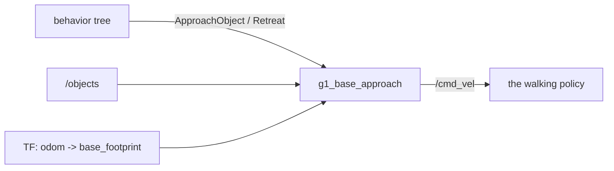

# g1_locomotion

Closes the gap between navigation and manipulation. Nav2 parks within 0.5 m of its goal and the
arm's reach window is about 0.11 m wide, so `g1_base_approach` walks the last stretch against the
measured object, and backs the robot out again afterwards. `ament_cmake`, C++20.



It writes `/cmd_vel`, the topic Nav2 writes; the mission tree never runs the two together. It
lives here because everything that writes a velocity belongs to the package that owns that path.

## Interfaces

| Interface | Direction | Type |
|---|---|---|
| `~/approach_object` | action | `g1_msgs/action/ApproachObject` |
| `~/retreat` | action | `g1_msgs/action/Retreat` |
| `/objects` | in | `vision_msgs/msg/Detection3DArray`, sensor QoS |
| `/cmd_vel` | out | `geometry_msgs/msg/Twist` (`cmd_vel_topic`) |

`ApproachObject` walks until the object sits in the arm's reach window. `Retreat` reverses straight
back by a set distance, at most 2 m, without turning. One goal runs at a time across both actions.

## Control law

One closed loop over forward, lateral and yaw at `cmd_rate_hz`, judged in the base frame, which is
where the arm's reach is defined. The walking policy has a deadband on both linear axes:

| commanded (m/s) | delivered v_x | delivered v_y |
|---|---|---|
| 0.10 | 0.016 | 0.007 |
| 0.20 | 0.123 | 0.083 |
| 0.30 | 0.208 | 0.201 |
| 0.40 | 0.329 | 0.301 |

So each linear axis is proportional with a floor (`min_speed_x_mps`, `min_speed_y_mps`), and exactly
zero inside its tolerance. Yaw has no deadband and no floor; it holds the working heading while
closing but is not part of arriving. Overshooting is recoverable, since the gait reverses; only an
object under the robot's footprint (`min_forward_m`) ends the goal. On arrival the node holds zero
for `settle_s`, re-measures, and closes again if the robot coasted out of the window.

The last sighting of each object counts for `object_timeout_ms`, because the props stand still and
the last half metre to the storage bench is blind: the hand carrying the ball hides the box.

## Parameters

`config/g1_base_approach.yaml` documents each one. The ones most likely to need changing:

| Parameter | Default | |
|---|---|---|
| `target_x_m`, `target_y_m` | 0.300, -0.220 | Where the object has to end up, in the base frame. y mirrors for the left arm. |
| `forward_tolerance_m`, `lateral_tolerance_m` | 0.030, 0.040 | How close each axis has to get. |
| `standoff_object_ids`, `standoff_target_x_m` | `[brown_box]`, `[0.350]` | Objects reached over rather than onto, approached from further back. |
| `min_speed_x_mps`, `min_speed_y_mps` | 0.20, 0.25 | Speed floors, set by the gait's deadband. |
| `object_timeout_ms` | 30000 | How old a sighting may be. |
| `lookup_grace_s` | 5.0 | How long a missing pose or transform is waited out, standing still. |

The speed limits belong to the walking policy and need re-measuring for a different one; the reach
window belongs to the arm and carries to hardware.

## Tests

```bash
colcon test --packages-select g1_locomotion
```

`test_approach_planner` covers the control law without a simulator: the floor that makes it
converge, the caps, all axes at once, signs, heading held but not required, recoverable and
terminal overshoot, and the limits it refuses.
