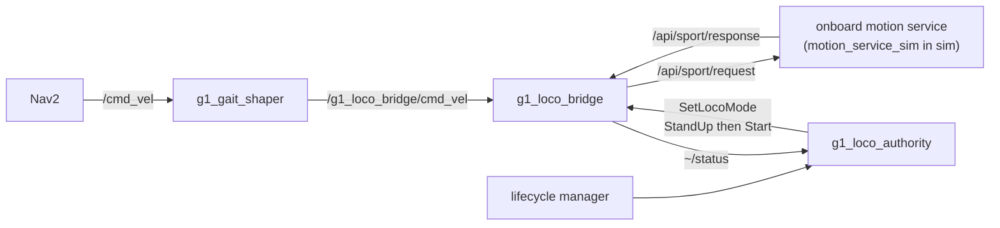

# g1_locomotion

The G1's LocoClient bridge, plus the two nodes that make a planner's velocity output usable by the
real gait. Everything here carries to hardware unchanged.

`ament_cmake`, C++20.



## Nodes

| Node | Kind | Purpose |
|---|---|---|
| `g1_loco_bridge` | lifecycle | Turns `Twist` and `SetLocoMode` goals into vendor JSON requests, correlates the async responses, and re-issues velocity so the robot keeps moving. |
| `g1_gait_shaper` | plain | Collapses a planner's continuous velocity onto the three motions this gait can actually produce. |
| `g1_loco_authority` | lifecycle | Acquires locomotion authority on activate and releases it on the way out. |

## Interfaces

| Name | Direction | Type |
|---|---|---|
| `/g1_loco_bridge/cmd_vel` | in | `geometry_msgs/msg/Twist` |
| `/g1_loco_bridge/set_mode` | action | `g1_msgs/action/SetLocoMode` |
| `/g1_loco_bridge/status` | out | `g1_msgs/msg/LocoStatus`, reliable and transient-local |
| `/api/sport/request` | out | `unitree_api/msg/Request` |
| `/api/sport/response` | in | `unitree_api/msg/Response` |
| `/cmd_vel` | in | `geometry_msgs/msg/Twist`, the shaper's input |

## Running

The bridge comes up with the rest of the stack:

```bash
ros2 launch g1_bringup bringup.launch.py
```

Reach `Start` before commanding any velocity. Outside `Start` the responder rejects velocity and
nothing reaches the legs:

```bash
ros2 action send_goal /g1_loco_bridge/set_mode g1_msgs/action/SetLocoMode "{fsm_id: 4}"    # StandUp
ros2 action send_goal /g1_loco_bridge/set_mode g1_msgs/action/SetLocoMode "{fsm_id: 500}"  # Start
ros2 topic pub /g1_loco_bridge/cmd_vel geometry_msgs/msg/Twist "{linear: {x: 0.6}}"
```

Under navigation, `g1_loco_authority` does the two transitions itself and the shaper feeds the
bridge, so none of the above is needed.

## The gait shaper

The simulated gait has a hard initiation dead zone with no hysteresis, so the usable action set has
three elements: stop, drive straight, turn in place. `GaitShaper` reduces Nav2's continuous output
onto exactly those.

It is subtractive only. Every output is the input unchanged, the input clamped smaller, or zero,
never larger. That invariant is swept as a property test rather than spot-checked, because turning
a small command into a large motion is what this stack's control-mode rules exist to prevent.

Yaw is tested first, so a command carrying both becomes a pure turn. Forward is compared signed, so
any negative `vx` becomes zero at any magnitude; reverse measures well inside the dead zone anyway,
and this is why a misconfigured recovery behaviour cannot produce a reverse lurch.

The dead zone belongs to the simulated walking policy, not the real G1's onboard controller, which
has no such gap. That is why the shaper lives here and not in Nav2 tuning: hardware bring-up simply
does not launch it.

`config/g1_gait_shaper.yaml`:

| Parameter | Default | Meaning |
|---|---|---|
| `fwd_engage` | `0.45` | Forward speeds below this become a stop. |
| `yaw_engage` | `1.20` | Yaw rates below this become a stop. |
| `yaw_clamp` | `1.57` | Ceiling on the turn that is passed through. |

The constructor rejects a configuration it cannot honour, including `yaw_clamp` below `yaw_engage`,
which would make turning unreachable while still reporting a turn.

## The authority bracket

A planner publishes velocity and nothing else. It has no way to send the `SetLocoMode` goals the
bridge needs first, so `g1_loco_authority` is that missing step, expressed as a lifecycle
transition: active means the robot is walk-capable, inactive means authority has been handed back.

It releases on deactivate, shutdown, error, a failed activate, and on a process signal. Without it
the bridge silently discards `cmd_vel`, Nav2 sends no goal, and the whole stack looks healthy while
the robot never moves.

It deliberately does not auto-acquire on the first `cmd_vel`. That is implicit acquisition, and a
stray publisher would stand the robot up and walk it.

| Parameter | Default | Meaning |
|---|---|---|
| `acquire_timeout_s` | `5.0` | Matches the bridge's own request timeout. |
| `settle_after_start_s` | `2.5` | The gait is not responsive the instant `Start` returns. |
| `set_mode_action` | `/g1_loco_bridge/set_mode` | A parameter, not a remap. Remapping does not reach the action client on Humble. |

## Configuration

`config/g1_loco_bridge.yaml` carries the velocity re-issue period, the request timeout, the axis
signs and the per-axis maxima. The axis signs and maxima are simulator properties, in the same way
the shaper's thresholds are.

## Tests

| Test | Needs a simulator | Covers |
|---|---|---|
| `test_loco_payloads` | no | Exact JSON wire payloads and the parser. |
| `test_loco_correlator` | no | Overlapping and out-of-order requests, sweep timeouts, the orphaned-response race, the pending bound. |
| `test_velocity_gate` | no | Re-issue cadence, stale and zero-command idling, the failure-streak release, the authority state machine. |
| `test_gait_shaper` | no | The dead zone, primitive exclusivity, the signed-forward asymmetry, the never-amplifies invariant, config validation. |
| `test_loco_bridge_node` | no | The node itself against a fake responder on an isolated domain. |
| `test_authority_release` | no | An acquire that fails after the bridge already believes authority is held. |

```bash
colcon test --packages-select g1_locomotion
```

Nothing here needs a simulator. `g1_bringup`'s `test_loco` validates the wiring between this bridge
and a real responder over DDS.
