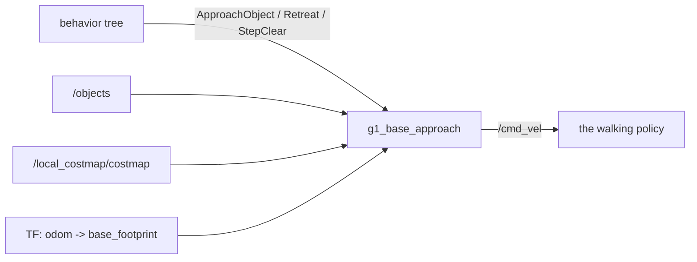

# g1_locomotion

Closes the gap between navigation and manipulation. Nav2 parks within 0.5 m of its goal, wider than
the arm's reach window, so `g1_base_approach` walks the last stretch against the measured object,
and backs the robot out again afterwards. It also steps the robot out of Nav2's collision band when
the gait has drifted it there. `ament_cmake`, C++20.


```mermaid
flowchart LR
    BT["behavior tree"] -- "ApproachObject / Retreat / StepClear" --> BA["g1_base_approach"]
    OBJ["/objects"] --> BA
    CM["/local_costmap/costmap"] --> BA
    TF["TF: odom -> base_footprint"] --> BA
    BA -- "/cmd_vel" --> POL["the walking policy"]
```

It writes `/cmd_vel`, the topic Nav2 writes; the mission tree never runs the two together.

## Interfaces

| Interface | Direction | Type |
|---|---|---|
| `~/approach_object` | action | `g1_msgs/action/ApproachObject` |
| `~/retreat` | action | `g1_msgs/action/Retreat` |
| `~/step_clear` | action | `g1_msgs/action/StepClear` |
| `/local_costmap/costmap` | in | `nav_msgs/msg/OccupancyGrid`, latched (`step_clear.costmap_topic`) |
| `/objects` | in | `vision_msgs/msg/Detection3DArray`, sensor QoS |
| `/cmd_vel` | out | `geometry_msgs/msg/Twist` (`cmd_vel_topic`) |

`ApproachObject` walks until the object sits in the arm's reach window. `Retreat` reverses straight
back by a set distance, at most 2 m, without turning. `StepClear` takes a clearance of at most
0.7 m. One goal runs at a time across all three.

## Stepping clear

Nav2 checks a 0.45 m circle, wider than the body because the gait drifts sideways. With furniture
inside that radius every Nav2 motion, spin included, refuses to start, though the body is still
clear of it. `StepClear` gets the robot out: from the local costmap's lethal cells it picks the
straight step, forward or backward, that reaches the goal's clearance soonest, trading distance
against turning (`turn_cost_m_per_rad`) and never passing nearer anything than `body_radius_m`. It
turns in place, walks the step, and stops early once clear. Already clear, it succeeds without
moving; boxed in, it fails without moving.

## Control law

One closed loop over forward, lateral and yaw at `cmd_rate_hz`, judged in the base frame, which is
where the arm's reach is defined. The walking policy has a deadband on both linear axes, measured
against MuJoCo:

| commanded (m/s) | delivered v_x | delivered v_y |
|---|---|---|
| 0.10 | 0.016 | 0.007 |
| 0.20 | 0.123 | 0.083 |
| 0.30 | 0.208 | 0.201 |
| 0.40 | 0.329 | 0.301 |

So each linear axis is proportional with a floor (`min_speed_x_mps`, `min_speed_y_mps`) and a
ceiling (`max_speed_x_mps`, `max_speed_y_mps`), and exactly zero inside its tolerance. Yaw has no
deadband and no floor; beyond `heading_tolerance_rad` it holds the working heading while closing,
and it is not part of arriving. Overshooting is recoverable, since the gait reverses; only an
object under the robot's footprint (`min_forward_m`) ends the goal. On arrival the node holds zero
for `settle_s`, re-measures, and closes again if the robot coasted out of the window.

Stopped, the pelvis comes back over the feet, so a settled object reads 20 to 70 mm further than
it did on the move: up to `settle_slack_m` beyond the window's far edge it counts as in reach,
while the near edge, where the pregrasp has no IK, has no slack. Just outside the window
sideways, a 0.15 s pulse at the floor speed (18 to 31 mm, measured) nudges the object in; forward
the same pulse moves 3 to 7 mm, under the measurement's own scatter.

## Parameters

Values are from `config/g1_base_approach.yaml`, which documents each one. The ones most likely to
need changing:

| Parameter | Value | Meaning |
|---|---|---|
| `target_x_m`, `target_y_m` | 0.315, -0.220 | Where the object has to end up, in the base frame. y mirrors for the left arm. |
| `forward_tolerance_m`, `lateral_tolerance_m` | 0.030, 0.040 | How close each axis has to get. |
| `standoff_object_ids`, `standoff_target_x_m` | `[brown_box, tray_1]`, `[0.350, 0.350]` | Objects reached over rather than onto, approached from further back. |
| `min_speed_x_mps`, `min_speed_y_mps` | 0.20, 0.25 | Speed floors, set by the gait's deadband. |
| `settle_slack_m` | 0.040 | How far beyond the window's far edge a stopped robot may find the object. |
| `nudge_band_m`, `nudge_y_s`, `max_nudges` | 0.050, 0.15, 12 | How far outside the window sideways an object is nudged in rather than driven, the pulse, and how many before driving again. |
| `object_timeout_ms` | 30000 | How old an object's last sighting may be. Long, because the props stand still and the hand carrying the ball hides the box for the last half metre to the storage bench. |
| `lookup_grace_s` | 5.0 | How long a missing pose or transform is waited out, standing still. |

The speed limits belong to the walking policy and need re-measuring for a different one; the reach
window belongs to the arm.

## Running

`g1_navigation`'s `nav2.launch.py` starts the node with `config/g1_base_approach.yaml`, so
`nav:=true` brings it up:

```bash
ros2 launch g1_bringup bringup.launch.py mode:=localization nav:=true
```

`./scripts/demos/pick-and-place.sh mission` runs `ApproachObject` and `Retreat` in the mission tree,
and the exploration tree in [world-model.md](../../../docs/guides/world-model.md) calls `StepClear`
before each walk and turn.

## Tests

```bash
./scripts/manage.sh test g1_locomotion   # neither test needs a simulator
```

| Test | Covers |
|---|---|
| `test_approach_planner` | The control law: the floor that makes it converge, the caps, all axes at once, signs, heading held but not required, recoverable and terminal overshoot, and the limits it refuses; the settle slack's far side only, and the sideways nudge's sign and band. |
| `test_step_clear` | The step search on hand-built obstacle layouts: already clear, a wall beside, a wall ahead, a corner, a post, and a robot boxed in. |
