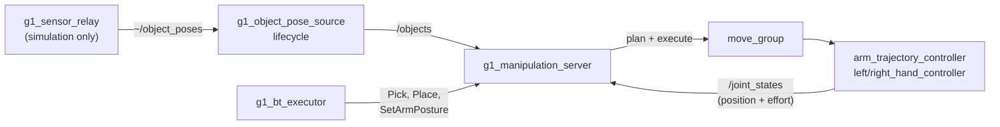

# g1_manipulation

Pick and place, served as actions over MoveIt, plus the node that decides where object poses are
allowed to come from.

`ament_cmake`, C++20. Two nodes.



That last edge is the grip check: the fingers hold an object by friction, and their own positions
and efforts are the only evidence that they have one.

The server adds no command path. It is another client of `move_group`, which is another client
of the controllers that already own the arm joints and the hand channels, so every low-level
channel keeps exactly one writer.

It also takes no control authority. The arm and hands must already be acquired before a goal
will execute, and releasing them is the caller's job. For a mission that is `g1_orchestration`'s
executor, which brackets the whole run: a skill that acquired per goal would hand the hands back
between pick and place and drop what it was carrying.

## Where object poses come from

`g1_object_pose_source` is the boundary between manipulation and perception. Skills consume
`/objects` and never learn which source filled it.

| `object_source` | Behaviour |
|---|---|
| `sim_ground_truth` | MuJoCo body poses, sampled inside the simulator and carried out by `g1_sensor_relay`. Exact: no noise, no occlusion, no misdetection. |
| `perception` | Poses measured by `g1_perception` from the camera, in simulation or on hardware. `bringup.launch.py perception:=true` selects it. |
| `hardware` (default) | **Refuses to configure.** The robot has no detector of its own; use `perception`. |

`hardware` is the default deliberately, matching `g1_state_estimation`'s odometry source: a
bring-up that forgets to say what it has must fail visibly rather than feed a grasp planner
simulator ground truth it cannot tell from a measurement. The stream the node reads follows
`object_source` in `manipulation.launch.py`, so the two cannot disagree.

`/objects` is `vision_msgs/Detection3DArray` in `odom`, carrying a pose and a bounding box per
object. The box is what the server builds its collision geometry from, so replacing the source
with a real detector changes nothing downstream.

## Actions

| Action | Goal | Notes |
|---|---|---|
| `~/pick` | `object_id`, `arm` | No pose in the goal: it is read from `/objects` when the goal starts, so a retry re-reads rather than replaying. |
| `~/place` | `surface_object_id` **or** `pose`, `arm` | Prefer the surface: it is read from `/objects` and the object is stood on top of it. A `pose` is where the **object** ends up, not the hand, transformed into the planning frame on arrival. |
| `~/set_arm_posture` | `group`, `named_target` | Named SRDF poses only. |

`Pick` and `Place` publish a phase as feedback and name that phase in the result on failure.
Every `Pick` failure path leaves the hand open and nothing attached, so a retry starts from a
defined state rather than part-way into a grasp, which is what makes the behavior tree's retry
meaningful rather than a replay.

## Where the hand grips

Not a number in this package. `{side}_hand_grasp_frame` is a link in `g1_description`, and pose
goals are given for that frame, so nothing here does offset arithmetic.

The palm link's origin is not the point the fingers close on. At the SRDF's `closed` posture the
Dex3's fingers curl toward the palm's **+y**, and the frame sits at palm (0.090, ±0.050, 0).
Planning to the palm origin puts the object through the fingers. Because it is a frame, checking it
is a matter of looking at it in RViz:

```bash
ros2 run tf2_ros tf2_echo right_hand_palm_link right_hand_grasp_frame
```

That the fingers close toward +y is also why `grasp_rpy` is a **roll**: it is the roll that turns
the closing axis toward the floor for a grasp off a table, and pitching the palm instead produces
poses with no IK anywhere useful.

### The hand's own envelope decides what it can pick up

Both of the frame's coordinates are bounded on two sides, measured in MuJoCo by sweeping the thumb
over its whole joint box rather than estimated:

| bound | value | what sets it |
|---|---|---|
| nearest the object may sit | palm x 0.046 | the retracted thumb's own surface at `pinch_ready`; nearer than this and the hand descends through the object |
| furthest it may sit | palm x 0.091 | how far the thumb swings out at `closed`; further and it never reaches |
| how far below the frame the hand hangs | 63 mm | the retracted thumb again, which is the lowest point of the whole hand |

So this frame takes objects **20 to 75 mm across**, and only at least **70 mm tall** — below that
the thumb arrives at the table before the object. A cube has to satisfy both at once, which is why
the props are 70 mm and not the 60 they were.

### Vertically it grips below the top face

Horizontally the grasp frame goes straight to the object. Vertically it aims below the top face, so
the fingers close around the object instead of on top of it, and the two parameters are the two
bounds above turned into numbers:

- `grasp_depth_below_top_m` (0.020), down from the top face, using the height the pose source
  reports in its bounding box. Capped by the palm: the frame is only 26 mm clear of the palm's own
  face, so a deeper grip drives the palm into the top of the object.
- `min_grip_height_m` (0.068), up from whatever the object stands on, and it wins when the two
  disagree. This is the 63 mm hang plus a margin.

`Place` mirrors the same function, reading the held object's height back out of the attached
collision object, so an object is released at the same relative height it was grasped at.

### The arm does not stop where it is told

Position-only, no gravity feed-forward: at the `lowcmd_params.yaml` gain of kp 40 the right
shoulder settles about 0.09 rad short of its target under the arm's own weight, which is roughly
40 mm at the hand. That is wider than the whole grip, and it is why a weld-based pick could look
like it worked while the hand was never near the object.

Rather than raise a gain the balance controller shares, the skill measures and corrects:

- `settleOnPose` at the **pregrasp** and at the **preplace**, in clear air, re-commanding the
  residual TF reports until the frame is within `settle_tolerance_m`.
- `descendOnto` onto the **grasp** and onto the **place** target, which is not the same
  correction: the error changes with the arm's configuration, so descending the full approach
  introduces a fresh 50 mm of it.

`Place` needs both as much as `Pick` does. Releasing 40 mm off target does not set an object down,
it drops it, and the place also re-checks the grip before committing — carried by friction, an
object can be gone before it is ever released, and saying so at the preplace beats reporting it
later as a place that landed a metre away.

Every descent there goes through a staging point `reaim_clearance_m` (0.08) back up the approach
axis, and only the short stretch from staging to the grasp is a straight line. Three rules, each
of them a failure that was measured:

- **The last stretch is a straight line, never planned.** A planner free to route around arrives
  from a direction that sweeps the object away; it knocked a 60 mm cylinder off the table.
- **Getting to staging may be planned**, because staging is above the top of anything this hand
  can grip, so a detour up there cannot reach the object.
- **Overshoot only a line that finished.** The correction assumes the shortfall is droop, which is
  proportional and cancels when you aim past it. When the Cartesian path instead ran out part way,
  that shortfall is unwalked path, and adding it to the target aims the hand *through the table* —
  the next descent then stops in the same place and the loop chases its own tail.

Staging at 8 cm rather than at the pregrasp is what makes a retry worth taking. The full approach
is 12 cm for a generated grasp and 22 cm for the fixed one, and it runs out of straight line part
way often enough that retrying the whole thing just repeats itself; 8 cm clears the props and is
short enough to walk.

The residual floors out around 8 mm, which is why `settle_tolerance_m` is 0.010: a tighter figure
only spends another descent failing to beat it, and the grip check is what actually decides whether
the pick worked.

## Grasping is contact

The planner cannot tell intended contact from a collision, and two things are unavoidably in the
way of a grasp: the octomap, which holds the support surface and the object, and the object's own
collision geometry, added so plans route around it right up until the hand is meant to close on
it. Both are handled, and how they are handled matters:

- The object is **removed** before the final descent and re-added as an **attached body** after
  the hand closes. Attached bodies are filtered out of the octomap by
  `PointCloudOctomapUpdater`'s shape mask; plain world objects are not.
- The hand and its wrist are exempted from octomap collision **only for the final approach**, not
  for the whole skill. Exempting the transit lets a plan route the arm straight through the
  table, which is visible in the viewer.

The exemption is restored on every exit path, including failure.

### The pregrasp has to clear the octomap on its own

The exemption covers the descent and nothing before it, so the PREGRASP is planned fully
collision-checked and must be genuinely clear. Measured at the facility workbench by asking
`/check_state_validity` for the colliding link pair rather than inferring it:

| grasp-frame height, pelvis frame | verdict |
|---|---|
| +0.10 | palm, all three thumb links, both wrist links |
| +0.1575 | `<octomap> <-> right_hand_thumb_2_link` |
| +0.22 and above | clear |

The cube sits at pelvis z +0.0375, so `approach_height_m` has to exceed 0.185. It is 0.22.
`lift_height_m` is 0.20 for a sharper reason: the exemption is restored at the end of the lift, so
wherever the lift finishes becomes the START state of the next collision-checked plan, and finishing
inside the octomap leaves the carry posture unplannable.

Judging the reachable window by "solves at both heights" is a mistake worth naming: the grasp pose
sits on the table and is inside its octomap *by construction*. Only the pregrasp has to be
collision-free.

The exemption covers the hand group, the palm and **all three** wrist joints. Roll was missing for
a while and it is the one that reaches: a place aborted with the start state in collision,
`<octomap> <-> right_wrist_roll_link`, on a plan whose every other link was exempt. It presents
misleadingly, because the start-state fixer finds a valid nearby state and the plan comes back
successful before the final validity check throws it out. "Motion plan was found but it seems to be
invalid" is what an incomplete ACM looks like. The set matches the `touch_links` the pick
attaches with, and should stay matched.

### Place a surface, not a coordinate

`Place` takes a `surface_object_id` and resolves the drop point from `/objects`, adding half the
surface's height and half the held object's so it lands resting rather than intersecting.

The coordinate path still exists but is a trap for anything the base approached. A tree writes its
target in the **map** frame; `ApproachObject` parks the base against `/objects`, which is published
in **odom**. Those agree only as well as AMCL does, and it was measured 0.23 m out at the storage
bench, against an arm window 0.04 m wide, so a target correct on the map sat 0.14 m outside
anything the arm could reach and failed every attempt with `GOAL_STATE_INVALID`. Reading the surface
from the stream the approach used makes the two agree by construction.

### Named postures plan and execute; they do not call move()

`MoveGroupInterface::move()` runs through MoveIt's `PlanExecution`, which re-checks the remaining
path against every planning-scene update and aborts on the first that invalidates it. With a chest
camera continuously re-integrating voxels around the arm that is moving, something invalidates it
constantly: the carry failed three times on three different links, each about two thirds of the way
through an already-valid plan. Everything here now plans and executes as `Pick` always did.
Both are fully collision-checked at plan time; only the in-flight recheck is gone, and on this
stack it was reporting the robot's own arm.

### The fingers are asked whether they are holding anything

The hand's `JointTrajectoryController` has no per-joint goal tolerances, so a finger stalled
against an object reports SUCCEEDED exactly as one that reached its target in free air does. Closing
the hand therefore proves nothing, and `moveToNamed(hand, "closed")` returning true is not evidence
of a grasp.

`grip_check.hpp` answers it from `/joint_states` instead. A joint counts as **loaded** when it
stalls at least `grip_min_position_error_rad` (0.08) short of the `closed` posture it was commanded
to **and** pushes with at least `grip_min_effort_nm` (0.10). AND, not OR: on hardware a finger can
be short with a slack drive, or at target under gravity, and neither is a grip. The hand is holding
when two distinct fingers are pressing; `thumb_0` is ignored, being abduction rather than flexion.

Targets come from `getNamedTargetValues("closed")`, so the SRDF numbers are never duplicated here.
The check runs twice in a pick, after the close and again after the lift, and both route into the
same failure path that reopens the hand, detaches, restores the ACM and removes the collision
object. It earns its keep immediately: a pick that misses now fails with "the hand closed on
nothing" or "the object was dropped during the lift" instead of reporting success.

## What transfers to the real robot

The point of doing this by contact rather than by welding is that most of it is then a property of
the hand rather than of the simulator. Worth keeping the two apart:

**Carries unchanged.** The grip check and both its call sites — `tau_est` arrives identically on
hardware. The grasp frame, the depth and the minimum grip height, which are measurements of the
Dex3's meshes. The `pinch_ready` posture and the reason for it. The settle and re-aim loops, since
the real arm has the same gravity droop and the same shared gains. The object-size window, which is
a requirement on whatever perception feeds this.

**Simulator crutches, and they are all in the model, not in this package.** Everything in the
pinned scenes' `<option>` block (`impratio`, `cone`, `noslip_iterations`). The finger geoms'
`solref`/`solimp`/`condim`/`friction`, which stand in for silicone pads; μ = 1.0 is a guess that
wants a pull test. The `contype 2/2` firewall, which exists only because the walking policy was
trained against a hand with no contact. The navigation world's welds, still a documented stand-in
for carrying during a gait. And ground truth on `/g1_sensor_relay/object_poses`: on hardware the
in-hand measurement has no source at all, which is the argument for wiring the Dex3's tactile array
(`press_sensor_state`, deliberately empty today) before hardware bring-up.

## Running

Comes up with the operator entry point:

```bash
ros2 launch g1_bringup bringup.launch.py moveit:=true manipulation:=true pin_pelvis:=true world:=manipulation activate_arm:=true activate_arm_delay_s:=40.0
```

`manipulation:=true` requires `moveit:=true`, and turns on `sensors:=true` itself, because object
ground truth leaves the simulator over the sensor relay's socket. Without it the pose source comes
up healthy and never receives anything.

```bash
ros2 action send_goal /g1_manipulation_server/pick g1_msgs/action/Pick \
  "{object_id: red_cube, arm: right}" --feedback
```

`activate_arm_delay_s` is raised from its default because this world takes longer to come up than
the delay assumes, and the acquire otherwise fires before `/lowstate` flows.

## Configuration

| File | Contents |
|---|---|
| `config/g1_object_pose_source.yaml` | The source, and the frames it verifies. Simulation only as shipped. |
| `config/g1_manipulation_server.yaml` | Approach and lift clearances, speed, planning time, and how the hand is held at the grasp. |

`grasp_rpy` is the only geometric tunable here. The *where* is the grasp frame in the URDF,
because it is a property of the Dex3 rather than of a task.

## Where a grasp comes from

By default a pick computes its own: straight down at the object's centre, just under its top
face, with the hand at `grasp_rpy`. That works for boxes and cylinders on a table.

With `grasp_source:=generated` it asks a grasp generator and keeps the best candidate it can
take. Filtering runs cheapest test first: `min_grasp_score`, then `max_approach_tilt_deg` from
straight down, then inverse kinematics for the arm's grasp frame. The pre-grasp sits back along
the grasp's own approach axis rather than straight up, so a side grasp keeps its clear line.

A generated grasp belongs to the generator's gripper frame, which is not a link in this URDF.
`grasp_offset` is the measured transform to `<side>_hand_grasp_frame`, and it defaults to zero;
`docs/guides/open-vocabulary-grasping.md` says how to read it off the candidates in RViz.

There is no fallback between the two: a pick whose generator answers with nothing usable aborts
and says so.

With `visualization:=true` every pick draws its decision on `~/grasp_plan`, latched. Each
generated candidate it weighed is an arrow along its approach: green taken, red too tilted,
orange out of reach. The goal it sent follows as axes, after `grasp_offset`, with the approach
from the pre-grasp and a label saying where the grasp came from.

The final approach is a straight line, as MoveIt's own pick pipeline does, because those last
centimetres are a corridor a sampling planner cannot thread. `cartesian_min_fraction` is how much
of it must be clear before it is taken; below that the pick plans around instead.

## Tests

| Test | Needs a simulator | Covers |
|---|---|---|
| `test_object_pose_source_node` | no | Source selection, the **hardware refusal**, the default being the refusing one, frame verification, stamp passthrough, and staying quiet until activated. |
| `test_grasp_geometry` | no | Arm-to-group-and-frame resolution and its refusals; that the grasp goal passes position through untouched and points the closing axis at the floor; that the two hands mirror. |
| `test_grasp_filter` | no | The two conversions between a generated grasp and a goal for this arm: the approach tilt a grasp comes in at, and the measured offset into the grasp frame, applied in the grasp's own frame and mirrored per hand. |
| `test_grip_check` | no | What counts as a finger pressing: free-air close, thumb plus one finger, the two side-by-side fingers alone, short with no torque, at target under torque, the left hand's negative targets, a missing joint, NaN. |
| `test_generated_grasp_pick` | Sim, `-L simulator` | A pick with a generator behind it: a candidate reaching up through the table is refused and named, an unknown object is still refused, and a usable candidate takes the object off the table and still has it three seconds later. Nothing falls back to the fixed grasp. |
| `test_pick_place` | Sim, `-L simulator` | The package's acceptance gate. Ground truth reaches `/objects`, a pick lifts and **holds** the cube, a place puts it back, and — the one that matters — a grasp aimed 30 cm above the cube is reported as a miss rather than a pick. |

```bash
colcon test --packages-select g1_manipulation
```

The two simulator suites only run with every `g1_` package selected, because the bring-up launch
files refuse to half-start when a package they need is off the ament prefix path:

```bash
colcon test --packages-select-regex '^g1_' --executor sequential --ctest-args -L simulator
```

### Object poses and frames

The source subscribes to poses in the frame the detector measured from and transforms them into
`output_frame_id` through TF. In simulation `g1_sensor_relay` reports in
`camera_color_optical_frame`, which is what a real 6D-pose detector on the D435 produces, so the
same path runs on the robot.

It transforms rather than relabelling. Announcing an object directly in a fixed frame is correct
only while that frame IS the world, which stops being true the moment odometry is an estimate:
with `odometry:=fast_lio` the base approach chased a point 2 m from the cube until this was fixed.

`publish_markers` adds `~/object_markers`, a box and a label per object built from the same
message `/objects` carries, so rviz shows what a skill acts on. Both shipped rviz configs display
it. `manipulation.launch.py` sets it from `visualization`, which bringup ties to `rviz`, so a
headless run publishes no markers.

| Parameter | Default | |
|---|---|---|
| `source_frame_id` | `camera_color_optical_frame` | The frame the detector measures in. |
| `output_frame_id` | `odom` | Fixed, so MoveIt collision objects do not move with the robot. |
| `publish_markers` | from launch | `~/object_markers` for rviz. |
