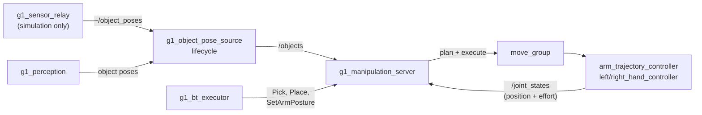

# g1_manipulation

Pick and place served as actions over MoveIt, and the node that decides where object poses come
from. `ament_cmake`, C++20.



The server adds no command path: it is a client of `move_group`, which drives the controllers that
already own the arm and hand channels. It takes no control authority either. The arm and hands must
be acquired before a goal executes; for a mission, `g1_orchestration`'s executor holds them for the
whole run.

## Nodes

| Node | Role |
|---|---|
| `g1_manipulation_server` | The `pick`, `place` and `set_arm_posture` actions. One goal at a time across all three. |
| `g1_object_pose_source` | Lifecycle node that republishes object poses on `/objects` in `odom`, from the configured source. |

## Object poses

Skills read `/objects` (`vision_msgs/Detection3DArray`, `odom`, a pose and a box per object) and
never learn which source filled it.

| `object_source` | Behaviour |
|---|---|
| `sim_ground_truth` | MuJoCo body poses carried out by `g1_sensor_relay`. Exact. |
| `perception` | Poses measured by `g1_perception`. `bringup.launch.py perception:=true` selects it. |
| `hardware` (default) | Refuses to configure: the robot has no detector of its own. |

The source transforms poses from the detector's frame into `odom` through TF rather than relabelling
them, and forwards the capture stamp, so a skill can judge how old a pose is.

| Parameter | Default | |
|---|---|---|
| `source_frame_id` | `camera_color_optical_frame` | The frame the detector measures in. |
| `output_frame_id` | `odom` | Fixed, so collision objects do not move with the robot. |
| `publish_markers` | from launch | `~/object_markers`, a box and label per object for RViz. |
| `transform_timeout_s` | 0.5 | How long a detection waits for its transform before it is dropped. |

## Actions

| Action | Goal | Notes |
|---|---|---|
| `~/pick` | `object_id`, `arm` | The pose is read from `/objects` when the goal starts, falling back on a sighting under `sighting_memory_s` old. |
| `~/place` | `surface_object_id` or `pose`, `arm` | Prefer the surface: it is read from `/objects` and the object is stood on it. A `pose` is where the object ends up. Refused when the arm holds nothing. |
| `~/set_arm_posture` | `group`, `named_target` | Named SRDF poses only. |

`Pick` and `Place` publish their phase as feedback and name it in the result on failure. Every
failure or cancel leaves the hand open, nothing attached and the collision exemptions restored, so
a behavior-tree retry starts clean.

## How a pick runs

1. **Locate.** Read the object, add its box to the planning scene, choose a grasp.
2. **Pregrasp.** Hand to `pinch_ready`, arm to `approach_height_m` above the grasp, then settle out
   the arm's gravity droop in clear air.
3. **Re-aim and stage.** Re-read the object, follow a shift under `grasp_refresh_max_shift_m`, and
   plan to a staging point `reaim_clearance_m` above the grasp while the object is still in the
   scene.
4. **Descend.** Remove the object, clear the octomap, exempt the hand from it, and walk the last
   stretch as a straight line. A miss backs straight up and repeats from staging, up to
   `settle_attempts` times; still past `max_grasp_offset_m` off, the pick is refused.
5. **Close.** Start outside the widest measured side and creep in `grip_search_step_m` at a time
   until the thumb opposes a finger, then hold every finger at its stall plus `grip_hold_bias_rad`.
6. **Check and attach.** The fingers' own positions and efforts must show a grip, or the pick fails
   in the grasp phase. The object is attached to the palm.
7. **Lift** straight up by `lift_height_m`. The held object stays exempt from the voxels it casts.

## How a place runs

1. **Target.** The named surface from `/objects` (or a recent sighting), plus half its height and
   half the held object's; or the given `pose`.
2. **Preplace.** Clear the octomap, exempt the hand and the held object, plan above the target and
   settle.
3. **Re-aim** at the surface's fresh pose, since reaching with a load moves the base.
4. **Lower, release, retreat.** Descend, open to `pinch_ready`, detach, and back straight out.
5. **Confirm.** The released object must reappear on `/objects` within `place_confirm_timeout_s`,
   inside the surface's footprint (or within `place_tolerance_m` of a `pose`).

## Grasp geometry

`{side}_hand_grasp_frame` is a link in `g1_description` at palm (0.090, ±0.050, 0), where the
fingers close, so pose goals are given for it directly. The fingers close toward palm +y, which is
why `grasp_rpy` is a roll. A top grasp aims `grasp_depth_below_top_m` under the top face, but never
lower than `min_grip_height_m` above the surface: the thumb hangs 63 mm below the frame. The hand
takes objects 20 to 75 mm across.

```bash
ros2 run tf2_ros tf2_echo right_hand_palm_link right_hand_grasp_frame
```

## Grip check

The hand controller has no goal tolerances, so a blocked finger reports success. `grip_check.hpp`
reads a grip from `/joint_states` instead: a finger presses when it is at least
`grip_min_position_error_rad` short of its target and pushes at least `grip_min_effort_nm`. After
the close the thumb must press with index or middle, or the pick fails. After the lift it is only
logged, since a cradled object loads the fingers too little to tell held from dropped; the place's
landing check catches a real drop.

## Where a grasp comes from

`grasp_source` chooses. `fixed_top_down` (default) descends on the object's centre with the hand at
`grasp_rpy`. `generated` asks the grasp service and takes the best candidate that passes
`min_grasp_score`, `max_approach_tilt_deg` and inverse kinematics, staging `approach_standoff_m`
back along its own approach axis. There is no fallback between them. `grasp_offset` is the measured
transform from the generator's gripper frame to the grasp frame; see
`docs/guides/open-vocabulary-grasping.md`. With `visualization:=true` every pick draws its
candidates and choice on `~/grasp_plan`.

## Configuration

| File | Contents |
|---|---|
| `config/g1_manipulation_server.yaml` | Every tunable, one line each. |
| `config/g1_object_pose_source.yaml` | The source and its frames. |

`manipulation.launch.py` sets these from its arguments, because the right value depends on the
launch:

| Argument | Default | |
|---|---|---|
| `object_source` | `sim_ground_truth` | See above. |
| `object_timeout_ms` | 1000.0 | How old a pose may be; bringup passes 8000 with perception. |
| `min_grip_height_m` | 0.080 | Lowest grip above the surface; bringup passes 0.035 for the navigation world, whose ball sits where the thumb hangs past the desk edge. |
| `grasp_source` | `fixed_top_down` | See above. |
| `grasp_offset` | zeros | Generator gripper frame to grasp frame, xyz then rpy, measured for the hand the generator serves. |
| `visualization` | false | Markers and `~/grasp_plan`. |

Tunables can be changed with `ros2 param set` between goals; a set during a goal is refused.
`velocity_scaling`, `grasp_rpy`, `grasp_service` and `publish_markers` are read-only.

## Running

```bash
ros2 launch g1_bringup bringup.launch.py moveit:=true manipulation:=true pin_pelvis:=true \
  world:=manipulation odometry:=ground_truth activate_arm:=true activate_arm_delay_s:=40.0

ros2 action send_goal /g1_manipulation_server/pick g1_msgs/action/Pick \
  "{object_id: red_block, arm: right}" --feedback
```

`manipulation:=true` needs `moveit:=true` and turns `sensors:=true` on, since ground truth leaves
the simulator over the relay.

## Tests

| Test | Simulator | Covers |
|---|---|---|
| `test_object_pose_source_node` | no | Source selection, the hardware refusal, frame verification, stamp passthrough, silence until activated. |
| `test_grasp_geometry` | no | Arm resolution and the grasp goal's position and mirrored orientation. |
| `test_grasp_filter` | no | Approach tilt and the gripper offset for generated grasps. |
| `test_grip_check` | no | What counts as a finger pressing, and when the hand is holding. |
| `test_generated_grasp_pick` | yes | A generated grasp: refused from under the table, refused for an unknown object, and picked when usable. |
| `test_pick_place` | yes | The acceptance gate: the block is lifted and held, placed back, and a grasp aimed above it is reported as a miss. |

```bash
colcon test --packages-select g1_manipulation
# The simulator suites need every g1_ package built:
colcon test --packages-select-regex '^g1_' --executor sequential --ctest-args -L simulator
```

## On hardware

The grip check, the grasp frame, the settle and re-aim loops and the object-size window carry over
unchanged: they are properties of the Dex3 and the arm, and `tau_est` arrives the same way. The
simulator-only parts live in the model: the finger contact parameters, the pinned scenes' solver
options, and the navigation world's grasp weld.
