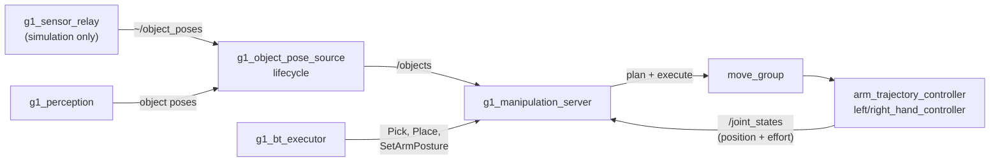

# g1_manipulation

Pick and place served as actions over MoveIt, and the node that decides where object poses come
from. `ament_cmake`, C++20.


```mermaid
flowchart LR
    REL["g1_sensor_relay<br/>(simulation only)"] -- "~/object_poses" --> SRC
    PER["g1_perception"] -- "object poses" --> SRC
    SRC["g1_object_pose_source<br/>lifecycle"] -- "/objects" --> SRV
    BT["g1_bt_executor"] -- "Pick, Place,<br/>SetArmPosture" --> SRV
    SRV["g1_manipulation_server"] -- "plan + execute" --> MG["move_group"]
    MG --> JTC["arm_trajectory_controller<br/>left/right_hand_controller"]
    JTC -- "/joint_states<br/>(position + effort)" --> SRV
```

The server adds no command path: it is a client of `move_group`. It takes no control authority
either. The arm and hands must be acquired before a goal executes; for a mission,
`g1_orchestration`'s executor holds them for the whole run.

## Nodes

| Node | Role |
|---|---|
| `g1_manipulation_server` | The `pick`, `place` and `set_arm_posture` actions. One goal at a time across all three. Subscribes to `/objects` and `/joint_states`, reads TF, and calls `move_group` and its `/clear_octomap`, `/get_planning_scene` and `/apply_planning_scene` services. |
| `g1_object_pose_source` | Lifecycle node that republishes object poses on `/objects` in `odom`, from the configured source. It transforms them from the detector's frame through TF rather than relabelling them, and forwards the capture stamp, so a skill can judge how old a pose is. `manipulation.launch.py` configures and activates it. |

## Object poses

Skills read `/objects` (`vision_msgs/Detection3DArray` in `odom`, a pose and a box per object) and
never learn which source filled it. The source subscribes to one input topic:

| `object_source` | Input topic | Behaviour |
|---|---|---|
| `sim_ground_truth` | `/g1_sensor_relay/object_poses` | MuJoCo body poses carried out by `g1_sensor_relay`. Exact. |
| `perception` | `/g1_object_geometry/object_poses` | Poses measured by `g1_perception`. `bringup.launch.py perception:=true` selects it. |
| `hardware` | none | Refuses to configure: the robot has no detector of its own. It is the node's default, so a bring-up that names no source fails visibly; the launch file defaults to `sim_ground_truth`. |

The source's other parameters:

| Parameter | Value | Meaning |
|---|---|---|
| `source_frame_id` | `camera_color_optical_frame` | The frame the detector measures in. |
| `output_frame_id` | `odom` | Fixed, so collision objects do not move with the robot. |
| `publish_markers` | the `visualization` launch argument | `~/object_markers`, a box and label per object for RViz. |
| `transform_timeout_s` | 0.5 | How long a detection waits for its transform before it is dropped. Code default, not in the YAML. |

## Actions

| Action | Goal | Notes |
|---|---|---|
| `~/pick` | `object_id`, `arm` | The pose is read from `/objects` when the goal starts, falling back on a sighting under `sighting_memory_s` old. |
| `~/place` | `surface_object_id` or `pose`, `arm` | Prefer the surface: it is read from `/objects` and the object is stood on it. A `pose` is where the object ends up. Refused when the arm holds nothing. |
| `~/set_arm_posture` | `group`, `named_target` | A named SRDF pose of `left_arm`, `right_arm`, `both_arms`, `left_hand` or `right_hand`. |

`Pick` and `Place` publish their phase as feedback and name it in the result on failure. A failed
or cancelled pick leaves the hand in `pinch_ready`, nothing attached and the collision exemptions
restored, so a retry from the behaviour tree starts clean. A place that fails before the release
leaves the object attached to the hand.

## How a pick runs

The steps follow the feedback phases.

1. `locating`: read the object, add its box to the planning scene and choose a grasp.
2. `pregrasp`: move the hand to `pinch_ready` and the arm to `approach_height_m` above the grasp,
   then settle out the arm's gravity droop in clear air.
3. `approach`: re-read the object and follow a shift under `grasp_refresh_max_shift_m`, then plan
   to a staging point `reaim_clearance_m` above the grasp while the object is still in the scene.
   Remove the object, clear the octomap, exempt the hand from it and walk the last stretch as a
   straight line. A miss backs straight up and retries from staging, up to `settle_attempts` more
   times; still more than `max_grasp_offset_m` off, the pick is refused.
4. `grasp`: start outside the widest measured side and creep in `grip_search_step_m` at a time
   until the thumb opposes a finger, then hold every finger at its stall plus
   `grip_hold_bias_rad`. If the grip check below passes, attach the object to the palm.
5. `lift`: straight up by `lift_height_m`. The held object stays exempt from the voxels it casts.

## How a place runs

1. `preplace`: the target is the named surface from `/objects` (or a recent sighting) plus half its
   height and half the held object's, or the given `pose`. Clear the octomap, exempt the hand and
   the held object, plan above the target and settle. Then re-aim at the surface's fresh pose,
   since reaching with a load moves the base.
2. `lower`: descend onto the target.
3. `release`: open to `pinch_ready` and detach.
4. `retreat`: back straight out. The released object must then reappear on `/objects` within
   `place_confirm_timeout_s`, inside the surface's footprint (or within `place_tolerance_m` of a
   `pose`).

## Grasp geometry

`{side}_hand_grasp_frame` is a link in `g1_description` at palm (0.090, ±0.050, 0), where the
fingers close, so pose goals are given for it directly. The right hand's fingers close toward palm
+y and the left's toward -y, which is why `grasp_rpy` is a roll and the left hand mirrors it. A top
grasp aims `grasp_depth_below_top_m` under the top face, but never lower than `min_grip_height_m`
above the surface: the thumb hangs 63 mm below the frame. The hand takes objects 20 to 75 mm
across.

```bash
ros2 run tf2_ros tf2_echo right_hand_palm_link right_hand_grasp_frame
```

## Grip check

The hand controller has no goal tolerances, so a blocked finger reports success. `grip_check.hpp`
reads a grip from `/joint_states` instead: a finger presses when it is at least
`grip_min_position_error_rad` short of its target and pushes at least `grip_min_effort_nm`. After
the close the thumb must press with the index or middle finger, or the pick fails. After the lift
the result is only logged: a cradled object loads the fingers too little to tell held from dropped.

## Where a grasp comes from

`grasp_source` chooses. `fixed_top_down` (default) descends on the object's centre with the hand at
`grasp_rpy`. `generated` asks the grasp service (`grasp_service`) and takes the best candidate that
passes `min_grasp_score`, `max_approach_tilt_deg` and inverse kinematics, staging
`approach_standoff_m` back along its own approach axis. There is no fallback between them. With
`visualization:=true` every pick draws its candidates and choice on `~/grasp_plan`.

## Configuration

`config/g1_manipulation_server.yaml` holds every server parameter the launch file does not set,
explained in comments. `config/g1_object_pose_source.yaml` holds the source's frames.
`manipulation.launch.py` takes the values that depend on the launch as arguments:

| Argument | Default | Meaning |
|---|---|---|
| `object_source` | `sim_ground_truth` | See above. |
| `object_timeout_ms` | 1000.0 | How old a pose may be; bringup passes 8000 with perception. |
| `min_grip_height_m` | 0.080 | Lowest grip above the surface; bringup passes 0.035 for the navigation world, whose ball sits where the thumb hangs past the desk edge. |
| `grasp_source` | `fixed_top_down` | See above. |
| `grasp_offset` | zeros | Sets `graspgen_to_grasp_frame_xyz_rpy`: generator gripper frame to grasp frame, xyz then rpy, measured for the hand the generator serves (see [the open-vocabulary guide](../../../docs/guides/open-vocabulary-grasping.md)). |
| `visualization` | false | Markers and `~/grasp_plan`. |

Tunables can be changed with `ros2 param set` between goals; a set during a goal is refused.
`velocity_scaling`, `grasp_rpy`, `grasp_source`, `grasp_service`, `publish_markers` and
`graspgen_to_grasp_frame_xyz_rpy` are read-only.

## Running

```bash
ros2 launch g1_bringup bringup.launch.py moveit:=true manipulation:=true pin_pelvis:=true \
  world:=manipulation odometry:=ground_truth activate_arm:=true activate_arm_delay_s:=40.0

ros2 action send_goal /g1_manipulation_server/pick g1_msgs/action/Pick \
  "{object_id: red_block, arm: right}" --feedback
```

`manipulation:=true` needs `moveit:=true` and turns `sensors:=true` on, since ground truth leaves
the simulator over the relay. `./scripts/demos/pick-and-place.sh in-place` runs this launch with the
tree that drives it; the [pick and place guide](../../../docs/guides/pick-and-place.md) covers the
missions.

## Tests

| Test | Simulator | Covers |
|---|---|---|
| `test_object_pose_source_node` | no | Source selection, the hardware refusal, frame verification, stamp passthrough, silence until activated. |
| `test_grasp_geometry` | no | Arm resolution and the grasp goal's position and mirrored orientation. |
| `test_grasp_filter` | no | Approach tilt and the gripper offset for generated grasps. |
| `test_grip_check` | no | What counts as a finger pressing, and when the hand is holding. |
| `test_hand_contact` | no | The allowed-collision-matrix edit behind the hand's contact exemptions. |
| `test_generated_grasp_pick` | yes | A generated grasp: refused from under the table, refused for an unknown object, and picked when usable. |
| `test_pick_place` | yes | The acceptance gate: the block is lifted and held, placed back, and a grasp aimed above it is reported as a miss. |

```bash
./scripts/manage.sh test g1_manipulation
# The simulator suites need every g1_ package built, since bringup finds them by path:
./scripts/manage.sh test --sim g1_manipulation
```

## On hardware

The grip check, the grasp frame, the settle and re-aim loops and the object-size window carry over
unchanged: they are properties of the Dex3 and the arm, and `tau_est` arrives the same way. The
simulator-only parts live in the model: the finger contact parameters, the pinned scenes' solver
options, and the navigation world's grasp weld.
