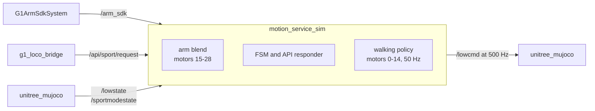

# g1_motion_service_sim

**Simulation only. Never launch this near real hardware.**

A stand-in for the G1's onboard motion service. On the real robot that service owns `/lowcmd`,
serves the weight-blended `/arm_sdk` interface, and answers `/api/sport/*`. `unitree_mujoco`
emulates only the low-level device, so none of it exists in simulation. This node fills all three
gaps.

`ament_cmake`, C++20. Launched exclusively by `g1_bringup`'s `sim.launch.py`.



The two halves never contend: they write disjoint slices of one `/lowcmd` message.

## Why it is its own package

Everything here exists only because the simulator stops at the low-level device. That makes it one
deletion boundary rather than three features: at hardware bring-up you stop launching this package
and nothing else changes.

It is not part of `g1_locomotion` because that package is the LocoClient client and this is the
server, and `g1_locomotion`'s whole claim is that it carries to hardware unchanged.

The simulation-only property is structural, not a switch. The walking policy's `base_lin_vel`
observation comes from `/sportmodestate`, and the real G1 publishes a type with no velocity field
at all.

## Topics

| Topic | Direction | Type |
|---|---|---|
| `/lowcmd` | out | `unitree_hg/msg/LowCmd` |
| `/lowstate` | in | `unitree_hg/msg/LowState` |
| `/arm_sdk` | in | `unitree_hg/msg/LowCmd` |
| `/sportmodestate` | in | `unitree_go/msg/SportModeState` |
| `/api/sport/request` | in | `unitree_api/msg/Request` |
| `/api/sport/response` | out | `unitree_api/msg/Response` |
| `/joint_states` | out | `sensor_msgs/msg/JointState`, lower body only |

Reliability and durability on `/api/sport/*` are matched to the vendor's. Do not deviate.

It is a plain node, not lifecycle-managed, because it emulates an always-on vendor service that has
no activate concept of its own.

## Arm path

The node captures a hold pose from the first `/lowstate` sample, then publishes `/lowcmd` at
`publish_rate_hz`, blending arms between that hold pose and the commanded values on `q`, `kp` and
`kd` alike. Motor slot 29 echoes the effective weight.

If the newest `/arm_sdk` message is older than `arm_sdk_timeout_ms`, the weight decays toward zero,
so a silent publisher eases the arms back to the hold pose instead of freezing them. A fresh
message resumes from wherever the weight sits, never snapping.

## LocoClient responder

| API id | Name | Behaviour |
|---|---|---|
| `7001` | `GET_FSM_ID` | Returns the current id, code `0`. |
| `7101` | `SET_FSM_ID` | Applies the legality table below. Code `0` or `7302`. |
| `7105` | `SET_VELOCITY` | Code `7301` unless the FSM is `Start`, else `0` and the command is latched. |
| `7106` | `SET_ARM_TASK` | Always rejected. It would move arm authority to the onboard controller and fight this stack's blend weight. |

State starts at `Damp(1)`, matching the robot's boot state:

```
Damp(1)    -> StandUp(4)
StandUp(4) -> Start(500), Damp(1)
Start(500) -> StandUp(4), Damp(1)
```

Every other edge is rejected. These rules are load-bearing: an accepted `SET_VELOCITY` latches the
command the walking policy consumes, and the latch carries the request's own duration as a
dead-man, so a silent bridge stops the robot within a second.

## Walking policy

An RL policy owning motors 0 to 14, running at 50 Hz. It balances the robot with no pelvis weld.

`policy/walker.onnx` and its external weights come from
[luckyrobots/g1-manipulation-challenge](https://github.com/luckyrobots/g1-manipulation-challenge),
described there as trained with RL in Isaac Lab. That repository publishes no licence file and no
attribution for the policy's own origin, so its redistribution terms are undeclared.

### Measured behaviour, read before commanding velocities

There is a hard gait-initiation dead zone with no hysteresis. Below it the robot stands still, and
kicking above it then dropping back stops the gait outright.

| Axis | No motion at or below | Steps from | Measured output |
|---|---|---|---|
| `vx` | 0.35 m/s | 0.40 m/s | 0.5 gives 0.35, 0.6 gives 0.47, 1.0 gives 0.93 |
| `vy` | 0.30 m/s | 0.50 m/s | 0.5 gives 0.44, 1.0 gives 0.93 |
| `vyaw` in place | 0.60 rad/s | 1.50 rad/s | 1.0 gives 0.21, 1.5 gives 1.08 |

Combined commands come out badly. A commanded (0.50, 0, 0.50) measured (0.337, 0.299, 0.390), a
third of a metre per second of lateral nobody asked for. Commands below threshold pass through
unchanged and are logged, never scaled up.

Walking also drifts sideways about 0.22 to 0.25 m/s, and turning collapses forward speed. Together
that makes it a teleop-grade locomotion source, not a planner-grade one. `g1_locomotion`'s
`g1_gait_shaper` is the consumer-side answer.

## Configuration

`config/motion_service_sim.yaml`:

| Parameter | Default | Meaning |
|---|---|---|
| `publish_rate_hz` | `500.0` | `/lowcmd` publish rate. |
| `leg_kp` / `leg_kd` | `100.0` / `1.0` | Stiff-hold gains, motors 0 to 11. |
| `waist_kp` / `waist_kd` | `50.0` / `1.0` | Stiff-hold gains, motors 12 to 14. |
| `arm_hold_kp` / `arm_hold_kd` | `40.0` / `1.0` | Arm gains at blend weight 0. |
| `arm_sdk_timeout_ms` | `500.0` | `/arm_sdk` age beyond this counts as stale. |
| `timeout_ramp_down_s` | `1.0` | Weight decay and resume rate. |

`config/walk_policy.yaml` holds the policy's joint names, default posture, action scales, per-joint
gains and limits. The file is commented; read it directly.

`sim.launch.py` supplies two more, because both are launch decisions rather than tuning:
`publish_lower_joint_states` and `walk_policy.enabled`.

## Tests

None of these need a simulator, DDS or a live graph.

| Test | Covers |
|---|---|
| `test_blend_math` | Blend-weight decay and resume, q/kp/kd blend. |
| `test_assemble_sim_low_cmd` | `/lowcmd` assembly: slots, gains, arm blend, weight echo. |
| `test_loco_fsm` | Every legal and illegal edge, and the Start-only velocity gate. |
| `test_walk_policy` | Joint order, observation layout, action mapping, dead-man, leg-authority fallback. |
| `test_walk_policy_session` | ONNX Runtime shape contract, external weights, determinism, and a golden action vector. |
| `test_wire_constants` | The motor-index constants this package duplicates from `g1_hardware_interface`. |

```bash
colcon build --symlink-install --packages-select g1_motion_service_sim
colcon test --packages-select g1_motion_service_sim
```

The launch-level suites that drive this node against a real simulator live in `g1_bringup`.
