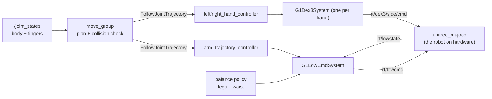

# g1_moveit_config

MoveIt 2 planning for the G1's two 7-DoF arms and its Dex3 hands, layered on the controllers the
control stack already runs. `ament_cmake`, configuration and launch only: `move_group` is
upstream.



MoveIt adds no command path. It is another client of actions the controllers already serve, so
the arm channel and each hand's topic keep exactly one writer.

## Launch files

| File | Starts |
|---|---|
| `move_group.launch.py` | `move_group`, plus MoveIt Servo with `servo:=true`. Nothing sim-specific. |
| `moveit_sim.launch.py` | `g1_bringup`'s `sim.launch.py` plus `move_group`. Arguments: `headless`, `world`, `sensors`, `pin_pelvis`, `sim_start_delay_s`. |
| `moveit_rviz.launch.py` | RViz with the MotionPlanning panel on `both_arms`. Argument: `rviz_config`. |

## Config

| File | Holds |
|---|---|
| `g1.srdf` | Planning groups, end effectors, named poses, collision matrix. |
| `kinematics.yaml` | `pick_ik` per arm, none for `both_arms`. |
| `joint_limits.yaml` | The velocity and acceleration limits trajectories are timed against. |
| `moveit_controllers.yaml` | The three `FollowJointTrajectory` controllers; `moveit_manage_controllers: false`. |
| `ompl_planning.yaml` | RRTConnect for the arm groups. |
| `sensors_3d.yaml` | `/livox/lidar` into a 25 mm octomap. |
| `servo.yaml` | MoveIt Servo, streaming to `arm_trajectory_controller`. |

## Arm ownership

The hardware component leaves any unclaimed joint unpowered, so the arms are always held by
something. `arm_freeze_controller` has them until the arm is acquired, and the acquire trades the
two in a single switch, never both out at once, or the arms drop. `g1_controllers`' README has
the full ownership table.

`move_group.launch.py` loads the same description `robot_state_publisher` does, so planning and
execution agree about the model. `test_moveit_config_drift` checks this package's controller and
joint-limit config against `g1_controllers` and `g1_description`.

The hands are separate components on their own SDK channels (`rt/dex3/<side>/{cmd,state}`).
`activate_arm` brings them up after the arm, best-effort: `G1Dex3System` refuses to activate
without hand state, so an absent hand shows up as an inactive component and leaves the arm
usable.

## Planning groups

| Group | Joints | Chain |
|---|---|---|
| `left_arm` | 7 | `torso_link` to `left_hand_palm_link` |
| `right_arm` | 7 | `torso_link` to `right_hand_palm_link` |
| `both_arms` | 14 | the two above, composed |
| `left_hand` | 7 | the Dex3 fingers, a tree rather than a chain |
| `right_hand` | 7 | as above |

`both_arms` is the only group that collision-checks one arm against the other and times a motion
so both hands arrive together. The per-arm groups stay because a 7-DoF search is far cheaper.

The hands are their own groups, never joints on an arm group, because they are a separate device
with separate topics and control authority; `test_robot_model` pins that. Each is its arm's
`end_effector`, which lets `attachObject` work out its own touch links.

Groups are rooted at `torso_link`, not `pelvis`: waist yaw belongs to `waist_freeze_controller`
and waist roll and pitch to the balance policy, so a group spanning them would plan motion
nothing executes. Their state still places the torso, and `joint_state_broadcaster` publishes
it.

The planning frame is `pelvis`, because the vendored URDF's floating base is commented out and
the SRDF declares no virtual joint. Fine while the robot stands still to manipulate; scene
objects fixed in `odom` would need a virtual joint.

## Named poses

Set from the MotionPlanning panel's goal-state dropdown, or with
`move_group.setNamedTarget("tucked")`. Each exists for `left_arm`, `right_arm` and `both_arms`.

| Pose | What it is |
|---|---|
| `home` | The arms' resting posture: nearly straight, angled forward, hands in front of the hips. |
| `zero` | Every arm joint at 0: upper arms down, forearms level and pointing forward, since the elbow's zero is a right angle. |
| `tucked` | Arms down, nearly straight, swung out clear of the hips. The posture to walk in. |
| `ready` | Hands forward of the hips, elbows slightly bent, clear of the torso. |
| `reach_front` | Hands out in front, just below shoulder height. |
| `carry` | Holds a picked object low beside the body, wrist flat. The in-place trees use it between pick and place. |

`test_robot_model` pins them: the three per-group copies agree, all sit inside the joint limits,
and `tucked` and `carry` keep 0.20 rad of room before self-collision. MoveIt still plans and
collision-checks the path to a named pose.

Arm pose disturbs the gait, so manipulate standing still and walk in `tucked`.

The hands have three postures each, on `left_hand` and `right_hand`:

| Pose | What it is |
|---|---|
| `open` | Every finger joint at 0: fingers straight, thumb mid-range. |
| `pinch_ready` | What a pick descends in: fingers open, thumb pulled back behind the object's near face. |
| `closed` | The thumb swung forward against the curled fingers, short of the end stops so both can press into an object. |

A pick and place runs: reach in `pinch_ready`, close, `attachObject`, move, place, open,
`detachObject`.

At `open` the thumb reaches the table before the object does. Even retracted in `pinch_ready` the
hand hangs 113 mm below the palm origin, 63 mm below the grasp frame, which is the clearance
`g1_manipulation`'s `min_grip_height_m` exists for (0.080 m by default; `g1_bringup` sets it per
world).

`closed` leaves thumb abduction (`thumb_0`) at zero: abducted, the thumb grazes the middle finger
late in the close, which stalls a finger in an empty hand and reads as a grasp to the grip check.

On hardware the fingers hold an object by friction; in the navigation world the simulator adds a
grasp weld as a stand-in (`g1_bringup/config/sim_sensors.yaml`). Either way MoveIt's attachment
is planner bookkeeping, not what carries the load.

## Kinematics

`pick_ik` on each arm. With 7 joints against a 6-DoF pose the solver picks from a null space, and
KDL's pseudo-inverse wanders it and clamps at joint limits. Swapping back is one line in
`config/kinematics.yaml`.

`both_arms` has **no** solver entry, on purpose. pick_ik, like KDL and TRAC-IK, rejects any group
that is not a chain; MoveIt instead routes a pose goal per hand through the per-arm solvers, and
builds that subgroup map only for groups with no solver of their own. An entry for `both_arms`
silently breaks its IK, and a test asserts there is none.

For two simultaneous Cartesian goals, call `setPoseTarget(pose, link)` once per hand.
`setPoseTargets` means something else: alternative goals for one link.

## Speed

`config/joint_limits.yaml` caps every arm joint at 0.8 rad/s and every finger at 2.0, and adds
the acceleration limits the URDF does not declare.

The URDF's 22 to 37 rad/s are motor limits, not what the arm tracks. `arm_trajectory_controller`
claims position alone, so the arm runs on the component's `position_only_kp` (300 on the
shoulders and elbows, 150 on the wrists) with no gravity compensation, and falls behind a
trajectory timed against the motor. That shows up as the controller aborting on its goal-time
tolerance.

The fingers have a real clamp: `G1Dex3System` slew-limits every finger at
`max_joint_velocity_rad_s` (3.0), so planning faster only stretches the motion until the
goal-time tolerance trips. `test_moveit_config_drift` keeps every finger limit under it. The
body component has no such clamp, deliberately: it would throttle the fast corrections the
balance policy needs.

## Running

From the operator entry point:

```bash
ros2 launch g1_bringup bringup.launch.py moveit:=true pin_pelvis:=true rviz:=true
```

Or this package on its own, which is what the integration tests launch:

```bash
ros2 launch g1_moveit_config moveit_sim.launch.py pin_pelvis:=true
ros2 launch g1_moveit_config moveit_rviz.launch.py
```

`move_group` will not plan until every joint it models has a state; `joint_state_broadcaster`
publishes all of them, body and fingers.

With a navigation mode as well (`mode:=localization nav:=true moveit:=true rviz:=true`), the RViz
that opens is this package's. Run a second `rviz2 -d` on `g1_navigation.rviz` for the map and
costmaps: a single combined window segfaults rviz2 once Nav2 is running.

Planning works immediately. Execution waits until the arm is acquired:

```bash
ros2 launch g1_bringup activate_arm.launch.py
```

Until then the controller refuses the goal, which is intended. `moveit_manage_controllers` is
false, so MoveIt never activates anything itself. Release with `deactivate_arm.launch.py` on
success or failure alike.

## Seeing the world

`config/sensors_3d.yaml` feeds `/livox/lidar` into an octomap, so plans route around real
obstacles. It comes up with `sensors:=true`:

```bash
ros2 launch g1_moveit_config moveit_sim.launch.py sensors:=true pin_pelvis:=true world:=perception
```

The octomap is built in the planning frame, `pelvis`; `octomap_frame` is never read. That holds
while the pelvis is pinned or the robot stands still, but a walking pelvis drags the voxel grid
with it and the map smears. `/clear_octomap` (`std_srvs/Empty`) resets it. There is no time
decay, so a voxel the sensor cannot currently see is never forgotten.

It reads the LiDAR, not the depth camera: `depth_image_proc`'s converter cannot receive the
camera relay's best-effort images.

## Collision matrix

The `disable_collisions` block in `config/g1.srdf` is not the Setup Assistant's:
`collisions_updater` does not finish on this model, because 38 of the URDF's 52 collision
elements are full visual meshes, about 525k triangles. It holds link pairs joined by a joint,
pairs touching at rest (from `/check_state_validity`), and the thumb-over-wrist pair a closing
hand always touches: 56 pairs, nothing sampled.

It contains no cross-arm pair, because `both_arms` exists to collision-check one arm against the
other. `test_robot_model` asserts those stay enabled.

## Tests

| Test | Needs a simulator | Covers |
|---|---|---|
| `test_moveit_config_drift` | no | This package against `g1_controllers`' controller config and `g1_description`'s hand clamp, the composite-group solver rule, SRDF well-formedness and the octomap sensor config. |
| `test_robot_model` | no | Group composition and order, planning frame, no hand or waist joints in an arm group, the collision matrix's adjacent and cross-arm pairs, the end effectors, and the named poses (copies agree, within limits, room before self-collision). |
| `test_launch_threading` | no | The arguments `g1_bringup`'s `moveit:=true` branch threads into the simulator, the RViz choice, and what `moveit_sim.launch.py` composes. |
| `test_octomap_blocks_a_plan` | yes | That the octomap fills from the LiDAR **and** that MoveIt collision-checks against it: a reach into a mapped obstacle is rejected, with `<octomap>` named in the contact. |
| `test_moveit_lowcmd` | yes | MoveIt with the pelvis unpinned: every motor claimed before the acquire, the freeze traded for the trajectory controller and back, both arms moving without the balance policy losing the robot, and both hands activating and closing through MoveIt. |

```bash
colcon test --packages-select g1_moveit_config
```

Nothing stands the torso off-square, so arm groups composing through a turned waist are
untested. `waist_freeze_controller` latches the yaw the scene starts at; a non-zero waist in the
MJCF keyframe would cover it.
