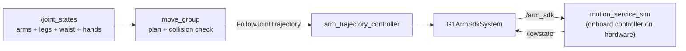

# g1_moveit_config

MoveIt 2 planning for the G1's two 7-DoF arms, layered on the `arm_trajectory_controller` that
already drives `rt/arm_sdk`.

`ament_cmake`, configuration and launch only. No nodes: `move_group` is upstream.



MoveIt adds no command path. It is another client of the action the controller already serves,
so `rt/arm_sdk` keeps exactly one writer.

## Planning groups

| Group | Joints | Chain |
|---|---|---|
| `left_arm` | 7 | `torso_link` to `left_hand_palm_link` |
| `right_arm` | 7 | `torso_link` to `right_hand_palm_link` |
| `both_arms` | 14 | the two above, composed |

`both_arms` is what makes two-handed motion a single plan: it is the only group that
collision-checks one arm against the other, and the only one that times a motion so both hands
arrive together. The per-arm groups remain because a 7-DoF search is far cheaper.

Groups are rooted at `torso_link`, not `pelvis`. The three waist joints belong to the onboard
controller, so a group spanning them would plan motion this stack cannot command. Their *state*
still matters, since it places the torso under the pelvis, which is why `motion_service_sim`
publishes it.

The planning frame is `pelvis` — the vendored URDF's floating base is commented out upstream and
the SRDF declares no virtual joint. Fine while the robot stands still to manipulate; scene
objects fixed in `odom` would need a virtual joint instead.

## Kinematics

`pick_ik` on each arm. Each arm is 7 joints against a 6-DoF pose, so the solver's choice within
the null space is the whole question, and KDL's pseudo-inverse wanders it and clamps at joint
limits. Swapping back is one line in `config/kinematics.yaml`.

`both_arms` deliberately has **no** solver entry. pick_ik, like KDL and TRAC-IK, rejects any
group that is not a chain; MoveIt instead routes a pose goal per hand through the per-arm
solvers, and it only builds that subgroup map for groups with no solver of their own. Adding an
entry for `both_arms` silently breaks its IK. A test asserts this.

For two simultaneous Cartesian goals, call `setPoseTarget(pose, link)` once per hand.
`setPoseTargets` means something else: alternative goals for one link.

## Speed

`config/joint_limits.yaml` caps every arm joint at 0.8 rad/s against the bridge's 1.0 rad/s slew
clamp, and adds the acceleration limits the URDF does not declare. The URDF's own 22-37 rad/s are
motor limits; timing a trajectory against them makes the bridge stretch it by a factor of thirty
and the controller abort on a goal-time tolerance that looks unrelated. A test compares the two
files.

## Running

```bash
ros2 launch g1_moveit_config moveit_sim.launch.py pin_pelvis:=true
ros2 launch g1_moveit_config moveit_rviz.launch.py
```

Planning works immediately. **Executing does not**, until the arm is acquired — the component
first, then the controller:

```bash
ros2 launch g1_bringup activate_arm.launch.py
```

Until then the controller refuses the goal, which is the intended failure rather than a bug.
`moveit_manage_controllers` is false so MoveIt never activates anything itself. Release with
`deactivate_arm.launch.py` on success or failure alike.

`waist_hold_rad:=0.35,0.0,0.0` stands the torso off-square, which is worth doing when changing
anything about frames.

## Regenerating the collision matrix

`config/g1.srdf` is hand-written except for its `disable_collisions` block. That block is
generated, and the header inside the file records the arguments and date. Humble ships a headless
generator, so this needs no GUI:

```bash
xacro $(ros2 pkg prefix g1_description)/share/g1_description/urdf/g1_arm_sdk.urdf.xacro > /tmp/g1.urdf
/opt/ros/humble/lib/moveit_setup_assistant/collisions_updater \
  --urdf /tmp/g1.urdf --srdf config/g1.srdf --output config/g1.srdf \
  --default --always --trials 10000 --min-collision-fraction 0.95
```

Expect it to take roughly half an hour: the G1's collision geometry is its full visual meshes.
Review the diff before committing, and check that cross-arm pairs from the elbows out are still
enabled — `both_arms` is pointless without them, and `test_robot_model` asserts it.

## Tests

| Test | Needs a simulator | Covers |
|---|---|---|
| `test_moveit_config_drift` | no | This package against `g1_bringup`'s controller and `g1_description`'s speed clamp; the composite-group solver rule; SRDF well-formedness. |
| `test_robot_model` | no | Group composition and order, planning frame, no hand or waist joints in an arm group, the collision matrix's adjacent pairs and its cross-arm pairs. |
| `test_moveit_plan_execute` | yes | Execution refused before acquire, a coordinated `both_arms` plan, planned speed under the clamp, and hand placement with the waist turned. |

```bash
colcon test --packages-select g1_moveit_config
```
