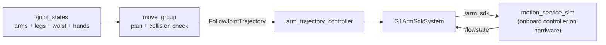

# g1_moveit_config

MoveIt 2 planning for the G1's two 7-DoF arms, layered on the `arm_trajectory_controller` that
already drives `rt/arm_sdk`.

`ament_cmake`, configuration and launch only. No nodes: `move_group` is upstream.



MoveIt adds no command path. It is another client of the action the controller already serves,
so `rt/arm_sdk` keeps exactly one writer.

## Planning groups

| Group | Joints | Chain |
|---|---|---|
| `left_arm` | 7 | `torso_link` to `left_hand_palm_link` |
| `right_arm` | 7 | `torso_link` to `right_hand_palm_link` |
| `both_arms` | 14 | the two above, composed |

`both_arms` is what makes two-handed motion a single plan: it is the only group that
collision-checks one arm against the other, and the only one that times a motion so both hands
arrive together. The per-arm groups remain because a 7-DoF search is far cheaper.

Groups are rooted at `torso_link`, not `pelvis`. The three waist joints belong to the onboard
controller, so a group spanning them would plan motion this stack cannot command. Their *state*
still matters, since it places the torso under the pelvis, which is why `motion_service_sim`
publishes it.

The planning frame is `pelvis` — the vendored URDF's floating base is commented out upstream and
the SRDF declares no virtual joint. Fine while the robot stands still to manipulate; scene
objects fixed in `odom` would need a virtual joint instead.

## Named poses

Set from the MotionPlanning panel's goal-state dropdown, or with
`move_group.setNamedTarget("tucked")`. Each exists for `left_arm`, `right_arm` and `both_arms`.

| Pose | What it is |
|---|---|
| `home` | Where the simulator actually holds the arms: shoulders back, elbows bent. Measured, not chosen. |
| `zero` | Every arm joint at 0. Arms straight down at the sides. |
| `tucked` | Arms in close, elbows well bent. The posture to navigate in: smallest swept volume and least COM offset. |
| `ready` | Forearms up and forward, clear of the torso, without being extended. |
| `reach_front` | Reaching a surface in front. The pick-and-place working posture. |

Every value was collision-checked against a running `move_group` before being written into the
SRDF, and `test_robot_model` pins them: the three per-group copies must agree, and all must sit
inside the joint limits. Poses are a convenience, not a safety mechanism, and MoveIt still plans
and collision-checks the path to one.

`tucked` is worth knowing about beyond convenience. Arm pose measurably disturbs a walking
humanoid, and the standing recommendation is to manipulate stationary and navigate with the arms
in (`docs/notes/arm-motion-and-balance.md`).

## Kinematics

`pick_ik` on each arm. Each arm is 7 joints against a 6-DoF pose, so the solver's choice within
the null space is the whole question, and KDL's pseudo-inverse wanders it and clamps at joint
limits. Swapping back is one line in `config/kinematics.yaml`.

`both_arms` deliberately has **no** solver entry. pick_ik, like KDL and TRAC-IK, rejects any
group that is not a chain; MoveIt instead routes a pose goal per hand through the per-arm
solvers, and it only builds that subgroup map for groups with no solver of their own. Adding an
entry for `both_arms` silently breaks its IK. A test asserts this.

For two simultaneous Cartesian goals, call `setPoseTarget(pose, link)` once per hand.
`setPoseTargets` means something else: alternative goals for one link.

## Speed

`config/joint_limits.yaml` caps every arm joint at 0.8 rad/s against the bridge's 1.0 rad/s slew
clamp, and adds the acceleration limits the URDF does not declare. The URDF's own 22-37 rad/s are
motor limits; timing a trajectory against them makes the bridge stretch it by a factor of thirty
and the controller abort on a goal-time tolerance that looks unrelated. A test compares the two
files.

## Running

One command, from the operator entry point:

```bash
ros2 launch g1_bringup bringup.launch.py moveit:=true pin_pelvis:=true rviz:=true
```

Or this package on its own, which is what the integration test launches:

```bash
ros2 launch g1_moveit_config moveit_sim.launch.py pin_pelvis:=true
ros2 launch g1_moveit_config moveit_rviz.launch.py
```

Either route turns on the non-arm joint states for you. `move_group` will not plan until every
joint it models has a state, and the arms hang off three waist joints `joint_state_broadcaster`
does not own.

With a navigation mode as well (`mode:=localization nav:=true moveit:=true rviz:=true`), the one
RViz that opens is this package's — run a second `rviz2 -d` on `g1_navigation.rviz` for the map
and costmaps. A single combined window was attempted and abandoned: every merge segfaulted rviz2
once Nav2 was actually running. `docs/notes/combined-nav-moveit-rviz.md` has the four runs and
where to resume.

Planning works immediately. **Executing does not**, until the arm is acquired — the component
first, then the controller:

```bash
ros2 launch g1_bringup activate_arm.launch.py
```

Until then the controller refuses the goal, which is the intended failure rather than a bug.
`moveit_manage_controllers` is false so MoveIt never activates anything itself. Release with
`deactivate_arm.launch.py` on success or failure alike.

`waist_hold_rad:=0.35,0.0,0.0` stands the torso off-square, which is worth doing when changing
anything about frames.

## Regenerating the collision matrix

`config/g1.srdf` is hand-written except for its `disable_collisions` block. That block is
generated, and the header inside the file records how and when.

**`collisions_updater` does not finish on this model.** Measured 2026-08-06: it was left running
for 1 h 22 m at `--trials 10000` and produced nothing, and 1000 trials, 1 trial and
`--default --trials 0` all failed to complete either — the expensive phase runs whatever the flags
say. The cause is the collision geometry: 38 of the URDF's 52 collision elements are the full
visual STL meshes, about 525k triangles.

What the shipped matrix was generated from instead is the robot's own rest pose, which is all the
"invalid start state" failure needs: link pairs joined by a joint, plus pairs found touching by
`move_group`'s `/check_state_validity` contacts. 54 pairs, generated in seconds, and deliberately
conservative — it disables what genuinely touches and nothing speculative. It contains no cross-arm
pair, which matters: `both_arms` exists to collision-check one arm against the other, and
`test_robot_model` asserts those stay enabled.

The "never in collision" pairs a full sampling run would add are a planning-speed optimisation, not
a correctness requirement. Getting them needs the collision geometry simplified first — see
`docs/notes` — after which the upstream generator becomes usable again.

## Tests

| Test | Needs a simulator | Covers |
|---|---|---|
| `test_moveit_config_drift` | no | This package against `g1_bringup`'s controller and `g1_description`'s speed clamp; the composite-group solver rule; SRDF well-formedness. |
| `test_robot_model` | no | Group composition and order, planning frame, no hand or waist joints in an arm group, the collision matrix's adjacent pairs and its cross-arm pairs, and the named poses (per-group copies agree, all within joint limits). |
| `test_launch_threading` | no | The arguments `g1_bringup`'s `moveit:=true` branch threads into the simulator, the RViz choice, and that `moveit_sim.launch.py` still composes what it did. |
| `test_moveit_plan_execute` | yes | Execution refused before acquire, a coordinated `both_arms` plan, planned speed under the clamp, and hand placement with the waist turned. |

```bash
colcon test --packages-select g1_moveit_config
```
