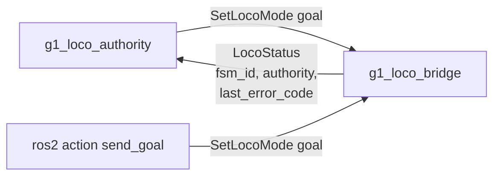

# g1_msgs

Interfaces for the LocoClient bridge in `g1_locomotion`: one action and one message.

`ament_cmake` with `rosidl_default_generators`. No source of its own.



```bash
colcon build --symlink-install --packages-select g1_msgs
```

## action/SetLocoMode.action

| Field | Meaning |
|---|---|
| `fsm_id` (goal) | Target FSM id. Only `DAMP` (1), `STAND_UP` (4) and `START` (500) are accepted; the bridge rejects anything else and logs why. |
| `success`, `error_code` (result) | `error_code` is the raw LocoClient wire status: `0` on success, otherwise `7301`, `7302`, or a correlator timeout. |
| `message` (result) | Context for logs and CLI use. Not meant to be parsed. |

`Squat`, `Sit` and `ZeroTorque` have no constants here. Nothing needs them, and their transition
legality was never checked against a real onboard controller.

There is no feedback field. The exchange either completes or times out within a few seconds, with
nothing meaningful to report mid-flight.

## msg/LocoStatus.msg

| Field | Meaning |
|---|---|
| `stamp` | When the status was produced. |
| `fsm_id` | Last FSM id the bridge knows to be true. `-1` before it has any information. |
| `authority` | `RELEASED`, `ACQUIRING`, `HELD` or `RELEASING`. Whether the bridge holds velocity-command authority. |
| `last_error_code` | Most recent wire status code seen, from a mode goal or a velocity request. |
| `ignored_cmd_vel` | How many non-zero velocity samples the bridge discarded for lack of authority. |

`ignored_cmd_vel` is monotonic and never reset on acquire, so a reader can assert that it stopped
increasing. Zero commands are not counted, because publishers idle at zero routinely and an idle
publisher is not a dropped intent. The counter exists because "the planner is running and the robot
is stationary" is otherwise silent.

## Why an action rather than a service

Completion is asynchronous. The LocoClient wire exchange is two plain topics: a request published
now, a response correlated to it later. A Humble service callback has to populate its response
before returning, so waiting there would block the executor. An action's `handle_accepted` returns
immediately and reports the outcome later through the goal handle, which matches the protocol's own
asynchrony.
