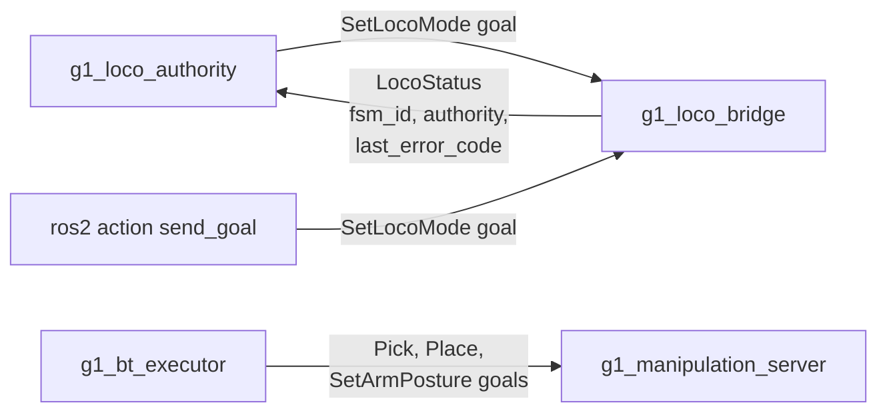

# g1_msgs

The stack's own interfaces: what `g1_locomotion` needs to drive the LocoClient bridge, and what
`g1_manipulation` serves to the behavior tree. Four actions and one message.

`ament_cmake` with `rosidl_default_generators`. No source of its own.



```bash
colcon build --symlink-install --packages-select g1_msgs
```

## action/SetLocoMode.action

| Field | Meaning |
|---|---|
| `fsm_id` (goal) | Target FSM id. Only `DAMP` (1), `STAND_UP` (4) and `START` (500) are accepted; the bridge rejects anything else and logs why. |
| `success`, `error_code` (result) | `error_code` is the raw LocoClient wire status: `0` on success, otherwise `7301`, `7302`, or a correlator timeout. |
| `message` (result) | Context for logs and CLI use. Not meant to be parsed. |

`Squat`, `Sit` and `ZeroTorque` have no constants here. Nothing needs them, and their transition
legality was never checked against a real onboard controller.

There is no feedback field. The exchange either completes or times out within a few seconds, with
nothing meaningful to report mid-flight.

## The manipulation actions

Served by `g1_manipulation_server`, called by the behavior tree in `g1_orchestration`.

| Action | Goal | Notes |
|---|---|---|
| `Pick` | `object_id`, `arm` | No pose in the goal. The server reads it from `/objects` when the goal starts, so a retry re-reads rather than replaying a stale one, and an object that is missing or stale there is a rejected goal rather than a guess. |
| `Place` | `pose`, `arm` | The pose is where the **object** ends up, not where the palm goes: the caller knows the target surface, only the server knows how the object is held. Transformed into the planning frame on arrival, so a goal in `odom` survives the robot having walked. |
| `SetArmPosture` | `group`, `named_target` | Named SRDF poses only, so a tree can say `tucked` without carrying fourteen joint values in XML. An unknown name is rejected, rather than silently holding position. |

`Pick` and `Place` publish a phase as feedback, and their result message names that phase on
failure. The phases are constants in the `.action` files so the server and its tests share one
definition instead of matching string literals. `SetArmPosture` has no feedback, for the same
reason `SetLocoMode` has none.

## msg/LocoStatus.msg

| Field | Meaning |
|---|---|
| `stamp` | When the status was produced. |
| `fsm_id` | Last FSM id the bridge knows to be true. `-1` before it has any information. |
| `authority` | `RELEASED`, `ACQUIRING`, `HELD` or `RELEASING`. Whether the bridge holds velocity-command authority. |
| `last_error_code` | Most recent wire status code seen, from a mode goal or a velocity request. |
| `ignored_cmd_vel` | How many non-zero velocity samples the bridge discarded for lack of authority. |

`ignored_cmd_vel` is monotonic and never reset on acquire, so a reader can assert that it stopped
increasing. Zero commands are not counted, because publishers idle at zero routinely and an idle
publisher is not a dropped intent. The counter exists because "the planner is running and the robot
is stationary" is otherwise silent.

## Why actions rather than services

Completion is asynchronous. The LocoClient wire exchange is two plain topics: a request published
now, a response correlated to it later. A Humble service callback has to populate its response
before returning, so waiting there would block the executor. An action's `handle_accepted` returns
immediately and reports the outcome later through the goal handle, which matches the protocol's own
asynchrony.

The manipulation actions are actions for a second reason as well: a pick runs for seconds and has
to be cancellable part-way, because a behavior tree that halts a running skill needs the arm to
stop rather than finish.
