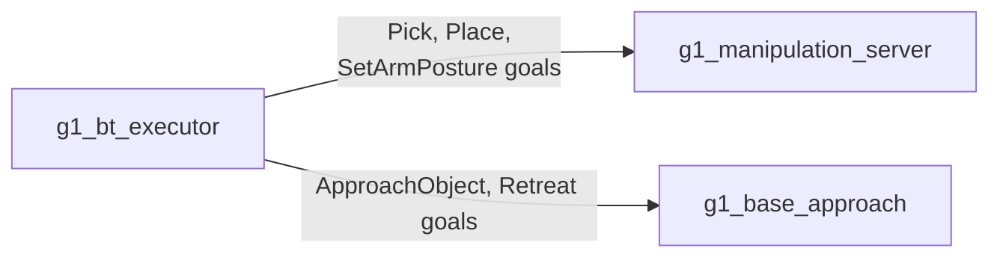

# g1_msgs

The stack's own interfaces: what `g1_locomotion` serves for the base approach, and what
`g1_manipulation` serves to the behaviour tree. Five actions, no messages.

`ament_cmake` with `rosidl_default_generators`. No source of its own.



```bash
colcon build --symlink-install --packages-select g1_msgs
```

## The manipulation actions

Served by `g1_manipulation_server`, called by the behavior tree in `g1_orchestration`.

| Action | Goal | Notes |
|---|---|---|
| `Pick` | `object_id`, `arm` | No pose in the goal. The server reads it from `/objects` when the goal starts, so a retry re-reads rather than replaying a stale one, and an object that is missing or stale there is a rejected goal rather than a guess. |
| `Place` | `surface_object_id` **or** `pose`, `arm` | Prefer the surface: the server reads it from `/objects` and stands the object on top of it, so the place and the approach that preceded it agree however far localization has drifted. A `pose` is where the **object** ends up, not where the palm goes, transformed into the planning frame on arrival. |
| `SetArmPosture` | `group`, `named_target` | Named SRDF poses only, so a tree can say `tucked` without carrying fourteen joint values in XML. An unknown name is rejected, rather than silently holding position. |

## The locomotion skill actions

Served by `g1_base_approach` in `g1_locomotion`, called by the same behavior tree.

| Action | Goal | Notes |
|---|---|---|
| `ApproachObject` | `object_id`, `arm`, `working_yaw`, `use_current_heading`, `timeout_s` | Walks the base until the object is inside the arm's reach window, judged in the base frame. Nav2 parks within 0.5 m and the window is about 0.2 m wide. |
| `Retreat` | `distance_m`, `timeout_s` | Reverses clear of a surface and stops. No turn: a navigation goal normally follows. |

`Pick` and `Place` publish a phase as feedback, and their result message names that phase on
failure. The phases are constants in the `.action` files so the server and its tests share one
definition instead of matching string literals. `SetArmPosture` has none: it is one planned motion
with nothing to report partway.

## Why actions rather than services

Every one of these takes seconds to minutes and has to be cancellable mid-flight. A service
callback has to populate its response before returning, so waiting there would block the executor;
an action's `handle_accepted` returns immediately and reports the outcome later through the goal
handle. Cancellation matters most: a mission that aborts has to be able to stop a walk or a
trajectory that is already running.

The manipulation actions are actions for a second reason as well: a pick runs for seconds and has
to be cancellable part-way, because a behavior tree that halts a running skill needs the arm to
stop rather than finish.
