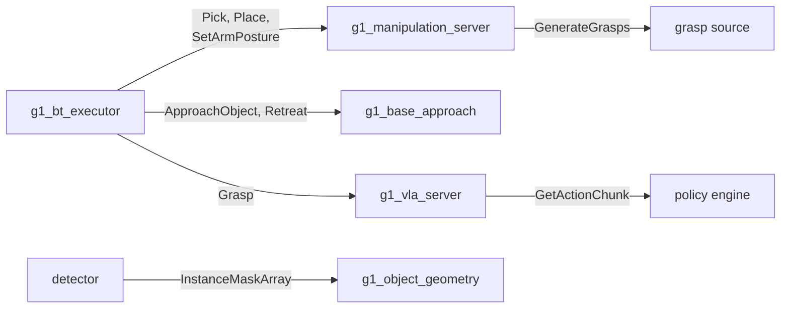

# g1_msgs

The stack's own interfaces: the actions the behavior tree calls on `g1_locomotion`,
`g1_manipulation` and `g1_vla`, the services behind the learned grasp and open-vocabulary
perception, and the instance masks a detector publishes. `ament_cmake` with
`rosidl_default_generators`, no source of its own.



```bash
colcon build --symlink-install --packages-select g1_msgs
```

## Actions

All six are actions because each runs for seconds and must be cancellable. Every one except
`SetArmPosture` publishes its phase as feedback, and `Pick`, `Place`, `ApproachObject` and
`Retreat` prefix a failure message with it. The phase strings are constants in the `.action`
files, so servers and tests share one definition.

| Action | Server | Goal | Notes |
|---|---|---|---|
| `Pick` | `g1_manipulation_server` | `object_id`, `arm` | The pose is read from `/objects` when the goal starts, so a retry re-reads it. An object not seen recently fails the goal. |
| `Place` | `g1_manipulation_server` | `surface_object_id` or `pose`, `arm` | `pose` is where the object ends up, not the palm, and is transformed into the planning frame on arrival. Prefer the surface: it comes from `/objects`, the stream the approach drove against. |
| `SetArmPosture` | `g1_manipulation_server` | `group`, `named_target` | Named SRDF poses only; an unknown name fails the goal. |
| `ApproachObject` | `g1_base_approach` | `object_id`, `arm`, `working_yaw`, `use_current_heading`, `timeout_s` | Walks the base until the object is inside the arm's reach window, judged in the base frame. Nav2 only parks within 0.5 m. |
| `Retreat` | `g1_base_approach` | `distance_m`, `timeout_s` | Reverses clear of a surface and stops, without turning. |
| `Grasp` | `g1_vla_server` | `instruction`, `object_id`, `arm` | Runs a learned policy under a planning-scene check. Success is the measured lift of `object_id`. Feedback counts chunks executed and rejected. |

## Services

| Service | Server | Notes |
|---|---|---|
| `GetActionChunk` | a `g1_vla` policy engine | `instruction` in, one chunk of absolute joint positions out. Positions may name any subset of the arm and hand joints; `time_from_start` must increase. `new_episode` marks a goal's first request. |
| `GenerateGrasps` | a `g1_perception` grasp source | Object id and hand in, poses and scores out, best first. Poses are in the generator's own gripper frame; the caller applies one measured offset. |
| `GroundInstruction` | `g1_instruction_grounder` | Instruction in, detector phrases and the target phrase out, plus optional exemplar pixels. |

## Messages

| Message | Carries | Notes |
|---|---|---|
| `InstanceMask` | `label`, `score`, `roi`, `data` | One object. `data` is a 0-or-255 crop of `roi`, not a full frame. `label` is the phrase the detector was asked for, so the object id holds when the model rewords its answer. |
| `InstanceMaskArray` | `header`, `image_width`, `image_height`, `model`, `instances` | `header` is the image's stamp and frame, not the publish time: the geometry node pairs on it. Nothing reads `model`, which keeps the segmenter swappable. |
| `ExemplarPoint` | `phrase`, `x`, `y` | A pixel on one object, returned by `GroundInstruction` to tell instances of a phrase apart. |
