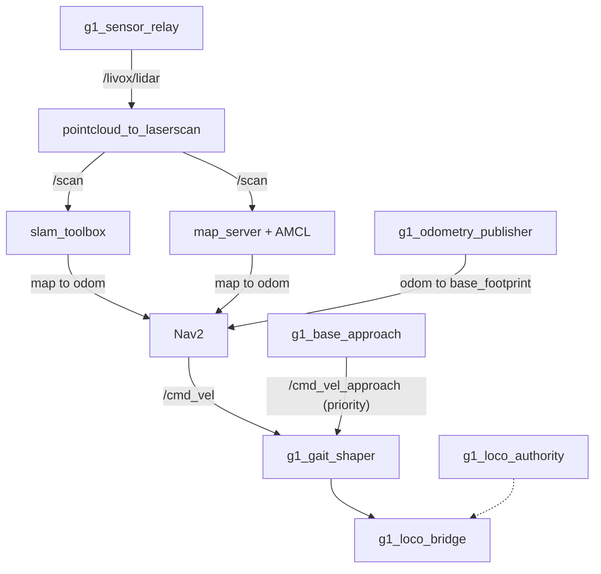

# g1_navigation

SLAM Toolbox mapping, AMCL localization and Nav2 for the G1 on the `unitree_mujoco` track.
Configuration, launch files and two G1-specific nodes' worth of glue. Nav2 itself is upstream.

`ament_cmake`, Python launch files.



## Launch files

| File | Purpose |
|---|---|
| `nav_stack.launch.py` | The stack itself, with no simulator: the shared container, the scan pipeline, SLAM or localization, and Nav2 when asked. What `g1_bringup` includes. |
| `nav_sim.launch.py` | Standalone wrapper: a simulator, `nav_stack.launch.py`, and RViz. What the integration suites launch. |
| `scan.launch.py` | `pointcloud_to_laserscan`, flattening the LiDAR into the 2D scan SLAM and AMCL consume. |
| `slam.launch.py` | `slam_toolbox` in online async mapping mode. |
| `localization.launch.py` | `map_server` and AMCL against the committed map. |
| `nav2.launch.py` | Nav2 itself: planner, controller, behaviours, BT navigator, lifecycle manager. One of the pieces `nav_stack.launch.py` composes, and only when `nav:=true`. |

The operator entry point is `g1_bringup`'s, matching `nav2_bringup`. It stages the simulator itself
and includes `nav_stack.launch.py` directly, so nothing here has to bundle a simulator on its
behalf. `nav_sim.launch.py` is that same stack with a simulator and RViz attached, for running
navigation on its own; it exposes `use_composition`, `container_name` and `map`, which the bring-up
entry point does not.

`nav_stack.launch.py` deliberately stages no simulator. Both callers stage exactly one, and a
second would put two writers on `/lowcmd`; `test_launch_threading` asserts the absence rather than
trusting it.

## Running

```bash
ros2 launch g1_bringup bringup.launch.py mode:=mapping rviz:=true
```

Drive it around with teleop and watch the map fill in. When it looks right:

```bash
ros2 run nav2_map_server map_saver_cli -f ~/facility
```

`maps/facility` is already committed, so that is only for a new scene. To navigate:

```bash
ros2 launch g1_bringup bringup.launch.py mode:=localization nav:=true rviz:=true

ros2 action send_goal /navigate_to_pose nav2_msgs/action/NavigateToPose \
  "{pose: {header: {frame_id: map}, pose: {position: {x: 2.5, y: -2.5}, orientation: {w: 1.0}}}}"
```

Everything here needs `sensors:=true`, which gates the LiDAR, the relay and the
`odom` to `base_footprint` chain. The navigation modes pass it for you.

## What the gait forces

The simulated gait has a hard initiation dead zone, so the usable action set is stop, drive
straight, turn in place. `g1_locomotion`'s `g1_gait_shaper` collapses Nav2's continuous output onto
those three, subtractively. Full numbers are in `g1_motion_service_sim`'s README.

Two consequences worth knowing before tuning:

The shaper zeroes any yaw below 1.20 rad/s, and the pure pursuit controller's curvature steering is
usually well under that. Effective behaviour is bang-bang: drive straight until the heading error
is large, then rotate in place. That makes `angular_dist_threshold` the dominant knob, not
`lookahead_dist`.

Nav2 is no longer the only writer on the velocity channel. `nav2.launch.py` also starts
`g1_locomotion`'s `g1_base_approach`, which closes the last half metre to a workbench under its own
control because Nav2's 0.5 m goal tolerance is more than twice the arm's usable window. The gait
shaper arbitrates the two and gives the approach priority; see `g1_locomotion`'s README for why the
arbitration lives there and not in a `twist_mux`.

It is launched unconditionally rather than gated on manipulation. It reads `/objects`, so without
`manipulation:=true` its goals simply fail with "no fresh pose", and gating it on an argument this
package knows nothing about is the cross-package coupling this file avoids elsewhere.

`behavior_server`'s `max_rotational_vel` is 1.57 rather than upstream's 1.0. At 1.0 it sat below
the shaper's engage threshold, so every `Spin` was zeroed before reaching the bridge while still
reporting success. `test_gait_coupling` now fails if that pairing regresses.

## Decisions that look odd without the reason

Nav2 runs uncomposed while the scan and localization nodes compose. Composed, the costmaps came up
on `Costmap2DROS` defaults instead of the params file, and `controller_server` then hung forever
activating against a frame that does not exist. `use_composition:=true` raises with that
explanation rather than hanging.

Reverse recovery is removed from both behaviour trees and from `behavior_plugins`, so no action
server exists to invoke. This gait barely reverses at all, and upstream's backup speed sits inside
the dead zone, so `BackUp` would burn its whole time allowance producing no motion while consuming
the round-robin slot `Spin` could have used.

`z_voxels` is 40, not upstream's 16. The sensor sits at 1.22 m, outside a 0.8 m voxel column.

`obstacle_max_range` is 3.0 m, well inside the sensor's reach, because the estimate's **attitude**
is what limits how far a floor return can be placed -- not its height. Measured over 713 sweeps of
a walk, the floor plane as the costmap sees it sits within a centimetre of where it belongs
(-0.0097 m median offset, barely moving) but tilts: 0.15 deg median, 0.75 at p95, 1.62 worst.
Tilt times range is a height error, so an estimate that is exact underfoot is wrong by
centimetres far away. At 5 m it takes 0.92 deg to lift a floor return past
`min_obstacle_height`; at 2 m it takes 2.3.

The same run, by range bucket:

| range | floor points | marked as obstacle |
|---|---|---|
| 1-2 m | 1 726 642 | 0.000 % |
| 2-3 m | 1 597 391 | 0.000 % |
| 3-4 m | 653 004 | 0.012 % |
| 4-5 m | 338 750 | 0.091 % |

3.0 m is chosen on that measurement rather than on the arithmetic, which does not quite reach:
1.53 deg clears the cut at 3 m and the worst tilt seen was 1.62. What it costs is that an
unmapped obstacle enters the global costmap about 2 m later; the local costmap loses nothing,
being 3 x 3 m rolling and unable to hold a return past ~2.1 m regardless. Before this, false
floor marks at 4-5 m were reaching the global costmap and failing the planner: a 13-goal soak
completed 7 with `obstacle_max_range: 5.0` and all 13 with 3.0.

Those tilt figures are the simulator's, so the 3.0 does not transfer as a number — only as a
method. Re-measure it on the robot the same way, by bucketing floor returns by range and
counting what crosses `min_obstacle_height`; a real Mid360 with real IMU noise may want a
shorter range, and it is the distribution's tail that decides, not its median.

## Configuration

| File | Contents |
|---|---|
| `config/nav2_params.yaml` | Planner, controller, costmaps, behaviours, BT navigator. |
| `config/localization.yaml` | `map_server` and AMCL. |
| `config/scan.yaml` | The point cloud to laser scan flatten, including the height band. |
| `config/slam_mapping.yaml` | `slam_toolbox` online async. |
| `config/g1_navigation.rviz` | RViz for the navigation modes. Fixed frame `map`. |
| `navigate_to_pose.xml`, `navigate_through_poses.xml` | Behaviour trees, with reverse recovery removed. |
| `maps/facility.{yaml,pgm}` | The committed map of the navigation scene. |

### RViz

`config/g1_navigation.rviz` holds everything in two toggleable groups: Nav2 (map, scan, AMCL
particle swarm, plans, both costmaps, footprints, the local voxel grid) and Sensors, which starts
folded away. `g1_bringup`'s `config/g1_sensors.rviz` is the counterpart for `mode:=none`: the same
Sensors group, no Nav2 group, fixed frame `odom`, because there is no `map` frame without SLAM or
AMCL.

Two static files rather than one rewritten at launch, since they differ in fixed frame as well as
in which groups exist. The price is drift, which `test_rviz_configs` catches.

This file lives here rather than in `g1_bringup` because the particle swarm is a
`nav2_rviz_plugins` display, and shipping it from the bring-up package would give that package a
Nav2 dependency.

## Tests

| Test | Needs a simulator | Covers |
|---|---|---|
| `test_navigate_to_pose` | yes | The acceptance gate: the robot reaches a goal on its own. |
| `test_nav_authority` | yes | Authority acquired on activate, released on deactivate, `cmd_vel` discarded before it. |
| `test_scan_pipeline` | yes | The frame chain and the scan. |
| `test_slam_map` | yes | slam_toolbox owning `map` to `odom`, and the map's geometry. |
| `test_gait_coupling` | no | Spin's rotational limits against the shaper's engage threshold. |
| `test_launch_threading` | no | Arguments surviving every include boundary, for both callers; `nav_stack.launch.py`'s include set, its single container, the uncomposed Nav2 pin, and that it stages no simulator. |
| `test_rviz_configs` | no | The sensor display group not drifting between the two configs. |
| `test_no_sim_time` | no | No shipped config enables `use_sim_time`. There is no `/clock` on this track. |

```bash
colcon test --packages-select g1_navigation
```

## Soak test

`nav_soak` brings the stack up, drives a list of goals across the facility one at a time,
records health, and tears everything down.

```bash
ros2 run g1_navigation nav_soak                        # default goal list
ros2 run g1_navigation nav_soak --rviz
ros2 run g1_navigation nav_soak --goals "3.0 -3.0,-2.5 2.0"
```

It reports distance driven, how much of Nav2's output falls inside the gait shaper's dead
band, `map` to `odom` correction sizes, pelvis pitch through the gait, and local costmap
lethal-cell counts. `nav_diag.py` is the recorder and also runs on its own against a stack
that is already up:

```bash
ros2 run g1_navigation nav_diag.py 200
```

Three details in `nav_soak` are load-bearing, and doing any of them the obvious way produces
results that look like stack defects. It sends one goal at a time and lets each finish, since
killing the action client mid-goal lets the next goal preempt the running one and the robot
falls. It tears down by process group and sweeps `/proc/PID/cmdline` rather than executable
paths, because anything running as `python3` or the `ros2` CLI otherwise survives as an orphan
into the next run. And it reads readiness from the launch log, because action and TF discovery
can exceed any reasonable timeout and AMCL only publishes `/amcl_pose` after a motion-gated
update, so a stationary robot never emits one.

Verify by hand that nothing survived:

```bash
ros2 node list --no-daemon | sort | uniq -d    # any output means an orphan is still running
```

`test_navigate_to_pose` will fail occasionally without anything being wrong. It drives the real
gait, which sometimes comes up unresponsive, and the suites are timing-sensitive. Re-run it alone
before believing a red run:

```bash
ctest --test-dir build/g1_navigation -R '^test_navigate_to_pose$'
```

There is deliberately no retry wrapper, because a retry would hide the rate.
