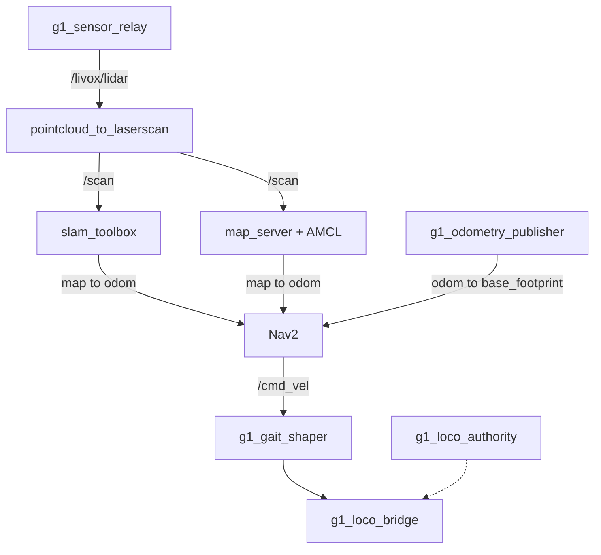

# g1_navigation

SLAM Toolbox mapping, AMCL localization and Nav2 for the G1 on the `unitree_mujoco` track.
Configuration, launch files and two G1-specific nodes' worth of glue. Nav2 itself is upstream.

`ament_cmake`, Python launch files.



## Launch files

| File | Purpose |
|---|---|
| `nav_sim.launch.py` | This package's orchestrator. Composes the simulator, the scan pipeline, and either SLAM or localization. |
| `scan.launch.py` | `pointcloud_to_laserscan`, flattening the LiDAR into the 2D scan SLAM and AMCL consume. |
| `slam.launch.py` | `slam_toolbox` in online async mapping mode. |
| `localization.launch.py` | `map_server` and AMCL against the committed map. |
| `nav2.launch.py` | Nav2 itself: planner, controller, behaviours, BT navigator, lifecycle manager. |

The operator entry point is `g1_bringup`'s, matching `nav2_bringup`. `nav_sim.launch.py` still runs
directly if you want it.

## Running

```bash
ros2 launch g1_bringup bringup.launch.py mode:=mapping rviz:=true
```

Drive it around with teleop and watch the map fill in. When it looks right:

```bash
ros2 run nav2_map_server map_saver_cli -f ~/facility
```

`maps/facility` is already committed, so that is only for a new scene. To navigate:

```bash
ros2 launch g1_bringup bringup.launch.py mode:=localization nav:=true rviz:=true

ros2 action send_goal /navigate_to_pose nav2_msgs/action/NavigateToPose \
  "{pose: {header: {frame_id: map}, pose: {position: {x: 2.5, y: -2.5}, orientation: {w: 1.0}}}}"
```

Everything here needs `sensors:=true`, which gates the LiDAR, the relay and the
`odom` to `base_footprint` chain. The navigation modes pass it for you.

## What the gait forces

The simulated gait has a hard initiation dead zone, so the usable action set is stop, drive
straight, turn in place. `g1_locomotion`'s `g1_gait_shaper` collapses Nav2's continuous output onto
those three, subtractively. Full numbers are in `g1_motion_service_sim`'s README.

Two consequences worth knowing before tuning:

The shaper zeroes any yaw below 1.20 rad/s, and the pure pursuit controller's curvature steering is
usually well under that. Effective behaviour is bang-bang: drive straight until the heading error
is large, then rotate in place. That makes `angular_dist_threshold` the dominant knob, not
`lookahead_dist`.

`behavior_server`'s `max_rotational_vel` is 1.57 rather than upstream's 1.0. At 1.0 it sat below
the shaper's engage threshold, so every `Spin` was zeroed before reaching the bridge while still
reporting success. `test_gait_coupling` now fails if that pairing regresses.

## Decisions that look odd without the reason

Nav2 runs uncomposed while the scan and localization nodes compose. Composed, the costmaps came up
on `Costmap2DROS` defaults instead of the params file, and `controller_server` then hung forever
activating against a frame that does not exist. `use_composition:=true` raises with that
explanation rather than hanging.

Reverse recovery is removed from both behaviour trees and from `behavior_plugins`, so no action
server exists to invoke. This gait barely reverses at all, and upstream's backup speed sits inside
the dead zone, so `BackUp` would burn its whole time allowance producing no motion while consuming
the round-robin slot `Spin` could have used.

`z_voxels` is 40, not upstream's 16. The sensor sits at 1.22 m, outside a 0.8 m voxel column.

## Configuration

| File | Contents |
|---|---|
| `config/nav2_params.yaml` | Planner, controller, costmaps, behaviours, BT navigator. |
| `config/localization.yaml` | `map_server` and AMCL. |
| `config/scan.yaml` | The point cloud to laser scan flatten, including the height band. |
| `config/slam_mapping.yaml` | `slam_toolbox` online async. |
| `config/g1_navigation.rviz` | RViz for the navigation modes. Fixed frame `map`. |
| `navigate_to_pose.xml`, `navigate_through_poses.xml` | Behaviour trees, with reverse recovery removed. |
| `maps/facility.{yaml,pgm}` | The committed map of the navigation scene. |

### RViz

`config/g1_navigation.rviz` holds everything in two toggleable groups: Nav2 (map, scan, AMCL
particle swarm, plans, both costmaps, footprints, the local voxel grid) and Sensors, which starts
folded away. `g1_bringup`'s `config/g1_sensors.rviz` is the counterpart for `mode:=none`: the same
Sensors group, no Nav2 group, fixed frame `odom`, because there is no `map` frame without SLAM or
AMCL.

Two static files rather than one rewritten at launch, since they differ in fixed frame as well as
in which groups exist. The price is drift, which `test_rviz_configs` catches.

This file lives here rather than in `g1_bringup` because the particle swarm is a
`nav2_rviz_plugins` display, and shipping it from the bring-up package would give that package a
Nav2 dependency.

## Tests

| Test | Needs a simulator | Covers |
|---|---|---|
| `test_navigate_to_pose` | yes | The acceptance gate: the robot reaches a goal on its own. |
| `test_nav_authority` | yes | Authority acquired on activate, released on deactivate, `cmd_vel` discarded before it. |
| `test_scan_pipeline` | yes | The frame chain and the scan. |
| `test_slam_map` | yes | slam_toolbox owning `map` to `odom`, and the map's geometry. |
| `test_gait_coupling` | no | Spin's rotational limits against the shaper's engage threshold. |
| `test_launch_threading` | no | Arguments surviving `bringup` to `nav_sim` to `sim`. |
| `test_rviz_configs` | no | The sensor display group not drifting between the two configs. |
| `test_no_sim_time` | no | No shipped config enables `use_sim_time`. There is no `/clock` on this track. |

```bash
colcon test --packages-select g1_navigation
```

`test_navigate_to_pose` will fail occasionally without anything being wrong. It drives the real
gait, which sometimes comes up unresponsive, and the suites are timing-sensitive. Re-run it alone
before believing a red run:

```bash
ctest --test-dir build/g1_navigation -R '^test_navigate_to_pose$'
```

There is deliberately no retry wrapper, because a retry would hide the rate.
