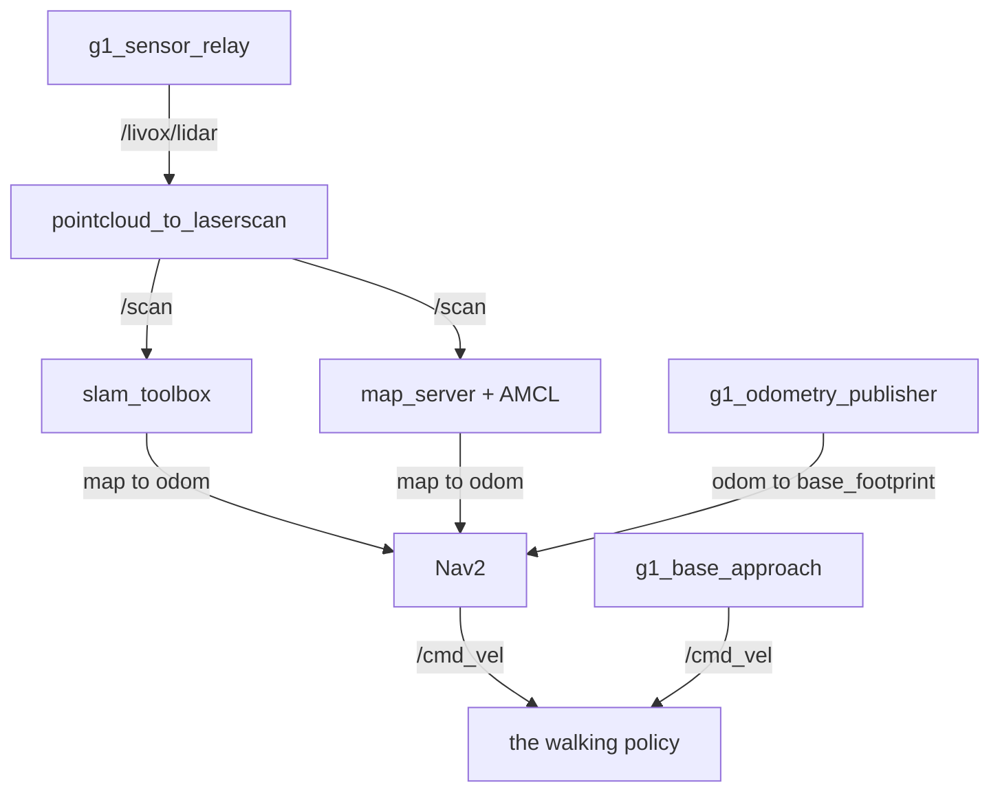

# g1_navigation

SLAM Toolbox mapping, AMCL localization and Nav2 for the G1 on the `unitree_mujoco` track.
Configuration, launch files and glue; the nodes themselves are upstream. `ament_cmake`, Python
launch files.



## Launch files

| File | Purpose |
|---|---|
| `nav_stack.launch.py` | The stack without a simulator: the shared container, the scan pipeline, SLAM or localization, and Nav2 with `nav:=true`. `g1_bringup` includes this. |
| `nav_sim.launch.py` | A simulator, `nav_stack.launch.py` and optional RViz. The integration suites launch this. |
| `scan.launch.py` | `pointcloud_to_laserscan`, flattening the LiDAR into the 2D scan SLAM and AMCL consume. |
| `slam.launch.py` | `slam_toolbox` in online async mapping mode. |
| `localization.launch.py` | `map_server` and AMCL against the committed map. |
| `nav2.launch.py` | Planner, controller, behaviors, BT navigator, lifecycle manager and `g1_base_approach`. Included only with `nav:=true`. |

`g1_bringup`'s `bringup.launch.py` is the operator entry point. `nav_sim.launch.py` also exposes
`use_composition` and `container_name`, which the bring-up entry point does not.

`nav_stack.launch.py` stages no simulator. Both callers stage exactly one, and a second would put
two writers on `rt/lowcmd`; `test_launch_threading` asserts it.

## Running

```bash
ros2 launch g1_bringup bringup.launch.py mode:=mapping rviz:=true
```

Drive it around with teleop and watch the map fill in, then save it:

```bash
ros2 run nav2_map_server map_saver_cli -f ~/facility
```

`maps/facility` is already committed, so that is only needed for a new scene. To navigate:

```bash
ros2 launch g1_bringup bringup.launch.py mode:=localization nav:=true rviz:=true

ros2 action send_goal /navigate_to_pose nav2_msgs/action/NavigateToPose \
  "{pose: {header: {frame_id: map}, pose: {position: {x: 2.5, y: -2.5}, orientation: {w: 1.0}}}}"
```

Everything here needs `sensors:=true` for the LiDAR, the relay and the `odom` to `base_footprint`
chain. The navigation modes set it for you.

## Gait constraints

The walking policy tracks a proportional fraction of the commanded velocity, with a deadband below
about 0.15 m/s on both linear axes: commanded 0.10 m/s, the robot does not move. Yaw has no
deadband and tracks near 1:1. `g1_controllers` clamps commands to 0.6 m/s and 0.9 rad/s.

Beyond that, ordinary Nav2 tuning applies. Any controller or recovery must command speeds above the
deadband, which is why reverse recovery is removed from both behavior trees and from
`behavior_plugins`: upstream's backup speed sits inside it.

Nav2 is not the only `/cmd_vel` writer. `nav2.launch.py` also starts `g1_locomotion`'s
`g1_base_approach`, which closes the last half metre because Nav2's 0.5 m goal tolerance is more
than twice the arm's usable window. Nothing arbitrates between them: the mission tree runs
`NavigateToPose` and `ApproachObject` in sequence, never together.

## Settings worth knowing before changing them

- Nav2 runs uncomposed while the scan and localization nodes compose. Composed, the costmaps come
  up on `Costmap2DROS` defaults instead of the params file and `controller_server` hangs
  activating, so `use_composition:=true` is rejected.
- `z_voxels` is 16, the voxel grid's maximum, so the 2.0 m column, which must contain the sensor
  at 1.22 m or `VoxelLayer` rejects every cloud, comes from `z_resolution` 0.125 m instead.
- `obstacle_max_range` is 3.0 m, well inside the sensor's reach. Attitude error times range is
  height error, so distant floor returns cross `min_obstacle_height` and mark as obstacles. The
  value is the simulator's; re-measure it on the robot.
- `obstacle_min_range` is 0.6 m. It keeps the carried object and the robot's own arm off the
  costmap; anything the base can hit shows up beyond it.
- AMCL uses `OmniMotionModel` because the robot strafes: `g1_base_approach` commands lateral
  velocity and the gait drifts sideways. The alphas stay at Nav2's defaults.

## Configuration

| Path | Contents |
|---|---|
| `config/nav2_params.yaml` | Planner, controller, costmaps, behaviors, BT navigator. |
| `config/localization.yaml` | `map_server` and AMCL. |
| `config/scan.yaml` | The point cloud to laser scan flatten, including the height band. |
| `config/slam_mapping.yaml` | `slam_toolbox` online async. |
| `config/g1_navigation.rviz` | RViz for the navigation modes. Fixed frame `map`. |
| `config/navigate_to_pose.xml`, `config/navigate_through_poses.xml` | Behavior trees, with reverse recovery removed. |
| `maps/facility.{yaml,pgm}` | The committed map of the navigation scene. |

`g1_navigation.rviz` has a Nav2 group and a folded Sensors group. `g1_bringup`'s
`g1_sensors.rviz` carries the same Sensors group with fixed frame `odom` for `mode:=none`, where no
`map` frame exists; `test_rviz_configs` keeps the two in step. The config lives here because its
AMCL particle display comes from `nav2_rviz_plugins`, a dependency `g1_bringup` should not take.

## Tests

```bash
colcon test --packages-select g1_navigation
```

| Test | Needs a simulator | Covers |
|---|---|---|
| `test_navigate_to_pose` | yes | The acceptance gate: the robot reaches a goal on its own, stays upright, and never trips the emergency freeze with the full sensor pipeline running. |
| `test_scan_pipeline` | yes | The frame chain and the scan. |
| `test_slam_map` | yes | slam_toolbox owning `map` to `odom`, and the map's geometry. |
| `test_launch_threading` | no | Arguments surviving every include boundary, for both callers: the include set, the single container, the uncomposed Nav2 pin, and that no simulator is staged. |
| `test_rviz_configs` | no | The Sensors display group not drifting between the two configs. |
| `test_no_sim_time` | no | No shipped config enables `use_sim_time`. There is no `/clock` on this track. |

`test_navigate_to_pose` drives the real gait and is timing-sensitive. It has no retry wrapper, so a
flaky rate stays visible. Re-run it alone before believing a red run:

```bash
ctest --test-dir build/g1_navigation -R '^test_navigate_to_pose$'
```

## Soak test

`nav_soak` brings the stack up, drives a list of goals across the facility one at a time, records
health, and tears everything down.

```bash
ros2 run g1_navigation nav_soak                        # default goal list
ros2 run g1_navigation nav_soak --rviz
ros2 run g1_navigation nav_soak --goals "3.0 -3.0,-2.5 2.0"
```

It reports distance driven, the share of Nav2 commands inside the gait deadband, `map` to `odom`
correction sizes, pelvis pitch, and local costmap lethal-cell counts. `nav_diag.py` is the
recorder, and also runs on its own against a stack that is already up:

```bash
ros2 run g1_navigation nav_diag.py 200
```

Three details in `nav_soak` are load-bearing:

- One goal at a time, each allowed to finish. A goal preempted mid-run replans abruptly and the
  robot can fall.
- Teardown by process group plus a `/proc/PID/cmdline` sweep. Processes running as `python3` or
  the `ros2` CLI otherwise survive as orphans into the next run.
- Readiness read from the launch log. Discovery can outlast any timeout, and AMCL publishes
  `/amcl_pose` only after the robot moves.

Check that nothing survived:

```bash
ros2 node list --no-daemon | sort | uniq -d    # any output means an orphan is still running
```
