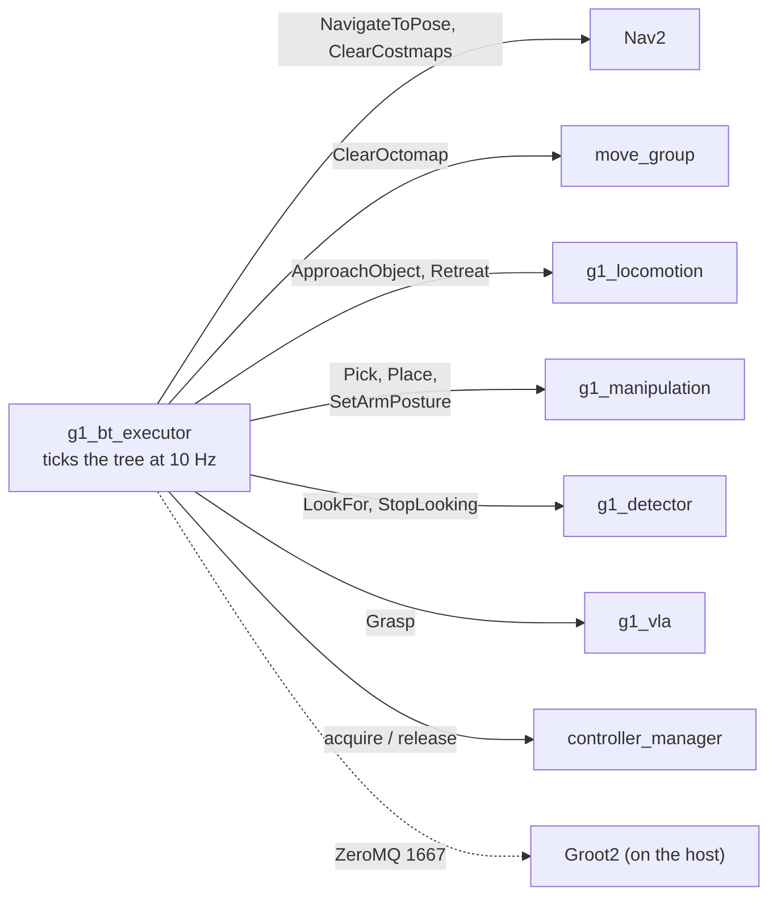

# g1_orchestration

The behavior tree that composes navigation and manipulation into a mission, on
BehaviorTree.CPP **v4**. `ament_cmake`, C++20.



The tree decides what happens and in what order; the skills decide how. Nothing here plans or
moves a joint. Nav2 links the same BehaviorTree.CPP library, and `behaviortree_ros2` is not in the
image, which is why this package has its own action-client base.

## Layout

One file per leaf, the layout `nav2_behavior_tree` uses.

| Path | What it is |
|---|---|
| `include/g1_orchestration/skills/`, `src/skills/` | One header and one source per leaf. |
| `ros_action_node.hpp` | Action-client base. Owns goal handling, cancellation and timeouts. |
| `skill_action_node.hpp` | Adds `judgeResult` for the `success`/`message` convention, so most leaves need only `fillGoal`. |
| `service_leaf.hpp` | The same for leaves that call a service and finish in one tick. |
| `ports.hpp` | Ports used by more than one leaf. |
| `registration.hpp`, `src/registration.cpp` | Binds classes to the names trees use. |

## Leaves

| Leaf | Wraps | Ports |
|---|---|---|
| `NavigateToPose` | Nav2 `/navigate_to_pose` | in `goal` as `"x;y;yaw"`, `frame_id`, `behavior_tree`; out `goal_yaw` |
| `ApproachObject` | `/g1_base_approach/approach_object` | `object_id`, `arm`, `working_yaw`, `use_current_heading`, `timeout_s` |
| `Retreat` | `/g1_base_approach/retreat` | `distance`, `timeout_s` |
| `Pick` | `/g1_manipulation_server/pick` | `object_id`, `arm` |
| `Place` | `/g1_manipulation_server/place` | `surface` (preferred), or `target` as `"x;y;z"` with `frame_id`; `arm` |
| `SetArmPosture` | `/g1_manipulation_server/set_arm_posture` | `group`, `named_target` |
| `ClearCostmaps` | Nav2 costmap clear services | `timeout_s`, `global_service`, `local_service` |
| `ClearOctomap` | MoveIt `/clear_octomap` | `timeout_s`, `service` |
| `AcquireArm` / `ReleaseArm` | `controller_manager` services | `timeout_s` |
| `LookFor` | the detector's `phrases`, then `/objects` | `objects` (`id` or `id=phrase`, comma-separated, waited on), `also` (asked for, not waited on), `detector`, `timeout_s`. Answers RUNNING while it waits. |
| `StopLooking` | the detector's `phrases` | `detector`, `timeout_s`; empties the list, which idles the detector |
| `Grasp` | `/g1_vla_server/grasp` | `instruction`, `object_id`, `arm` |

Every action leaf also takes `server_timeout_s` (default 10.0), how long to wait for the server to
appear.

Action leaves send their goal on the first tick, answer RUNNING while it is in flight, and
**cancel rather than abandon** when halted. A failed leaf logs the server's own reason, so a
failure reads `did not complete: could not reach 'tucked'` rather than just failing.

`ApproachObject` requires either `working_yaw` or `use_current_heading`. Pass the staging goal's
`goal_yaw` rather than retyping the number:

```xml
<NavigateToPose goal="4.30;-5.60;1.5708" goal_yaw="{workbench_yaw}"/>
<ApproachObject object_id="red_block" working_yaw="{workbench_yaw}"/>
```

## Adding a skill

A skill is a ROS action served by whichever package owns that domain, plus a leaf here that calls
it. Anything that writes a velocity belongs in `g1_locomotion`; anything that moves the arm belongs
in `g1_manipulation`. Nothing about the robot goes in this package.

1. **Define the action** in `g1_msgs`, and add it to that package's `CMakeLists.txt`. Give the
   result a `success` and a `message` so the leaf can use the shared result judging.
2. **Implement the server** in the owning package. Not here.
3. **Add the leaf**, a header and a source under `skills/`. Derive from `SkillActionNode` and the
   only thing left to write is `fillGoal`, because `judgeResult` already handles the
   `success`/`message` convention. Derive from `RosActionNode` instead when the result is not that
   shape, as Nav2's is not, or from `ServiceLeaf` and override `tick()` for a call that finishes in
   one tick. `skills/pick.cpp` and `skills/clear_costmaps.cpp` are the two shortest examples.
4. **Register it** in `src/registration.cpp` with `registerLeaf<OpenDoor>(factory, "OpenDoor",
   context)`, and list the source in `CMakeLists.txt`.
5. **Regenerate the Groot2 palette** and rebuild:

```bash
ros2 run g1_orchestration g1_bt_node_model src/g1_orchestration/trees/g1_orchestration_nodes.xml
```

Port descriptions become Groot2's tooltips, so write them for a tree author. `test_node_model`
fails if the palette drifts, and `test_tree_loads` fails if a tree names a leaf nobody registered.

## Trees

| Tree | Needs | What it does |
|---|---|---|
| `pick_and_place.xml` | Nav2, `world:=navigation`, perception | Acquire, tuck, drive to a staging pose, look, close the last gap, pick, carry, drive to storage, look, close again, place, tuck, release. |
| `pick_and_place_in_place.xml` | `world:=manipulation` | The same skills with no driving. |
| `sort_into_box.xml` | `world:=tabletop`, perception | Pick the red block from a cluttered table and drop it in the box. |
| `vla_grasp_in_place.xml` | `world:=manipulation`, `vla:=true` | The learned grasp in place of a planned pick. |
| `TuckBothArms` | subtree of `pick_and_place.xml` | Both arms to `tucked`, each retried. |

The navigation stations are staging poses, not working poses: Nav2's goal tolerance is 0.5 m
against an arm window about 0.11 m wide, so `ApproachObject` closes the rest against the measured
object. Named postures are driven per arm, because `both_arms` fails to execute a named posture on
this stack while either arm alone succeeds.

## The arm bracket belongs to the executor

The executor releases the arm and hands on every exit path (success, tree failure, an exception
while loading, SIGINT) through an RAII guard around the whole tree. `ReleaseArm` also exists as a
leaf for handing the arm back early, and always reports SUCCESS.

Acquiring trades `arm_freeze_controller` for `arm_trajectory_controller` in one `STRICT`
`switch_controller` call: the component leaves unclaimed joints unpowered, so two calls would drop
the arms in between, and `BEST_EFFORT` can silently apply only the deactivation. Because `STRICT`
refuses a switch that is already done, both controllers' states are read first; `planArmSwitch`
makes that decision without service calls, so it is unit-tested. The hands are separate component
activations and keep `BEST_EFFORT`, so a hand that will not come up still leaves the arm usable.

## Running

The mission starts nothing else. The simulator, Nav2, MoveIt and the skills must already be up.

```bash
ros2 launch g1_bringup bringup.launch.py moveit:=true manipulation:=true pin_pelvis:=true \
  world:=manipulation odometry:=ground_truth activate_arm:=true activate_arm_delay_s:=40.0
```

```bash
ros2 launch g1_orchestration mission.launch.py tree:=pick_and_place_in_place.xml
```

The full mission wants `mode:=localization nav:=true world:=navigation` instead.

| Argument | Default | Meaning |
|---|---|---|
| `tree` | `pick_and_place.xml` | Which tree in `trees/` to run. |
| `groot2_port` | `1667` | ZeroMQ port, or `0` to disable the publisher. |
| `tick_rate_hz` | `10.0` | How often the tree is ticked. |

## Groot2

Groot2 runs on the **host**, not in the container. The container uses host networking, so the
editor reaches the executor at `localhost:1667`.

**To watch a run:** start the mission, then choose Monitor and connect to `localhost:1667`. The
publisher only exists while a tree is running.

**To edit trees:** open `trees/g1_orchestration.btproj`. Once per project, use **Import Models**
and pick `trees/g1_orchestration_nodes.xml` beside it; Groot2 writes the model into the project
and remembers it. Tree files are symlinked into the install space, so a tree saved from Groot2 is
picked up by the next `ros2 launch` with no rebuild.

On the free tier, live monitoring is capped at 20 nodes per view and blackboard inspection,
breakpoints and node substitution are PRO-only. The editor itself is unrestricted.

## Tests

None need a simulator.

| Test | Covers |
|---|---|
| `test_tree_loads` | Every shipped tree parses against the registered node set; the mission tree still has the leaves and retry wrappers it is supposed to; an unknown leaf is rejected; the port string conversions and their refusals. |
| `test_action_leaf` | A leaf ticked against a real server on the two threads the executor uses: a rejected goal fails the leaf, an accepted one that succeeds reaches SUCCESS. `LookFor` against a stand-in detector: what it writes, the ids it waits on, and that it does not block a tick. |
| `test_node_model` | The checked-in Groot2 palette matches the registered nodes and their ports. |
| `test_authority_drift` | The acquire sequence against `g1_bringup`'s `activate_arm`: the same names, the arm first with the hands behind it, and the freeze controller still displaced in the same switch. Plus `planArmSwitch`, including that an incoming controller which is not loaded switches nothing at all. |

```bash
colcon test --packages-select g1_orchestration
```
