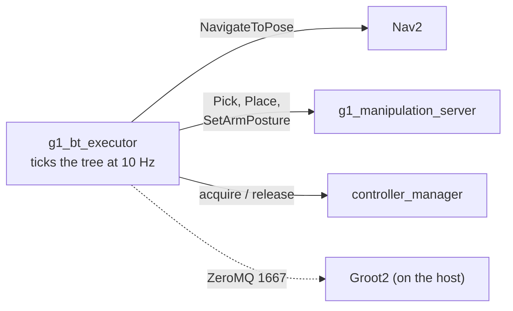

# g1_orchestration

The behavior tree that composes navigation and manipulation into a mission, on
BehaviorTree.CPP **v4**.

`ament_cmake`, C++20. One node, a handful of leaves, and the trees they run.



The tree decides *what* happens and in what order; the skills decide *how*. Nothing here plans,
moves a joint, or drives a costmap. Nav2 in particular is a black box: the tree sees whether a
goal was reached and nothing else.

## v4 alongside Nav2's v3

Nav2 uses BehaviorTree.CPP **v3** for its own navigator, and keeps it. The two are separate
Debian packages that install side by side with disjoint files (`bt4_*` vs `bt3_*` binaries,
`libbehaviortree_cpp.so` vs `libbehaviortree_cpp_v3.so`) and disjoint include roots. Nothing
links both: `bt_navigator` links v3 inside its own process, this executor links v4 inside its
own, and they only ever meet over the `NavigateToPose` action.

Worth stating because it used not to be true — v4's deb once collided with v3's over
`/opt/ros/humble/bin/bt3_log_cat` (BehaviorTree.CPP issue #734). That is long fixed, and it was
verified here by installing both rather than assumed.

`btcpp_ros2` (BehaviorTree.ROS2) is **not released for Humble**, which is why this package
hand-rolls its one action-client node base rather than vendoring that repo for four leaves.

## Leaves

| Leaf | Wraps | Ports |
|---|---|---|
| `NavigateToPose` | Nav2's `/navigate_to_pose` | `goal` as `"x;y;yaw"`, `frame_id` |
| `Pick` | `g1_manipulation` | `object_id`, `arm` |
| `Place` | `g1_manipulation` | `target` as `"x;y;z"`, `arm`, `frame_id` |
| `SetArmPosture` | `g1_manipulation` | `group`, `named_target` |
| `AcquireArm` / `ReleaseArm` | `controller_manager` services | `timeout_s` |

Every action leaf sends its goal on the first tick, answers RUNNING while it is in flight, and
**cancels rather than abandons** when halted. A tree that moves on while an arm is still
executing a trajectory is the "release cleanly on success or failure" rule in
`docs/CONTROL_MODES.md` being broken.

`AcquireArm` runs the same ordered sequence as `g1_bringup`'s `activate_arm` script — component
before controller, arm required and hands best-effort — and `test_authority_drift` fails if the
two stop naming the same things. It differs in one way on purpose: it switches controllers
`BEST_EFFORT` rather than `STRICT`, because a tree leaf has to be idempotent. The arm is often
already acquired, and `STRICT` calls that a failure.

## The arm bracket belongs to the executor

`docs/CONTROL_MODES.md` rule 4 asks that a skill release control authority cleanly on success
*or* failure. At mission scope the only place that can be guaranteed is around the whole tree,
so the executor releases the arm and hands on **every** exit path: success, tree failure, an
exception while loading, and SIGINT. A tree cannot promise that for itself, because the paths
where it matters most are the ones where the tree stopped running.

`ReleaseArm` exists as a leaf as well, for a tree that wants to hand the arm back early. It
always reports SUCCESS: a release that failed the tree it is cleaning up after would be worse
than useless, and the executor releases again regardless.

## Trees

| Tree | Needs | What it does |
|---|---|---|
| `pick_and_place.xml` | Nav2, `world:=navigation`, a map | The mission: tuck, drive to the workbench, pick, carry, drive to storage, place, tuck, release. |
| `pick_and_place_in_place.xml` | `world:=manipulation` | The same skills with no driving. What to run while manipulation is being tuned. |

Both are plain XML and Groot2-editable. `test_tree_loads` parses every tree in `trees/` against
the registered node set, so a leaf renamed in C++ but not in XML fails at build time rather than
after a stack is already up.

Named postures are driven per arm rather than through `both_arms`: `both_arms` currently fails to
execute a named posture on this stack while either arm alone succeeds, and the cause is not yet
found. Only one arm carries anything, so it costs the mission nothing. See `docs/notes`.

## Running

The mission starts nothing else — the simulator, Nav2, MoveIt and the skills must already be up,
and staging any of them here would put a second writer on a low-level channel:

```bash
ros2 launch g1_bringup bringup.launch.py moveit:=true manipulation:=true pin_pelvis:=true world:=manipulation activate_arm:=true activate_arm_delay_s:=40.0
```

```bash
ros2 launch g1_orchestration mission.launch.py tree:=pick_and_place_in_place.xml
```

The full mission wants `mode:=localization nav:=true world:=navigation` instead.

## Groot2

The executor publishes over ZeroMQ so Groot2 can watch the tree tick live. The container uses
host networking, so the editor reaches it at `localhost:1667` with nothing to configure.

Groot2 runs on the **host**, not in the container — it is a Qt GUI shipped as an AppImage from
[behaviortree.dev/groot](https://www.behaviortree.dev/groot). Start the mission, then in Groot2
choose **Monitor**, connect to `localhost:1667`, and the tree appears. Connect after the executor
starts: the publisher only exists while a tree is running.

**The free tier monitors at most 20 nodes.** The editor itself is unrestricted; it is live
monitoring that is capped, and blackboard inspection, breakpoints and node substitution are
PRO-only. Both shipped trees are well inside 20, but a tree grown past it will not monitor on the
free tier, which is worth knowing before splitting a mission into many small leaves.

| Argument | Default | Meaning |
|---|---|---|
| `tree` | `pick_and_place.xml` | Which tree in `trees/` to run. |
| `groot2_port` | `1667` | ZeroMQ port, or `0` to disable the publisher. |
| `tick_rate_hz` | `10.0` | How often the tree is ticked. |

## Tests

None need a simulator.

| Test | Covers |
|---|---|
| `test_tree_loads` | Every shipped tree parses with all node types registered; the mission tree still has the leaves it is supposed to; an unknown leaf is rejected; the port string conversions and their refusals. |
| `test_authority_drift` | The acquire sequence against `g1_bringup`'s `activate_arm`, which is the other implementation of it, and that the arm comes first with the hands behind it. |

```bash
colcon test --packages-select g1_orchestration
```
