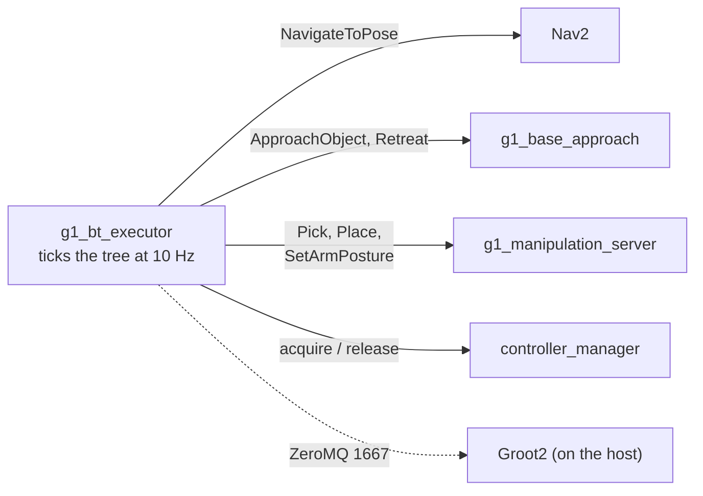

# g1_orchestration

The behavior tree that composes navigation and manipulation into a mission, on
BehaviorTree.CPP **v4**.

`ament_cmake`, C++20. One node, a handful of leaves, and the trees they run.



The tree decides *what* happens and in what order; the skills decide *how*. Nothing here plans,
moves a joint, or drives a costmap. Nav2 in particular is a black box: the tree sees whether a
goal was reached and nothing else.

## v4 alongside Nav2's v3

Nav2 uses BehaviorTree.CPP **v3** for its own navigator, and keeps it. The two are separate
Debian packages that install side by side with disjoint files (`bt4_*` vs `bt3_*` binaries,
`libbehaviortree_cpp.so` vs `libbehaviortree_cpp_v3.so`) and disjoint include roots. Nothing
links both: `bt_navigator` links v3 inside its own process, this executor links v4 inside its
own, and they only ever meet over the `NavigateToPose` action.

Worth stating because it used not to be true — v4's deb once collided with v3's over
`/opt/ros/humble/bin/bt3_log_cat` (BehaviorTree.CPP issue #734). That is long fixed, and it was
verified here by installing both rather than assumed.

`btcpp_ros2` (BehaviorTree.ROS2) is **not released for Humble**, which is why this package
hand-rolls its one action-client node base rather than vendoring that repo for four leaves.

## Layout

One file per leaf under `src/skills/`, with its declaration in
`include/g1_orchestration/skills/` — the layout `nav2_behavior_tree` uses, and the reason a new
skill is a new file rather than an edit to a shared one.

| Piece | What it is |
|---|---|
| `ros_action_node.hpp` | The action-client base. Owns goal handling, cancellation and timeouts; children supply `fillGoal` and `judgeResult`. |
| `skill_action_node.hpp` | Adds `judgeResult` for the `success`/`message` convention every skill server here follows, so most leaves need only `fillGoal`. |
| `service_leaf.hpp` | The same for leaves that call a service and finish within one tick. |
| `ports.hpp` | Ports shared by more than one leaf, declared once so their descriptions stay identical. |
| `registration.hpp` | Binds classes to the names a tree uses, and generates the Groot2 palette. |

To add a skill: define the action in `g1_msgs`, implement the server in whichever package owns
that domain, then add a header and source under `skills/`, list the source in `CMakeLists.txt`,
register it in `registration.cpp`, and regenerate the palette.

## Leaves

| Leaf | Wraps | Ports |
|---|---|---|
| `NavigateToPose` | Nav2's `/navigate_to_pose` | in: `goal` as `"x;y;yaw"`, `frame_id`; out: `goal_yaw` |
| `ApproachObject` | `g1_locomotion`'s base approach | `object_id`, `arm`, `working_yaw`, `timeout_s` |
| `Retreat` | the same | `distance`, `timeout_s` |
| `Pick` | `g1_manipulation` | `object_id`, `arm` |
| `Place` | `g1_manipulation` | `surface` (preferred), or `target` as `"x;y;z"` with `frame_id`; `arm` |
| `SetArmPosture` | `g1_manipulation` | `group`, `named_target` |
| `ClearCostmaps` | Nav2's costmap clear services | `timeout_s` |
| `AcquireArm` / `ReleaseArm` | `controller_manager` services | `timeout_s` |

Every action leaf sends its goal on the first tick, answers RUNNING while it is in flight, and
**cancels rather than abandons** when halted. A tree that moves on while an arm is still
executing a trajectory is the "release cleanly on success or failure" rule in
`docs/CONTROL_MODES.md` being broken.

`ApproachObject` takes a `working_yaw` with no default, and refuses the goal without one. A missing
heading would silently mean "face +x", which is a valid yaw and almost never the right one; the
skill would approach square to nothing and the failure would read as bad geometry rather than a
missing port.

It has to equal the yaw the staging goal arrived on, so the tree does not retype it: `NavigateToPose`
publishes its own `goal_yaw`, and the approach reads it back.

```xml
<NavigateToPose goal="4.30;-5.60;1.5708" goal_yaw="{workbench_yaw}"/>
<ApproachObject object_id="red_cube" working_yaw="{workbench_yaw}"/>
```

Both numbers used to be literals kept equal by hand, with the invariant stated only in a comment.

A failed leaf logs the **server's own reason**, not just that it failed. An aborted goal still
carries its result, and every abort in these servers writes a phase-prefixed explanation into it:
`did not complete: could not reach 'tucked'`. That was thrown away for a while in favour of a bare
"did not complete", and each diagnosis then cost a full mission re-run to recover information the
tree had already been handed.

`AcquireArm` runs the same ordered sequence as `g1_bringup`'s `activate_arm` script — component
before controller, arm required and hands best-effort — and `test_authority_drift` fails if the
two stop naming the same things. It differs in two ways on purpose. It switches controllers
`BEST_EFFORT` rather than `STRICT`, because a tree leaf has to be idempotent: the arm is often
already acquired, and `STRICT` calls that a failure. And it does not return until the arm has
SETTLED, three seconds after the switch, because activating the controller does not leave the arm
where it was — `rt/arm_sdk` ramps its blend weight and the joints move for a second or two.
Commanding a trajectory into that made MoveIt refuse with "start point deviates from current robot
state more than 0.05", measured at 0.051 rad on the elbow 176 ms after the switch returned. An
authority handoff is complete when the thing has stopped moving, not when the service call
returns — the same reason `g1_loco_authority` has `settle_after_start_s`.

## The arm bracket belongs to the executor

`docs/CONTROL_MODES.md` rule 4 asks that a skill release control authority cleanly on success
*or* failure. At mission scope the only place that can be guaranteed is around the whole tree,
so the executor releases the arm and hands on **every** exit path: success, tree failure, an
exception while loading, and SIGINT. A tree cannot promise that for itself, because the paths
where it matters most are the ones where the tree stopped running.

`ReleaseArm` exists as a leaf as well, for a tree that wants to hand the arm back early. It
always reports SUCCESS: a release that failed the tree it is cleaning up after would be worse
than useless, and the executor releases again regardless.

## Trees

| Tree | Needs | What it does |
|---|---|---|
| `pick_and_place.xml` | Nav2, `world:=navigation`, a map | The mission: acquire, tuck both arms, drive to a STAGING pose, close the last gap, pick, carry, back off, drive to storage, close again, place, back off, tuck, release. |
| `pick_and_place_in_place.xml` | `world:=manipulation` | The same skills with no driving. What to run while manipulation is being tuned. |

Both are plain XML and Groot2-editable. `test_tree_loads` parses every tree in `trees/` against
the registered node set, so a leaf renamed in C++ but not in XML fails at build time rather than
after a stack is already up.

Named postures are driven per arm rather than through `both_arms`: `both_arms` currently fails to
execute a named posture on this stack while either arm alone succeeds, and the cause is not yet
found. See `docs/notes`.

BOTH arms are tucked before travelling, and the left one is not symmetry for its own sake. A
hanging hand sits at pelvis (+0.209, -0.193, -0.064), which is 21 cm in front of the pelvis and 1 cm
under the workbench slab, so it jams on the table edge and the base stops moving while the approach
keeps issuing commands. Tucking only the right arm moves the collision to the left one and changes
nothing.

**Every** tuck is retried, closing ones included. The failure is per-attempt rather than structural
-- "Motion plan was found but it seems to be invalid", which is OMPL having sampled a path that
clips the live octomap -- and the posture itself is verified collision-free against the robot
model. The closing pair originally had no retry wrapper and failed an otherwise complete mission on
a single clipped waypoint, 30 of 142, after the cube was already on the pad.

### The stations are staging poses, not working poses

Nav2 cannot park the robot where the arm can reach anything: `xy_goal_tolerance` is 0.5 m and
`robot_radius` is 0.45, against an arm whose usable window is about 0.2 m wide. So each
`NavigateToPose` goal is a pose Nav2 can legally reach, short of the surface, and `ApproachObject`
closes the rest against the measured object rather than against the map. That is the standard
mobile-manipulation pattern: a stand-off pose on the surface normal, approached straight in.

Both stations face +y and hand that yaw to `ApproachObject` over the blackboard.

### Retreat backs straight off before turning

`Retreat` reverses clear and stops. It does not turn and it does not walk anywhere: the approach
leaves the robot close enough that turning on the spot sweeps the robot and the carried cube across
the desk, and the navigation goal that follows does the turning properly.

That reverse had to be unlocked. `g1_gait_shaper` used to zero every negative `vx`, so the first
attempt backed off with angled strafes -- which does move the base backwards but needs a 45 degree
turn to set up, and that turn IS the collision. The policy reverses perfectly well at -0.60
(-0.247 m/s measured), so the shaper now has a separate, higher `rev_engage` that keeps Nav2's
backup speeds zeroed and lets a deliberate command through.

The carry posture is taken AFTER the retreat, not before. Moving the arm to `carry` while still at
the desk failed with `<octomap> <-> right_hand_index_1_link` 220 steps into a 248 step path: the
pose is fine, the room to swing into is not.

## Running

The mission starts nothing else — the simulator, Nav2, MoveIt and the skills must already be up,
and staging any of them here would put a second writer on a low-level channel:

```bash
ros2 launch g1_bringup bringup.launch.py moveit:=true manipulation:=true pin_pelvis:=true world:=manipulation activate_arm:=true activate_arm_delay_s:=40.0
```

```bash
ros2 launch g1_orchestration mission.launch.py tree:=pick_and_place_in_place.xml
```

The full mission wants `mode:=localization nav:=true world:=navigation` instead.

## Groot2

The executor publishes over ZeroMQ so Groot2 can watch the tree tick live. The container uses
host networking, so the editor reaches it at `localhost:1667` with nothing to configure.

Groot2 runs on the **host**, not in the container — it is a Qt GUI shipped as an AppImage from
[behaviortree.dev/groot](https://www.behaviortree.dev/groot). Start the mission, then in Groot2
choose **Monitor**, connect to `localhost:1667`, and the tree appears. Connect after the executor
starts: the publisher only exists while a tree is running.

**The free tier monitors at most 20 nodes.** The editor itself is unrestricted; it is live
monitoring that is capped, and blackboard inspection, breakpoints and node substitution are
PRO-only. Each subtree is monitored as its own view, so keeping any one of them under 20 is what
matters rather than the total.

### Editing, not just watching

Monitoring needs nothing but the publisher. EDITING needs a palette: the list of nodes Groot2 may
place, with their ports.

1. Open `trees/g1_orchestration.btproj`. Both trees appear.
2. Once per project, **Import Models** and pick `trees/g1_orchestration_nodes.xml` beside it.
   Groot2 writes the model into the project and remembers it.

The tree files are symlinked into the install space, so a tree saved from Groot2 is picked up by
the next `ros2 launch` with no rebuild.

That palette is generated from the same factory the executor builds, never hand-written, and
`test_node_model` fails if it drifts. After adding or changing a leaf:

```bash
ros2 run g1_orchestration g1_bt_node_model \
  src/g1_orchestration/trees/g1_orchestration_nodes.xml
```

The port descriptions in `providedPorts()` are what Groot2 shows as tooltips, so they are worth
writing for a reader rather than for the compiler.

| Argument | Default | Meaning |
|---|---|---|
| `tree` | `pick_and_place.xml` | Which tree in `trees/` to run. |
| `groot2_port` | `1667` | ZeroMQ port, or `0` to disable the publisher. |
| `tick_rate_hz` | `10.0` | How often the tree is ticked. |

## Tests

None need a simulator.

| Test | Covers |
|---|---|
| `test_tree_loads` | Every shipped tree parses with all node types registered; the mission tree still has the leaves it is supposed to, including one `ApproachObject` per surface and one `Retreat` per departure; an unknown leaf is rejected; the port string conversions and their refusals. |
| `test_node_model` | The checked-in Groot2 palette still matches the registered nodes and their ports. |
| `test_authority_drift` | The acquire sequence against `g1_bringup`'s `activate_arm`, which is the other implementation of it, and that the arm comes first with the hands behind it. |

```bash
colcon test --packages-select g1_orchestration
```
