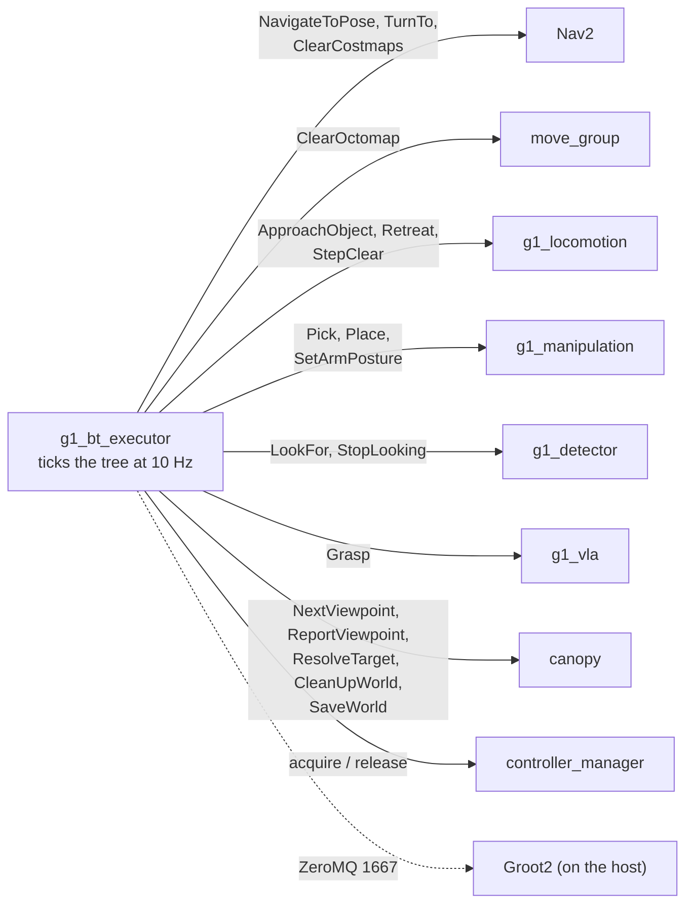

# g1_orchestration

Runs the behavior trees that compose navigation and manipulation into a mission, on
BehaviorTree.CPP v4. `ament_cmake`, C++20.


```mermaid
flowchart LR
    EXE["g1_bt_executor<br/>ticks the tree at 10 Hz"]
    EXE -- "NavigateToPose, TurnTo,<br/>ClearCostmaps" --> NAV["Nav2"]
    EXE -- "ClearOctomap" --> MG["move_group"]
    EXE -- "ApproachObject, Retreat,<br/>StepClear" --> BA["g1_locomotion"]
    EXE -- "Pick, Place,<br/>SetArmPosture" --> MAN["g1_manipulation"]
    EXE -- "LookFor, StopLooking" --> DET["g1_detector"]
    EXE -- "Grasp" --> VLA["g1_vla"]
    EXE -- "NextViewpoint, ReportViewpoint,<br/>ResolveTarget, CleanUpWorld,<br/>SaveWorld" --> WM["canopy"]
    EXE -- "acquire / release" --> CM["controller_manager"]
    EXE -. "ZeroMQ 1667" .-> G["Groot2 (on the host)"]
```

The tree decides what happens and in what order, and the skills decide how; nothing here plans or
moves a joint. Nav2 links the same BehaviorTree.CPP library. BehaviorTree.ROS2 is not in the
image, so this package has its own action-client base.

## Layout

| Path | What it is |
|---|---|
| `include/g1_orchestration/skills/`, `src/skills/` | One header and one source per skill. Leaves that belong together share a file: `look_for`, `arm_authority_leaves` and `world_model_leaves`. |
| `ros_action_node.hpp`, `skill_action_node.hpp`, `service_leaf.hpp` | The bases. `RosActionNode` owns goal handling, cancellation and the wait for the server; `SkillActionNode` adds `judgeResult` for the `success`/`message` convention, so most leaves need only `fillGoal`; `ServiceLeaf` is for a call that finishes in one tick. |
| `ports.hpp`, `port_types.hpp` | Ports used by more than one leaf, and the `Station` (`x;y;yaw`) and `Point3` (`x;y;z`) port types. |
| `arm_authority.hpp`, `src/arm_authority.cpp` | Acquiring and releasing the arm and hands. |
| `registration.hpp`, `src/registration.cpp` | Binds classes to the names trees use. |

## Leaves

| Leaf | Wraps | Ports |
|---|---|---|
| `NavigateToPose` | Nav2 `/navigate_to_pose` | in `goal` as `"x;y;yaw"`, `frame_id`, `behavior_tree`; out `goal_yaw` |
| `ApproachObject` | `/g1_base_approach/approach_object` | `object_id`, `arm`, `working_yaw`, `use_current_heading`, `timeout_s` |
| `Retreat` | `/g1_base_approach/retreat` | `distance`, `timeout_s` |
| `StepClear` | `/g1_base_approach/step_clear` | `clearance`, `timeout_s`. Succeeds at once when already clear, so it can run before every Nav2 motion. |
| `Pick` | `/g1_manipulation_server/pick` | `object_id`, `arm` |
| `Place` | `/g1_manipulation_server/place` | `surface` (preferred), or `target` as `"x;y;z"` with `frame_id`; `arm` |
| `SetArmPosture` | `/g1_manipulation_server/set_arm_posture` | `group`, `named_target` |
| `ClearCostmaps` | Nav2 costmap clear services | `timeout_s`, `global_service`, `local_service` |
| `ClearOctomap` | MoveIt `/clear_octomap` | `timeout_s`, `service` |
| `AcquireArm` / `ReleaseArm` | `controller_manager` services | `timeout_s` |
| `LookFor` | the detector's `phrases`, then `/objects` | `objects` (`id` or `id=phrase`, comma-separated, waited on), `also` (asked for, not waited on), `detector`, `timeout_s`. Answers RUNNING while it waits. |
| `StopLooking` | the detector's `phrases` | `detector`, `timeout_s`; empties the list, which idles the detector |
| `Grasp` | `/g1_vla_server/grasp` | `instruction`, `object_id`, `arm` |
| `NextViewpoint` | `/canopy/next_viewpoint` | in `mode` (`frontier` or `coverage`), `retry_s`, `timeout_s`; out `goal`, `headings`, `viewpoint_id`, `room_id`, `outcome`. `outcome` is `viewpoint`, `stuck`, `done` or `error`. Fails on `done` or `error`, which ends a viewpoint loop; on `stuck` it succeeds and the tree steps clear before asking again. |
| `ReportViewpoint` | `/canopy/report_viewpoint` | `viewpoint_id`, `reached` |
| `ResolveTarget` | `/canopy/get_approach_pose` | in `target` (object id, room, or label), `room`, `standoff`; out `goal`, `yaw`, `target_id` |
| `CleanUpWorld` | `/canopy/clean_up` | `timeout_s`; takes out what canopy can tell is not an object, marked so a person can restore it |
| `SaveWorld` | `/canopy/save` | `timeout_s` |
| `TurnTo` | Nav2 `/spin` | `yaw` in `frame`, `base_frame`, `yaw_rate`, `slack_s`; turns by the difference from the current heading |

The leaves that wrap an action server also take `server_timeout_s` (default 10.0), how long to
wait for the server to appear. Every port and its default is in the Groot2 palette,
`trees/g1_orchestration_nodes.xml`.

Action leaves send their goal on the first tick, answer RUNNING while it is in flight, and cancel
the goal when halted. Leaves built on `SkillActionNode` log the server's own reason when a skill
fails. `ReleaseArm`, `ClearCostmaps`, `ClearOctomap`, `StopLooking` and `ReportViewpoint` always
return SUCCESS, so cleanup cannot fail a tree; a failed call is only logged.

`ApproachObject` requires either `working_yaw` or `use_current_heading`. Pass the staging goal's
`goal_yaw` rather than retyping the number:

```xml
<NavigateToPose goal="4.30;-5.60;1.5708" goal_yaw="{workbench_yaw}"/>
<ApproachObject object_id="red_block" working_yaw="{workbench_yaw}"/>
```

## Adding a skill

A skill is a ROS action served by whichever package owns that domain, plus a leaf here that calls
it. Anything that writes a velocity belongs in `g1_locomotion` and anything that moves the arm in
`g1_manipulation`; the leaf only calls them.

1. Define the action in `g1_msgs` and add it to that package's `CMakeLists.txt`. Give the result a
   `success` and a `message` so the leaf can use the shared result judging.
2. Implement the server in the owning package, not here.
3. Add the leaf, a header and a source under `skills/`. Derive from `SkillActionNode`, which
   already judges the `success`/`message` result, and write a constructor that names the action,
   `providedPorts()` and `fillGoal()`. Derive from `RosActionNode` instead when the result is not
   that shape, as Nav2's is not, or from `ServiceLeaf` and override `tick()` for a call that
   finishes in one tick. `skills/pick.cpp` and `skills/clear_octomap.cpp` are minimal examples.
4. Register it in `src/registration.cpp` with `registerLeaf<OpenDoor>(factory, "OpenDoor",
   context)`, and list the source in `CMakeLists.txt`.
5. Rebuild, then regenerate the Groot2 palette from the workspace root:

```bash
ros2 run g1_orchestration g1_bt_node_model src/g1_orchestration/trees/g1_orchestration_nodes.xml
```

Port descriptions become Groot2's tooltips, so write them for a tree author. `test_node_model`
fails if the palette drifts, and `test_tree_loads` fails if a tree names a leaf nobody registered.

## Trees

| Tree | Needs | What it does |
|---|---|---|
| `pick_and_place.xml` | Nav2, `world:=navigation`, perception | Acquire, tuck, drive to a staging pose, look, close the last gap, pick, back off, drive to storage, look, close again, place, back off, tuck, release. |
| `pick_and_place_in_place.xml` | `world:=manipulation` | Pick the block, hold it at `carry`, put it down at a fixed `odom` target, tuck, release. No driving. |
| `sort_into_box.xml` | `world:=tabletop`, perception | Pick the red block from a cluttered table and drop it in the box. |
| `vla_grasp_in_place.xml` | `world:=manipulation`, `vla:=true` | The learned grasp in place of a planned pick. |
| `explore.xml` | Nav2, canopy's world model, a detector | Walks to frontiers until the LiDAR map is closed, then to camera viewpoints until every room has been seen, then cleans up and saves the world. Steps clear of furniture before each Nav2 motion. |
| `TuckBothArms` | subtree of `pick_and_place.xml` | Both arms to `tucked`, each retried. One leaf per arm, because `both_arms` fails to execute a named posture on this stack while either arm alone succeeds. |

## The arm bracket belongs to the executor

The manipulation trees take the arm with `AcquireArm` first. The executor releases the arm and
hands on every exit path (success, tree failure, an exception while loading, SIGINT or SIGTERM)
through an RAII guard around the whole tree. `ReleaseArm` also exists as a leaf for handing the arm
back early.

Acquiring trades `arm_freeze_controller` for `arm_trajectory_controller` in one `STRICT`
`switch_controller` call: the hardware component leaves unclaimed joints unpowered, so two calls
would drop the arms in between, and `BEST_EFFORT` can silently apply only the deactivation.
`STRICT` refuses a switch that is already done, so both controllers' states are read first, and
`planArmSwitch` makes that decision without service calls, which is why it is unit-tested. The
hands are separate component activations and keep `BEST_EFFORT`, so a hand that will not come up
still leaves the arm usable.

## Running

The mission starts nothing else: the simulator, Nav2, MoveIt and the skills must already be up.
The in-place tree needs only the manipulation stack:

```bash
ros2 launch g1_bringup bringup.launch.py moveit:=true manipulation:=true pin_pelvis:=true \
  world:=manipulation odometry:=ground_truth activate_arm:=true activate_arm_delay_s:=40.0
```

Once the log says `activation complete`, in another shell:

```bash
ros2 launch g1_orchestration mission.launch.py tree:=pick_and_place_in_place.xml
```

`./scripts/demos/pick-and-place.sh in-place|mission|sort` opens each stack and tree in panes. The
[pick and place](../../../docs/guides/pick-and-place.md),
[learned grasping](../../../docs/guides/learned-grasping.md) and
[world model](../../../docs/guides/world-model.md) guides cover the other trees.

| Argument | Default | Meaning |
|---|---|---|
| `tree` | `pick_and_place.xml` | Which tree in `trees/` to run. |
| `groot2_port` | `1667` | ZeroMQ port, or `0` to disable the publisher. |
| `tick_rate_hz` | `10.0` | How often the tree is ticked. |

The launch starts `g1_bt_executor`, which takes `tree_file` (required; the launch builds it from
`tree`), `tick_rate_hz` and `groot2_port`, with defaults in `config/g1_bt_executor.yaml`. It logs
`mission finished: SUCCESS` or `FAILURE` and exits 0 or 1, or 130 when interrupted.

## Groot2

Groot2 runs on the host. The container uses host networking, so Monitor connects to
`localhost:1667` while a tree is running. To edit trees, open `trees/g1_orchestration.btproj`,
which includes the four mission trees but not `explore.xml`, and once per project use "Import
Models" on `trees/g1_orchestration_nodes.xml`. Trees are symlinked into the install space, so a
tree saved from Groot2 is picked up by the next launch with no rebuild.

On the free tier, live monitoring is capped at 20 nodes per view and blackboard inspection,
breakpoints and node substitution are PRO-only. The editor itself is unrestricted.

## Tests

None need a simulator. `./scripts/manage.sh test g1_orchestration` runs all four.

| Test | Covers |
|---|---|
| `test_tree_loads` | Every shipped tree parses against the registered leaves; `pick_and_place.xml` keeps the leaves and retry wrappers it is supposed to; an unknown leaf is rejected; `Station` and `Point3` parse and refuse a short string. |
| `test_action_leaf` | The action-leaf base, through `Retreat`, against a stand-in server on the two threads the executor uses: a rejected goal fails the leaf, an accepted one that succeeds reaches SUCCESS. `LookFor` against a stand-in detector: what it writes, the ids it waits on, and that it does not block a tick. |
| `test_node_model` | The checked-in Groot2 palette matches the registered nodes and their ports. |
| `test_authority_drift` | The acquire sequence against `g1_bringup`'s `activate_arm`: the same names, the arm first with the hands behind it, and the freeze controller still displaced in the same switch. Plus `planArmSwitch`, including that an incoming controller which is not loaded switches nothing at all. |
