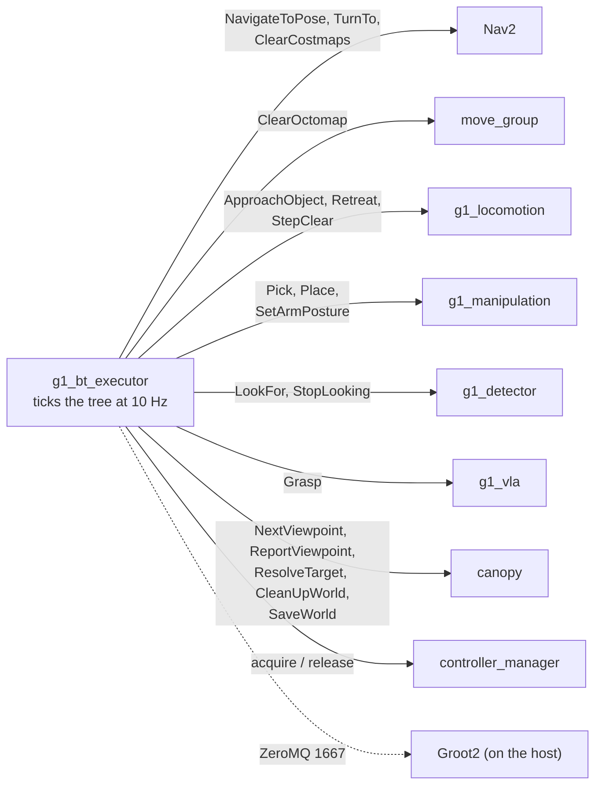

# g1_orchestration

Runs the behavior trees that compose navigation and manipulation into a mission, on
BehaviorTree.CPP v4. `ament_cmake`, C++20. Two executors share the leaves: `g1_bt_executor` runs a
hand-written tree from a file and exits, and `nervros_executor` is the long-lived node a NervROS
agent sends missions to.


```mermaid
flowchart LR
    EXE["g1_bt_executor<br/>ticks the tree at 10 Hz"]
    EXE -- "NavigateToPose, TurnTo,<br/>ClearCostmaps" --> NAV["Nav2"]
    EXE -- "ClearOctomap" --> MG["move_group"]
    EXE -- "ApproachObject, Retreat,<br/>StepClear" --> BA["g1_locomotion"]
    EXE -- "Pick, Place,<br/>SetArmPosture" --> MAN["g1_manipulation"]
    EXE -- "LookFor, StopLooking" --> DET["g1_detector"]
    EXE -- "Grasp" --> VLA["g1_vla"]
    EXE -- "NextViewpoint, ReportViewpoint,<br/>ResolveTarget, CleanUpWorld,<br/>SaveWorld" --> WM["canopy"]
    EXE -- "acquire / release" --> CM["controller_manager"]
    EXE -. "ZeroMQ 1667" .-> G["Groot2 (on the host)"]
```

The tree decides what happens and in what order, and the skills decide how; nothing here plans or
moves a joint. Nav2 links the same BehaviorTree.CPP library. BehaviorTree.ROS2 is not in the
image, so this package has its own action-client base.

## Layout

| Path | What it is |
|---|---|
| `include/g1_orchestration/skills/`, `src/skills/` | One header and one source per skill. Leaves that belong together share a file: `look_for`, `arm_authority_leaves` and `world_model_leaves`. |
| `ros_action_node.hpp`, `skill_action_node.hpp`, `service_leaf.hpp` | The bases. `RosActionNode` owns goal handling, cancellation and the wait for the server; `SkillActionNode` adds `judgeResult` for the `success`/`message` convention, so most leaves need only `fillGoal`; `ServiceLeaf` is for a call that finishes in one tick. |
| `ports.hpp`, `port_types.hpp` | Ports used by more than one leaf, and the `Station` (`x;y;yaw`) and `Point3` (`x;y;z`) port types. |
| `arm_authority.hpp`, `src/arm_authority.cpp` | Acquiring and releasing the arm and hands. |
| `registration.hpp`, `src/registration.cpp` | Binds classes to the names trees use. |
| `nervros_executor.*`, `mission_observer.*`, `server_fleet.*`, `authority_port.*` | The mission executor: the node, what it watches in a running tree, the action servers StopAll reaches, and the seam to `controller_manager`. |
| `mission_validator.*`, `catalog.*`, `macro_library.*`, `sha256.*` | Whether a mission may run, and what it may name. No ROS, so a service thread and the mission thread share them. |
| `config/catalog.yaml`, `trees/library/` | The skills a mission may use, and the macro subtree each one runs. |

## Leaves

| Leaf | Wraps | Ports |
|---|---|---|
| `NavigateToPose` | Nav2 `/navigate_to_pose` | in `goal` as `"x;y;yaw"`, `frame_id`, `behavior_tree`; out `goal_yaw` |
| `ApproachObject` | `/g1_base_approach/approach_object` | `object_id`, `arm`, `working_yaw`, `use_current_heading`, `timeout_s` |
| `Retreat` | `/g1_base_approach/retreat` | `distance`, `timeout_s` |
| `StepClear` | `/g1_base_approach/step_clear` | `clearance`, `timeout_s`. Succeeds at once when already clear, so it can run before every Nav2 motion. |
| `Pick` | `/g1_manipulation_server/pick` | `object_id`, `arm` |
| `Place` | `/g1_manipulation_server/place` | `surface` (preferred), or `target` as `"x;y;z"` with `frame_id`; `arm` |
| `SetArmPosture` | `/g1_manipulation_server/set_arm_posture` | `group`, `named_target` |
| `ClearCostmaps` | Nav2 costmap clear services | `timeout_s`, `global_service`, `local_service` |
| `ClearOctomap` | MoveIt `/clear_octomap` | `timeout_s`, `service` |
| `AcquireArm` / `ReleaseArm` | `controller_manager` services | `timeout_s` |
| `LookFor` | the detector's `phrases`, then `/objects` | `objects` (`id` or `id=phrase`, comma-separated, waited on), `also` (asked for, not waited on), `detector`, `timeout_s`; out `first_id`, the first entry's id as the detector reports it (`O17` is `o17`). Answers RUNNING while it waits. |
| `StopLooking` | the detector's `phrases` | `detector`, `timeout_s`; empties the list, which idles the detector |
| `Grasp` | `/g1_vla_server/grasp` | `instruction`, `object_id`, `arm` |
| `NextViewpoint` | `/canopy/next_viewpoint` | in `mode` (`frontier` or `coverage`), `retry_s`, `timeout_s`; out `goal`, `headings`, `viewpoint_id`, `room_id`, `outcome`. `outcome` is `viewpoint`, `stuck`, `done` or `error`. Fails on `done` or `error`, which ends a viewpoint loop; on `stuck` it succeeds and the tree steps clear before asking again. |
| `ReportViewpoint` | `/canopy/report_viewpoint` | `viewpoint_id`, `reached` |
| `ResolveTarget` | `/canopy/get_approach_pose` | in `target` (object id, room, or label), `room`, `standoff`; out `goal`, `yaw`, `target_id` |
| `CleanUpWorld` | `/canopy/clean_up` | `timeout_s`; takes out what canopy can tell is not an object, marked so a person can restore it |
| `SaveWorld` | `/canopy/save` | `timeout_s` |
| `TurnTo` | Nav2 `/spin` | `yaw` in `frame`, `base_frame`, `yaw_rate`, `slack_s`; turns by the difference from the current heading |
| `DriveStraight` | Nav2 `/drive_on_heading` | `direction` forward or backward, `distance` 0.1 to 2 m, `speed` (0.3, kept within 0.2 to 0.4), `slack_s`, `coast_m` (0.1, the gait's run-on after the stop, taken off the distance); fails on Nav2's collision stop |
| `TurnBy` | Nav2 `/spin` | `degrees` -180 to 180, positive left, `yaw_rate`, `slack_s`; a relative turn, no TF |

The leaves that wrap an action server also take `server_timeout_s` (default 10.0), how long to
wait for the server to appear. Every port and its default is in the Groot2 palette,
`trees/g1_orchestration_nodes.xml`.

Action leaves send their goal on the first tick, answer RUNNING while it is in flight, and cancel
the goal when halted. Leaves built on `SkillActionNode` log the server's own reason when a skill
fails. `ReleaseArm`, `ClearCostmaps`, `ClearOctomap`, `StopLooking` and `ReportViewpoint` always
return SUCCESS, so cleanup cannot fail a tree; a failed call is only logged.

`ApproachObject` requires either `working_yaw` or `use_current_heading`. Pass the staging goal's
`goal_yaw` rather than retyping the number:

```xml
<NavigateToPose goal="4.30;-5.60;1.5708" goal_yaw="{workbench_yaw}"/>
<ApproachObject object_id="red_block" working_yaw="{workbench_yaw}"/>
```

## Adding a skill

A skill is a ROS action served by whichever package owns that domain, plus a leaf here that calls
it. Anything that writes a velocity belongs in `g1_locomotion` and anything that moves the arm in
`g1_manipulation`; the leaf only calls them.

1. Define the action in `g1_msgs` and add it to that package's `CMakeLists.txt`. Give the result a
   `success` and a `message` so the leaf can use the shared result judging.
2. Implement the server in the owning package, not here.
3. Add the leaf, a header and a source under `skills/`. Derive from `SkillActionNode`, which
   already judges the `success`/`message` result, and write a constructor that names the action,
   `providedPorts()` and `fillGoal()`. Derive from `RosActionNode` instead when the result is not
   that shape, as Nav2's is not, or from `ServiceLeaf` and override `call()` for a call that
   finishes in one tick. `skills/pick.cpp` and `skills/clear_octomap.cpp` are minimal examples.
4. Register it in `src/registration.cpp` with `registerLeaf<OpenDoor>(factory, "OpenDoor",
   context)`, and list the source in `CMakeLists.txt`.
5. Rebuild, then regenerate the Groot2 palette from the workspace root:

```bash
ros2 run g1_orchestration g1_bt_node_model src/g1_orchestration/trees/g1_orchestration_nodes.xml
```

Port descriptions become Groot2's tooltips, so write them for a tree author. `test_node_model`
fails if the palette drifts, and `test_tree_loads` fails if a tree names a leaf nobody registered.

## Trees

| Tree | Needs | What it does |
|---|---|---|
| `pick_and_place.xml` | Nav2, `world:=navigation`, perception | Acquire, tuck, drive to a staging pose, look, close the last gap, pick, back off, drive to storage, look, close again, place, back off, tuck, release. |
| `pick_and_place_in_place.xml` | `world:=manipulation` | Pick the block, hold it at `carry`, put it down at a fixed `odom` target, tuck, release. No driving. |
| `sort_into_box.xml` | `world:=tabletop`, perception | Pick the red block from a cluttered table and drop it in the box. |
| `vla_grasp_in_place.xml` | `world:=manipulation`, `vla:=true` | The learned grasp in place of a planned pick. |
| `explore.xml` | Nav2, canopy's world model, a detector | Walks to frontiers until the LiDAR map is closed, then to camera viewpoints until every room has been seen, then cleans up and saves the world. Steps clear of furniture before each Nav2 motion. |
| `TuckBothArms` | subtree of `pick_and_place.xml` | Both arms to `tucked`, each retried. One leaf per arm, because `both_arms` fails to execute a named posture on this stack while either arm alone succeeds. |

## The mission executor

`nervros_executor` runs the behavior trees an agent compiles from a plan, one mission at a time, and
reports what it does. `g1_bt_executor` cannot: one process per tree has no status, no cancel but a
signal, and no idea what the hands hold. The agent is [NervROS](https://github.com/Adyansh04/nervros);
the contract is its `nervros_interfaces`.

| Interface | Name | Notes |
|---|---|---|
| Action | `/nervros_executor/execute_mission` | `ExecuteMission`. Modes: execute, validate (load and check only), dry run (every leaf replaced by a stand-in that waits its share of the skill's catalog time). |
| Service | `/nervros_executor/validate_mission` | The same checks without a goal, plus a load; returns the worst-case duration. |
| Service | `/nervros_executor/get_catalog` | The skills as JSON, the palette (`TreeNodesModel`: every leaf's ports and the skills' subtrees), BehaviorTree.CPP's version, and the catalog's, which changes with the skills and with the palette. |
| Service | `/nervros_executor/stop_all` | Halts the mission, cancels goals on every skill server, holds posture. Safe at any time. |
| Topic | `/nervros_executor/robot_state` | `RobotState`, reliable and transient local, on change and at 1 Hz. |

### What a mission may say

One `Mission` tree of `Sequence`, `Fallback`, `RetryUntilSuccessful` (1 to 3 attempts), `Timeout`
and `ForceSuccess` around `SubTree`s of the catalog's skills, and nothing else. That is an
allowlist because a model must be able to arrange the macros in `trees/library` and never write a
leaf. The document defines no other tree (BehaviorTree.CPP would let it redefine a registered
macro; the executor registers its own copies with each mission's factory), has no `<include>`, and
carries `tree_sha256`, the lowercase SHA-256 of the exact bytes of `tree_xml` (an empty hash does
not match). No `Parallel`, reactive node, `Repeat`, `Script`, `SetBlackboard`, `AcquireArm` or
`ReleaseArm`, no pre or post condition attribute (`_skipIf`, `_post`, ...), no leaf written
directly. Each skill gets exactly its catalog arguments, in the shape it needs; depth, node count,
step count (each step is a whole macro at load time) and size are capped, and so is the worst case:
a mission that could run past `max_duration_cap_s` is turned away (`TOO_LONG`) instead of being cut
off half done by the watchdog.

Problems come back as `{code, line, node, message}` in `diagnostics_json`, worded for the model to
fix its plan; the codes are in `mission_validator.hpp`. The worst case sums a `Sequence` and a
`Fallback` (a fallback may try every branch, and a watchdog set from the slowest would fire on a
mission still working), multiplies a retry by its attempts and caps each `Timeout`. A skill counts
for its catalog `max_duration_s`, which is also the `Timeout` its macro is wrapped in.

### Skills

`config/catalog.yaml` is what a planner is told and `trees/library/` is what runs; `test_catalog_drift`
keeps them in step (names, ports, limits, resources). The macros are flat: none names another.

| Skill | Does | Needs |
|---|---|---|
| `GoToTarget` | Resolves a world-model id (`R2`, `O17`) to a pose facing it, clears costmaps, steps clear of furniture, walks (three tries), squares up. | `base` |
| `GoToPose` | The same walk to `x;y;yaw` in the `map` frame. | `base` |
| `PickObject` | Needs the hand empty. Asks the detector for the object, closes the last stretch, picks, idles the detector, backs off 1.2 m. | `base`, arms |
| `PlaceInto` | Needs the hand to hold something. Asks the detector for the container and for what the hand holds, closes in, places, backs off. | `base`, arms |
| `WalkStraight` | Walks forward or backward a distance (0.1 to 2 m) with `DriveStraight`, one try. Nav2 projects the walk on the local costmap and stops it before a collision, which fails the step. | `base` |
| `TurnInPlace` | Turns by an angle (-180 to 180 degrees, positive left) with `TurnBy`, one try. | `base` |
| `TuckForTravel` | Tucks each arm whose hand is empty. | arms |
| `ExploreBuilding` | The loop of `trees/explore.xml`: frontiers until the map is closed, then canopy's viewpoints until every room is seen, then clean up and save. Explores for up to 23 minutes, since a whole run is longer than a mission may be, and saves; running out of time is not a failure, a world model that cannot plan is. | `base` |

An argument with `format: number` takes a decimal from its `min` to its `max`, which the validator
checks and the catalog JSON carries. In the simulator a 1 m walk ended within 1 cm and a 90 degree
turn within about 5 degrees.

`object_id` and `container_id` take a world-model id (`O17`) or, where there is none, the name the
detector reports (`red_block`). The detector names what it finds by the lowercased id (`o17`),
`LookFor` hands that on as `first_id`, and the leaves after it use it. `phrase` is the words the
detector looks for; the planner fills it from the world model's label (`default_from` in the
catalog). The mock detector matches on the id only, so in the simulator the id must be the
simulator's name.

### Authority

The arms and both hands are taken once, before the first tick, when any skill needs them, and not per
skill: a released Dex3 hand goes limp and drops what it holds. `base` is a name only. However a
mission ends (success, failure, cancel, watchdog, exception, stop) the arms are released only if no
hand holds something, or may; otherwise they are kept, `RobotState` says so, and the next mission that
needs them finds them held. `Pick` and `Place` results say what a hand holds (`holding_left`,
`holding_right`, in the mission's own ids); `resources_held` lists `base`, `left_arm`, `right_arm`.
The same is kept in the mission's root blackboard as `held_left` and `held_right` (`id=phrase`, with
the id the detector knows it by, kept current as the mission picks and places) because `Place` fails
unless the held object is on `/objects` after the release, so `PlaceInto` must ask the detector for
it, `TuckForTravel` must not fold an arm that holds something, and `PickObject` and `PlaceInto` fail
at once, before anything moves, on a hand that is full or empty the wrong way round.

A hand can also be *unknown* (`?` in the blackboard; "unknown" in `RobotState.message`): it may hold
something the executor cannot name. That is the case when the arms were already taken before this
executor found them (it restarted while a hand held an object), and for the arm of a `Pick` that was
halted while it ran, since the hand may have closed before the cancel arrived. An unknown hand counts
as full: the arms are kept, `TuckForTravel` skips it, `PickObject` refuses it, and `PlaceInto` may use
it. It stops being unknown when a `Place` with that arm succeeds, or when a later mission finds the
arms free again because someone let go of them (`deactivate_arm`, once the hands have been looked
at). A stack whose bringup activates the arms (`activate_arm:=true`) needs
`hands_empty_on_attach:=true`, or the first mission finds them taken and trusts nothing.

### Stopping

`StopAll` does not wait on anything slow:

1. The mission thread halts the tree, which cancels its leaves' goals. The leaves are also told to
   start nothing more (one flag, set by a stop, a cancel, the watchdog or a shutdown), so a tick
   that is inside a wait for a server, or looping through retries, ends at once instead of running
   out its budget.
2. Every goal on every server in `stop_action_servers` is cancelled, whoever sent it, and so is the
   arm trajectory controller's, which then holds the arm where it is (no snap).
3. It waits up to `stop_wait_s` for the halt, asks again for any goal accepted since, and waits for
   the servers' status topics, the arm controller's included, to show no goal.
4. The base needs nothing more: nothing writes `/cmd_vel`, and the policy zeroes a stale command
   after 0.5 s and stands. **The hands are never touched**: cancelling a hand controller's goal
   would loosen the grip.
5. It returns `ok`, a message and `state_after` (`holding posture; right hand keeps red_block`), and
   sets `RobotState.stopped` until the next executed mission starts.

`ok` is false if the mission thread has not halted in time (it can be inside a controller_manager
call, which nothing interrupts) or a server still has a goal in flight after the wait; `message` says
which, and how many servers were actually asked. g1_manipulation checks for a cancel between the
phases of a pick and between lift attempts; once the hand has closed on the object a cancelled pick
keeps it, so stopping during the grasp or the lift does not drop it. The executor still counts that
hand as unknown, since a halted leaf gets no result.

### Results and events

The result has `outcome`; for anything but success also `failed_node`, `failed_step_id` (the `s<N>`
of the step's `s<N>_<Skill>` name) and `failure_reason`, the skill server's own message. The node is
the last leaf to fail before the tree did, so a failure a retry recovered from is not blamed. A
`Timeout` that ran out, the step's or the macro's, is `OUTCOME_TIMEOUT` like the watchdog; a cancel
or stop is `OUTCOME_CANCELED`; both name the step that was running. Feedback carries the running
nodes and the status transitions since the last message: `event_level: steps` keeps the step
subtrees and the leaves that do something, `all` every node; a halt shows as RUNNING to IDLE.

`StopAll` and `ValidateMission` answer while a mission ticks: the mission runs on a thread of its own.

### Parameters

All in `config/nervros_executor.yaml`, commented there.

| Parameter | Default | Meaning |
|---|---|---|
| `tick_rate_hz` | 10 | Tick rate. |
| `max_duration_cap_s`, `watchdog_factor` | 1800, 1.2 | The most any mission may run, and the most its worst case may come to; a goal with no limit gets its worst case times the factor. |
| `groot2_port` | 0 | Groot2 monitoring; 0 (the default) disables it. A debugging aid for a developer's own machine: it binds every interface, has no authentication, and Groot2's hooks can block or override a running node. Never on a network anyone else can reach. |
| `hands_empty_on_attach` | false | Arms found already taken: trust the hands to be empty (a simulator that activates them at bringup), instead of treating them as unknown. |
| `arg_choices` | `""` | `Skill.arg=a\|b;...` limits those arguments to those values, listed in the served catalog and checked by the validator: where the simulator's mock detector finds objects by body name only, the names it knows (`PickObject.object_id=mug_4;PlaceInto.container_id=tray_1` in the apartment). |
| `catalog_file`, `macros_dir` | `config/catalog.yaml`, `trees/library` | Relative to the package share directory. |
| `event_level` | `steps` | `steps` or `all`. |
| `max_tree_depth`, `max_tree_nodes`, `max_tree_steps`, `max_xml_bytes` | 10, 200, 32, 131072 | Bounds on a mission's text. |
| `feedback_period_s`, `cancel_settle_s`, `stop_wait_s` | 0.25, 0.5, 3.0 | Feedback rate; spin after a halt so cancels reach their servers; the most a stop waits. |
| `authority_timeout_s` | 15 | Per-step budget for `controller_manager` calls. |
| `dry_run_time_scale`, `dry_run_min_leaf_s` | 0.02, 0.05 | A dry run's share of a skill's catalog time per leaf, and its floor. |
| `stop_action_servers` | the nine skill servers | As `/name:type`. `test_catalog_drift` fails if a leaf uses one that is not listed. |
| `arm_controller_action` | the arm trajectory controller | Cancelled by `StopAll` to hold the arm. |

### Running it

```bash
ros2 launch g1_orchestration nervros_executor.launch.py
ros2 run g1_orchestration send_mission.sh src/g1_orchestration/trees/missions/pick_and_place.xml dry-run
```

It starts nothing else: the stack has to be up, as for `g1_bt_executor`. Give it 30 s or more to
shut down (the launch does): it halts the mission, waits for the servers and hands the arms back.
`send_mission.sh` hashes a
file and sends it with `ros2 action send_goal --feedback`; the second argument is `execute` (the
default), `validate`, `dry-run` or `check` (the service), and a third is the limit in seconds.
`trees/missions/pick_and_place.xml` is a mission as the agent writes them, the one the simulator
ran; a test keeps it valid.

## The arm bracket belongs to the executor

The manipulation trees take the arm with `AcquireArm` first. The executor releases the arm and
hands on every exit path (success, tree failure, an exception while loading, SIGINT or SIGTERM)
through an RAII guard around the whole tree. `ReleaseArm` also exists as a leaf for handing the arm
back early.

Acquiring trades `arm_freeze_controller` for `arm_trajectory_controller` in one `STRICT`
`switch_controller` call: the hardware component leaves unclaimed joints unpowered, so two calls
would drop the arms in between, and `BEST_EFFORT` can silently apply only the deactivation.
`STRICT` refuses a switch that is already done, so both controllers' states are read first, and
`planArmSwitch` makes that decision without service calls, which is why it is unit-tested. The
hands are separate component activations and keep `BEST_EFFORT`, so a hand that will not come up
still leaves the arm usable.

## Running

The mission starts nothing else: the simulator, Nav2, MoveIt and the skills must already be up.
The in-place tree needs only the manipulation stack:

```bash
ros2 launch g1_bringup bringup.launch.py moveit:=true manipulation:=true pin_pelvis:=true \
  world:=manipulation odometry:=ground_truth activate_arm:=true activate_arm_delay_s:=40.0
```

Once the log says `activation complete`, in another shell:

```bash
ros2 launch g1_orchestration mission.launch.py tree:=pick_and_place_in_place.xml
```

`./scripts/demos/pick-and-place.sh in-place|mission|sort` opens each stack and tree in panes. The
[pick and place](../../../docs/guides/pick-and-place.md),
[learned grasping](../../../docs/guides/learned-grasping.md) and
[world model](../../../docs/guides/world-model.md) guides cover the other trees.

| Argument | Default | Meaning |
|---|---|---|
| `tree` | `pick_and_place.xml` | Which tree in `trees/` to run. |
| `groot2_port` | `1667` | ZeroMQ port, or `0` to disable the publisher. |
| `tick_rate_hz` | `10.0` | How often the tree is ticked. |

The launch starts `g1_bt_executor`, which takes `tree_file` (required; the launch builds it from
`tree`), `tick_rate_hz` and `groot2_port`, with defaults in `config/g1_bt_executor.yaml`. It logs
`mission finished: SUCCESS` or `FAILURE` and exits 0 or 1, or 130 when interrupted.

## Groot2

Groot2 runs on the host. The container uses host networking, so Monitor connects to
`localhost:1667` while a tree is running. To edit trees, open `trees/g1_orchestration.btproj`,
which includes the four mission trees but not `explore.xml`, and once per project use "Import
Models" on `trees/g1_orchestration_nodes.xml`. Trees are symlinked into the install space, so a
tree saved from Groot2 is picked up by the next launch with no rebuild.

On the free tier, live monitoring is capped at 20 nodes per view and blackboard inspection,
breakpoints and node substitution are PRO-only. The editor itself is unrestricted.

## Tests

None need a simulator. `./scripts/manage.sh test g1_orchestration` runs all of them.

| Test | Covers |
|---|---|
| `test_tree_loads` | Every shipped tree parses against the registered leaves; `pick_and_place.xml` keeps the leaves and retry wrappers it is supposed to; an unknown leaf is rejected; `Station` and `Point3` parse and refuse a short string. |
| `test_action_leaf` | The action-leaf base, through `Retreat`, against a stand-in server on the two threads the executor uses: a rejected goal fails the leaf, an accepted one that succeeds reaches SUCCESS. `LookFor` against a stand-in detector: what it writes, the ids it waits on, and that it does not block a tick. |
| `test_node_model` | The checked-in Groot2 palette matches the registered nodes and their ports. |
| `test_authority_drift` | The acquire sequence against `g1_bringup`'s `activate_arm`: the same names, the arm first with the hands behind it, and the freeze controller still displaced in the same switch. Plus `planArmSwitch`, including that an incoming controller which is not loaded switches nothing at all. |
| `test_mission_validator` | Every form a mission may not take is refused with its own code and line: an include, a wrong hash, another tree, each forbidden node, condition attributes, a leaf written directly, unbounded timeouts and retries, bad arguments. The worst case on known trees, the shipped worked example, and input that is not XML at all. SHA-256 against the standard vectors. |
| `test_catalog_drift` | Catalog, macros and leaves agree: same names, ports, limits and resources; every macro loads with its leaves registered; the JSON has the shape the agent reads; `stop_action_servers` covers every action server a leaf uses. |
| `test_mission_observer` | Events at both levels, halts against resets, the running step, and which failure ends a mission: the last leaf, not a retried one, with the step and the leaf's own words. |
| `test_nervros_executor` | The node against stand-in skill servers, a detector and costmap services: refusals with diagnostics (bytes that are not UTF-8 included), dry runs, one mission at a time, cancel, watchdog and cap, a tick stuck waiting for a server that a stop, a cancel or the watchdog still ends, what `StopAll` says it did, arms taken once and kept while a hand holds an object or may, a pick then a place as two missions or one. |
