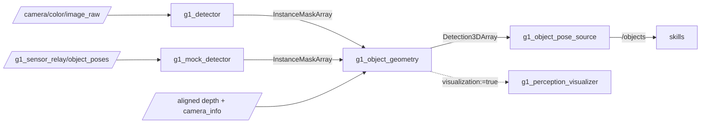

# g1_perception

Finds objects by name and says where they are. A detector segments whatever the phrases ask for,
and this package turns those masks plus the aligned depth frame into the object poses the
manipulation skills already consume. Nothing here plans or moves anything, and nothing here
knows which model drew the masks.



```bash
colcon build --symlink-install --packages-select g1_perception
```

## Nodes

| Node | Does |
|---|---|
| `g1_detector` | Sends camera frames and the phrase list to the host vision server and publishes the instance masks it answers with. Python, see below. |
| `g1_mock_detector` | Cuts the same masks out of simulator ground truth against the real rendered depth. No GPU, no server, no network. Simulation only. Launched under the name `g1_detector`, so a tree writes the same `phrases` whichever detector runs. |
| `g1_object_geometry` | Deprojects each mask, finds the surface the object stands on, fits a box, and tracks it across frames so an id keeps naming one object. |
| `g1_graspgen_adapter` | Sends the depth frame, its intrinsics and one object's mask to the host grasp generator and serves the grasps it answers with. Python, see below. |
| `g1_mock_grasp_source` | Answers the same service from `/objects` alone: three sensible grasps and one reaching up through the table. No GPU. |
| `g1_instruction_grounder` | Turns an instruction into the noun phrases the detector can be asked for, and writes them onto it. Python, see below. |
| `g1_perception_visualizer` | Draws each detection on the frame it was cut from, and the simulator's ground truth labelled with how far off perception is. Only runs with `visualization:=true`. |

## Interfaces

| Direction | Name | Type |
|---|---|---|
| Sub | `color/image_raw` (detector) | `sensor_msgs/Image`, best effort, depth 1 |
| Sub | `object_poses`, `depth/image_raw`, `camera_info` (mock) | `vision_msgs/Detection3DArray`, `sensor_msgs/Image`, `sensor_msgs/CameraInfo` |
| Sub | `~/instance_masks`, `depth/image_raw`, `depth/camera_info` (geometry) | `g1_msgs/InstanceMaskArray`, `sensor_msgs/Image`, `sensor_msgs/CameraInfo` |
| Pub | `~/instance_masks` (both detectors) | `g1_msgs/InstanceMaskArray`, reliable |
| Pub | `~/object_poses` (geometry) | `vision_msgs/Detection3DArray`, reliable |
| Pub | `~/tracked_masks` (geometry) | `g1_msgs/InstanceMaskArray`, the input masks relabelled with object ids |
| Srv | `~/generate_grasps` (both grasp sources) | `g1_msgs/GenerateGrasps` |
| Srv | `~/ground` (grounder) | `g1_msgs/GroundInstruction` |
| Sub | `color/image_raw`, `color/camera_info`, `tracked_masks`, `object_poses`, `ground_truth_topic` (visualizer) | as above; nothing is drawn until a frame's masks, poses and image are all in |
| Pub | `~/annotated_image` (visualizer) | `sensor_msgs/Image`, rgb8, best effort: masks tinted per object, fitted boxes, `id score` labels, and `unmeasured` on an instance the geometry rejected |
| Pub | `~/ground_truth` (visualizer) | `visualization_msgs/MarkerArray`, transient local, in `fixed_frame`: a box per object labelled `<n> mm off` or `not seen` |

Images come in best effort, because the relay publishes that way and a reliable subscriber would
never match; the detector keeps only the newest frame, since its request blocks for a second.
Masks and poses go out reliable: a dropped one is seconds of blindness, not a skipped frame.

## Object ids

An object is published as `<phrase>_<index>`, so `red block` becomes `red_block_0`. The index
belongs to a track: it follows the object while it is seen and is freed `track_timeout_s` after it
is not. A phrase seen once with one track keeps that track however far the pose jumps; with more
than one object under a phrase, tracks match within `track_match_radius_m`.

A second copy of a detection is published under the bare phrase, `red_block`, so a tree can name an
object without knowing its index. The alias belongs to the first object seen alone under its phrase
until that track retires, and is withheld from any frame where that object is unseen or another
one with the same phrase is seen too, so it never jumps between objects.

## Parameters

`config/g1_object_geometry.yaml`, the ones worth knowing:

| Parameter | Default | Meaning |
|---|---|---|
| `up_frame` | `odom` | Where up comes from, and the frame tracking is done in. |
| `mask_erosion_px` | 2 | Pixels trimmed off each mask; depth at an object's edge is a blend of the object and what is behind it. |
| `support_ring_px` | 6 | How far outside the mask to look for the surface the object stands on. |
| `support_band_m` | 0.06 | How far from the object's lowest visible point that surface may be, which keeps the floor and a taller neighbour out of the estimate. |
| `depth_gate_m` | 0.15 | How deep an object may be before points are treated as leakage. Tighter than this cuts the top off something tall seen from above. |
| `min_points` | 150 | Below this, counted after the depth gate, an instance is reported as unusable rather than fitted. |
| `depth_history_s` | 5.0 | How long depth frames are kept for a mask to be paired with; has to outlast the detector's latency, up to about 4 s. |
| `depth_history_max_frames` | 150 | Frame cap on that history, which bounds its memory at a fast depth rate. |
| `stamp_tolerance_ms` | 130 | How closely a mask's stamp must match a depth frame's. The nearest frame is taken, so this only has to cover the camera's frame gap under load. |
| `track_match_radius_m` | 0.08 | How far an object may move between detections and still be itself, when its phrase names more than one. |
| `track_timeout_s` | 6.0 | How long an unseen track keeps its id and its alias. |

`config/g1_detector.yaml` carries the server address, the request timeout and the detection rate.
`phrases` is a launch argument rather than a file key, and `ros2 param set` changes it while the
node runs. Both detectors re-read it every pass and ask once per distinct phrase; an empty list
idles them, and the mission tree switches perception on only for the steps that need it.

`config/g1_perception_visualizer.yaml` sizes the colour history the visualizer draws on, which has
to outlast the detector's latency, and names the frame ground truth is compared in.

## Why three nodes are Python

`g1_detector`, `g1_graspgen_adapter` and `g1_instruction_grounder` are ZMQ and msgpack clients.
The models they talk to need torch and CUDA, which this image deliberately does not have, so they
run on the host and these nodes speak their wire protocol, as `g1_vla`'s policy adapter does.
Everything the masks are used for is C++: the geometry, the tracking, and both stand-ins.

The socket handling the three share lives in `g1_perception/host_clients.py`.

## Instructions

A detector takes "red block", not "the mug to the left of the bowl". `g1_instruction_grounder`
asks a vision-language model on the host to name the objects and say which one the instruction
means, then writes those phrases onto the detector's `phrases` parameter, which is its whole
control interface.

## Grasps

`g1_graspgen_adapter` asks NVIDIA's GraspGenX for six-degree-of-freedom grasps on one tracked
object. The hand travels as twelve numbers, its sweep volume, rather than as a name, which is why
a model that never trained on a Dex3-1 produces grasps for one. Poses come back in the camera
frame and in the generator's own gripper frame, so the arm side applies one measured offset.
Left-hand requests are refused: mirroring a sweep volume describes a different gripper.

## What the geometry assumes

An object stands on a surface and the camera sees its top. Height runs from that surface to the
highest visible point, which is what makes one view enough: a sphere's lowest visible point is its
equator, not its base.

Width comes from the visible points only, so a shape hiding its far side reads slightly small and
slightly close. Anything else inside a mask is measured as the object, which is why the pinned
tabletop spawns the arms clear.

## Running

With the stand-in detector, which needs no GPU:

```bash
ros2 launch g1_bringup bringup.launch.py world:=tabletop pin_pelvis:=true \
  odometry:=ground_truth moveit:=true manipulation:=true perception:=true detector:=mock
```

Against the real models, after starting the host server (see
`docs/guides/open-vocabulary-grasping.md`):

```bash
ros2 launch g1_bringup bringup.launch.py world:=tabletop pin_pelvis:=true \
  odometry:=ground_truth moveit:=true manipulation:=true perception:=true detector:=vision \
  phrases:="red block,white cup"
```

```bash
ros2 topic echo /objects --field detections[0].results[0].hypothesis
```

Add `rviz:=true` to watch it: the MoveIt window shows the annotated image, the ground truth and
the grasp plan. The flag behind them is `visualization`, which follows `rviz`.

## Tests

| Test | Needs a simulator | Covers |
|---|---|---|
| `test_object_geometry` | No | Slugs, erosion, deprojection including the NaN and padded-row cases the simulator never produces, the depth gate, and the box fit: a tilted rectangle's yaw, a square that must not inflate, a sphere's height from its support plane, and a mask that ran onto the table. |
| `test_object_tracker` | No | Ids that survive jitter, a lone object followed past the match radius, a second instance getting its own index, two neighbours that must not swap, index reuse after a timeout, an alias that never jumps between objects, and the phrase recovered from an id. |
| `test_depth_history` | No | Pairing a late mask with its own depth frame, refusing one outside the tolerance, and dropping frames past the window or the frame cap. |
| `test_perception_visualizer` | No | Which drawn instance counts as measured, including a rejected one whose raw label equals an alias. |
| `test_visualizer` | No | The visualizer on synthetic frames: the annotated image, ground truth moved into `odom` and labelled with the error, an empty frame left untouched, and masks that arrive before their frame. |
| `test_detector` | No | The detector client against a stub vision server: the request encoding, the mask message, the image's own stamp, and a phrase list that is re-read rather than cached. |
| `test_grounder` | No | The grounder against a stub: an instruction becomes phrases, the target is one of them, the phrases actually reach the detector's parameter, exemplar points survive, and an empty instruction is refused. |
| `test_graspgen_adapter` | No | The grasp adapter against a stub generator: the request encoding the real server would reject, the frame and stamp of the answer, ordering by confidence, an unknown object, and a left-hand request refused rather than mirrored. |
| `test_perception_objects` | Sim, `-L simulator` | Measured poses against the simulator's own for every tabletop prop: position and size, both names published, and the stamp being the measurement's rather than the publisher's. |
