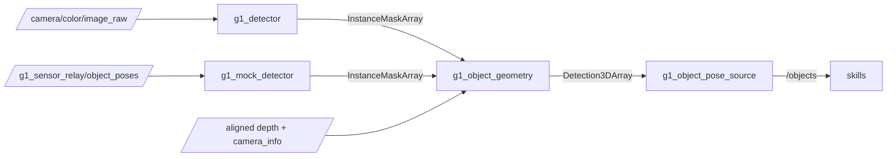

# g1_perception

Finds objects by name and says where they are. A detector segments whatever the phrases ask for,
and this package turns those masks plus the aligned depth frame into the object poses the
manipulation skills already consume. Nothing here plans or moves anything, and nothing here
knows which model drew the masks.



```bash
colcon build --symlink-install --packages-select g1_perception
```

## Nodes

| Node | Does |
|---|---|
| `g1_detector` | Sends camera frames and the phrase list to the host vision server and publishes the instance masks it answers with. Python, see below. |
| `g1_mock_detector` | Cuts the same masks out of simulator ground truth against the real rendered depth. No GPU, no server, no network. Simulation only. |
| `g1_object_geometry` | Deprojects each mask, finds the surface the object stands on, fits a box, and tracks it across frames so an id keeps naming one object. |
| `g1_graspgen_adapter` | Sends the depth frame, its intrinsics and one object's mask to the host grasp generator and serves the grasps it answers with. Python, see below. |
| `g1_mock_grasp_source` | Answers the same service from `/objects` alone: three sensible grasps and one reaching up through the table. No GPU. |
| `g1_instruction_grounder` | Turns an instruction into the noun phrases the detector can be asked for, and writes them onto it. Python, see below. |

## Interfaces

| Direction | Name | Type |
|---|---|---|
| Sub | `color/image_raw` (detector) | `sensor_msgs/Image`, `SensorDataQoS` |
| Sub | `object_poses`, `depth/image_raw`, `camera_info` (mock) | `vision_msgs/Detection3DArray`, `sensor_msgs/Image`, `sensor_msgs/CameraInfo` |
| Sub | `~/instance_masks`, `depth/image_raw`, `depth/camera_info` (geometry) | `g1_msgs/InstanceMaskArray`, `sensor_msgs/Image`, `sensor_msgs/CameraInfo` |
| Pub | `~/instance_masks` (both detectors) | `g1_msgs/InstanceMaskArray`, reliable |
| Pub | `~/object_poses` (geometry) | `vision_msgs/Detection3DArray`, reliable |
| Pub | `~/tracked_masks` (geometry) | `g1_msgs/InstanceMaskArray`, the input masks relabelled with object ids |
| Srv | `~/generate_grasps` (both grasp sources) | `g1_msgs/GenerateGrasps` |
| Srv | `~/ground` (grounder) | `g1_msgs/GroundInstruction` |
| Pub | `~/grasp_candidates` (graspgen) | `visualization_msgs/MarkerArray`, one arrow per candidate along its approach axis |

Images come in at sensor QoS because the relay publishes best-effort and a reliable subscriber
against it silently never matches. Masks and poses go out reliable: they are what a skill decides
a grasp from, and a dropped one is seconds of blindness rather than a skipped frame.

## Object ids

An object is published as `<phrase>_<index>`, so `red cube` becomes `red_cube_0`. The index
belongs to a track, not to a frame: it follows the object while it is seen and is freed a couple
of seconds after it is not. While exactly one object answers to a phrase, a second copy of the
detection is published under the bare `red_cube`, so a tree can name an object without knowing how
many of them there turned out to be.

## Parameters

`config/g1_object_geometry.yaml`, the ones worth knowing:

| Parameter | Default | Meaning |
|---|---|---|
| `up_frame` | `odom` | Where up comes from, and the frame tracking is done in. |
| `mask_erosion_px` | 2 | Pixels trimmed off each mask; depth at an object's edge is a blend of the object and what is behind it. |
| `support_ring_px` | 6 | How far outside the mask to look for the surface the object stands on. |
| `support_band_m` | 0.06 | How far from the object's lowest visible point that surface may be, which keeps the floor and a taller neighbour out of the estimate. |
| `depth_gate_m` | 0.15 | How deep an object may be before points are treated as leakage. Tighter than this cuts the top off something tall seen from above. |
| `min_points` | 150 | Below this, counted after the depth gate, an instance is reported as unusable rather than fitted. |
| `stamp_tolerance_ms` | 50 | How closely a mask's stamp must match a depth frame's. |
| `track_match_radius_m` | 0.08 | How far an object may move between detections and still be itself. |

`config/g1_detector.yaml` carries the server address, the request timeout and the detection rate.
`phrases` is a launch argument rather than a file key, and `ros2 param set` changes it while the
node runs.

## Why three nodes are Python

`g1_detector`, `g1_graspgen_adapter` and `g1_instruction_grounder` are ZMQ and msgpack clients.
The models they talk to need torch and CUDA, which this image deliberately does not have, so they
run on the host and these nodes speak their wire protocol, as `g1_vla`'s policy adapter does.
Everything the masks are used for is C++: the geometry, the tracking, and both stand-ins.

The socket handling the three share lives in `g1_perception/host_clients.py`.

## Instructions

A detector takes "red cube". It does not take "the mug to the left of the bowl": no relations, no
sentences, and no notion of which object a sentence is about. `g1_instruction_grounder` asks a
vision-language model on the host to name the objects in the scene and say which one the
instruction means, then writes those phrases onto the detector's `phrases` parameter. That is the
detector's whole control interface, so nothing else had to be built to steer it.

## Grasps

`g1_graspgen_adapter` asks NVIDIA's GraspGenX for six-degree-of-freedom grasps on one tracked
object. The hand travels as twelve numbers, its sweep volume, rather than as a name, which is why
a model that never trained on a Dex3-1 produces grasps for one. Poses come back in the camera
frame, belonging to the generator's own gripper frame rather than to any link here, so the arm
side applies one measured offset. Left-hand requests are refused: mirroring a sweep volume
describes a different gripper.

## What the geometry assumes

An object stands on a surface, and the camera sees its top. The vertical extent is measured from
that surface up to the highest visible point, which is what makes one view enough: the lowest
visible point of a sphere is its equator, not its base.

The horizontal extent comes from the visible points only, so a shape that hides its own far side
reads slightly small and slightly close. Measured on the tabletop world: four of the five objects
land within 2 mm of truth, and the sphere sits 1.2 cm short along the view direction.

## Running

With the stand-in detector, which needs no GPU:

```bash
ros2 launch g1_bringup bringup.launch.py world:=tabletop pin_pelvis:=true \
  odometry:=ground_truth moveit:=true manipulation:=true perception:=true detector:=mock
```

Against the real models, after starting the host server (see
`docs/guides/open-vocabulary-grasping.md`):

```bash
ros2 launch g1_bringup bringup.launch.py world:=tabletop pin_pelvis:=true \
  odometry:=ground_truth moveit:=true manipulation:=true perception:=true detector:=vision \
  phrases:="red cube,white cup"
```

```bash
ros2 topic echo /objects --field detections[0].results[0].hypothesis
```

## Tests

| Test | Needs a simulator | Covers |
|---|---|---|
| `test_object_geometry` | No | Slugs, erosion, deprojection including the NaN and padded-row cases the simulator never produces, the depth gate, and the box fit: a tilted rectangle's yaw, a square that must not inflate, a sphere's height from its support plane, and a mask that ran onto the table. |
| `test_object_tracker` | No | Ids that survive jitter, a second instance getting its own index, two neighbours that must not swap, index reuse after a timeout, and the sole-instance alias. |
| `test_depth_history` | No | Pairing a late mask with its own depth frame, refusing one outside the tolerance, and dropping frames past the window. |
| `test_detector` | No | The detector client against a stub vision server: the request encoding, the mask message, the image's own stamp, and a phrase list that is re-read rather than cached. |
| `test_grounder` | No | The grounder against a stub: an instruction becomes phrases, the target is one of them, the phrases actually reach the detector's parameter, exemplar points survive, and an empty instruction is refused. |
| `test_graspgen_adapter` | No | The grasp adapter against a stub generator: the request encoding the real server would reject, the frame and stamp of the answer, ordering by confidence, an unknown object, and a left-hand request refused rather than mirrored. |
| `test_perception_objects` | Sim, `-L simulator` | Measured poses against the simulator's own, for all five tabletop objects: position within 2 cm, size within 2.5 cm, both names published, and the stamp being the measurement's rather than the publisher's. |
