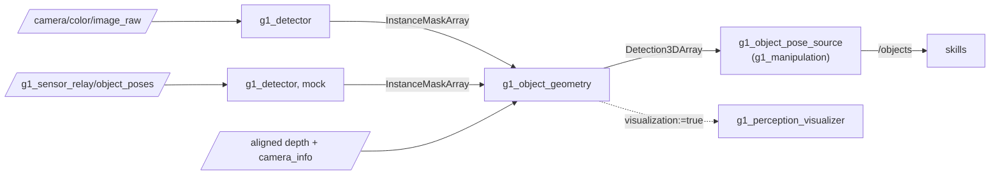

# g1_perception

Finds objects by name and says where they are. A detector segments whatever the phrases ask for,
and this package turns those masks plus the aligned depth frame into the object poses the
manipulation skills consume. Nothing here plans or moves anything, and nothing here knows which
model drew the masks.


```mermaid
flowchart LR
    C[/camera/color/image_raw/] --> D[g1_detector]
    T[/g1_sensor_relay/object_poses/] --> M[g1_detector, mock]
    D -- InstanceMaskArray --> G[g1_object_geometry]
    M -- InstanceMaskArray --> G
    P[/aligned depth + camera_info/] --> G
    G -- Detection3DArray --> S["g1_object_pose_source<br/>(g1_manipulation)"]
    S -- /objects --> K[skills]
    G -. "visualization:=true" .-> V[g1_perception_visualizer]
```

```bash
./scripts/manage.sh build g1_perception
```

## Nodes

| Node | Does |
|---|---|
| `g1_detector` | canopy_perception's `detector`, configured by `config/g1_detector.yaml`: sends camera frames and the phrase list to canopy's semantic server on the host, run with SAM 3.1 (Grounded SAM 2 from the vision server can stand in), and publishes the instance masks it answers with. |
| `g1_detector` (mock) | canopy_perception's `mock_detector`: cuts the same masks out of simulator ground truth against the real rendered depth. No GPU, no server, no network. Simulation only. Launched as `g1_detector` too, so a tree writes the same `phrases` whichever detector runs. |
| `g1_object_geometry` | Deprojects each mask, finds the surface the object stands on, fits a box, and tracks it across frames so an id keeps naming one object. |
| `g1_graspgen_adapter` | Sends the depth frame, its intrinsics and one object's mask to [GraspGenX](https://github.com/NVlabs/GraspGenX) on the host and serves the grasps it answers with. The Dex3-1 goes as its sweep volume (`sweep_volume`, twelve numbers), not by name. Poses come back in the generator's own gripper frame, so the arm side applies one measured offset. Left-hand requests are refused, since mirroring a sweep volume describes a different gripper. Python, see below. |
| `g1_mock_grasp_source` | Answers the same service from `/objects` alone: three sensible grasps and one reaching up through the table. No GPU. |
| `g1_instruction_grounder` | Asks a vision-language model on the host to turn an instruction into the noun phrases the detector can be asked for (it takes "red block", not "the mug to the left of the bowl") and writes them onto the detector's `phrases`, its whole control interface. Needs `grounding:=true` and a vision server started with `--vlm`. Python, see below. |
| `g1_perception_visualizer` | Draws each detection on the frame it was cut from, and the simulator's ground truth labelled with how far off perception is. Only runs with `visualization:=true`. |

`perception.launch.py` takes `detector:=mock|vision` (default `mock`), `phrases`,
`grasp_engine:=none|mock|graspgen` (default `none`), `grounding` and `visualization` (both default
`false`), plus `mock_latency_s`, `mock_rate_hz`, `mock_margin_m` and `only_from_below` for the
stand-ins. `g1_bringup` includes it with `perception:=true`, which needs `manipulation:=true`.

## Interfaces

Names are as `perception.launch.py` remaps them. Masks are `canopy_msgs/InstanceMaskArray` and
object poses `vision_msgs/Detection3DArray`.

| Node | In | Out |
|---|---|---|
| `g1_detector` | `/camera/color/image_raw` | `/g1_perception/instance_masks` |
| `g1_detector` (mock) | `/g1_sensor_relay/object_poses`, `/camera/aligned_depth_to_color/image_raw`, `/camera/color/camera_info` | `/g1_perception/instance_masks` |
| `g1_object_geometry` | `/g1_perception/instance_masks`, `/camera/aligned_depth_to_color/image_raw` (32FC1, metres), `/camera/aligned_depth_to_color/camera_info` | `/g1_object_geometry/object_poses`, in the camera frame; `/g1_object_geometry/tracked_masks`, the input masks relabelled with object ids |
| `g1_graspgen_adapter` | `/g1_object_geometry/tracked_masks`, the depth image and its `camera_info` | `/g1_grasp_engine/generate_grasps` (`g1_msgs/GenerateGrasps`) |
| `g1_mock_grasp_source` | `/objects` | `/g1_grasp_engine/generate_grasps` |
| `g1_instruction_grounder` | `/camera/color/image_raw` | `/ground_instruction` (`g1_msgs/GroundInstruction`); writes `phrases` on `/g1_detector` |
| `g1_perception_visualizer` | `/camera/color/image_raw`, `/camera/color/camera_info`, `/g1_object_geometry/tracked_masks`, `/g1_object_geometry/object_poses`, `/g1_sensor_relay/object_poses` | `/g1_perception_visualizer/annotated_image` (rgb8): masks tinted per object, fitted boxes, `id score` labels, and `unmeasured` on an instance the geometry rejected. `/g1_perception_visualizer/ground_truth` (`MarkerArray`, transient local, in `fixed_frame`): a box per object labelled `<n> mm off` or `not seen` |

Images come in best effort, because the relay publishes that way and a reliable subscriber would
never match; the detector keeps only the newest frame, since its blocking request would otherwise
hand the next pass an old one. Masks and poses go out reliable, because a dropped one is seconds
of blindness. `g1_object_pose_source` in `g1_manipulation` turns
`/g1_object_geometry/object_poses` into `/objects`, in the `odom` frame. The visualizer draws
nothing until a frame's masks, poses and image are all in.

## Object ids

An object is published as `<phrase>_<index>`, so `red block` becomes `red_block_0`. The index
belongs to a track: it follows the object while it is seen and is freed `track_timeout_s` after it
is not. A phrase seen once with one track keeps that track however far the pose jumps; with more
than one object under a phrase, tracks match within `track_match_radius_m`.

A detection is also published under the bare phrase, `red_block`, so a tree can name an object
without knowing its index (`publish_bare_phrase_alias: false` turns that off). The alias follows
the first object seen alone under its phrase and is withheld from any frame where that object is
unseen or another one with the same phrase is seen too, so it never jumps between objects.

## Parameters

`config/g1_object_geometry.yaml` documents every key. The ones worth knowing:

| Parameter | Default | Meaning |
|---|---|---|
| `up_frame` | `odom` | Where up comes from, and the frame tracking is done in. |
| `mask_erosion_px` | 2 | Pixels trimmed off each mask; depth at an object's edge is a blend of the object and what is behind it. |
| `support_ring_px` | 6 | How far outside the mask to look for the surface the object stands on. |
| `support_band_m` | 0.06 | How far from the object's lowest visible point that surface may be, which keeps the floor and a taller neighbour out of the estimate. |
| `depth_gate_m` | 0.15 | How deep an object may be before points are treated as leakage. Tighter than this cuts the top off something tall seen from above. |
| `min_points` | 150 | Below this, counted after the depth gate, an instance is reported as unusable rather than fitted. |
| `depth_history_s` | 5.0 | How long depth frames are kept for a mask to be paired with; has to outlast the detector's latency, up to about 4 s. |
| `depth_history_max_frames` | 150 | Frame cap on that history, which bounds its memory at a fast depth rate. |
| `stamp_tolerance_ms` | 130 | How closely a mask's stamp must match a depth frame's. The nearest frame is taken, so this only has to cover the camera's frame gap under load. |
| `track_match_radius_m` | 0.08 | How far an object may move between detections and still be itself, when its phrase names more than one. |
| `track_timeout_s` | 6.0 | How long an unseen track keeps its id and its alias. |

`config/g1_detector.yaml` holds `server_address` (`tcp://127.0.0.1:5561`, canopy's SAM 3.1
server), `zmq_timeout_ms`
(20000), `detect_rate_hz` (1.0), `max_image_age_s` (2.5), `box_threshold` (0.40) and
`text_threshold` (0.25). `phrases` is a launch argument rather than a file key, and
`ros2 param set` changes it while the node runs. Both detectors re-read it every pass, and an
empty list idles them; the mission trees use that to run perception only for the steps that need
it.

The other nodes read `config/g1_perception_visualizer.yaml` (its colour history has to outlast the
detector's latency), `config/g1_graspgen_adapter.yaml`, `config/g1_instruction_grounder.yaml` and
`config/g1_mock_grasp_source.yaml`.

## Why two nodes are Python

`g1_graspgen_adapter` and `g1_instruction_grounder` are ZMQ and msgpack clients. The models they
talk to need torch and CUDA, which this image does not have, so they run on the host and these
nodes speak their wire protocol, as `g1_vla`'s policy adapter does. The rest of the package is
C++. They share socket handling with the detector (`canopy_perception/host_clients.py`);
`g1_perception/host_clients.py` adds the grasp generator's call.

## What the geometry assumes

An object stands on a surface and the camera sees its top. Height runs from that surface to the
highest visible point, which is what makes one view enough: a sphere's lowest visible point is its
equator, not its base. Width comes from the visible points only, so a shape hiding its far side
reads slightly small and slightly close. Anything else inside a mask is measured as the object,
which is why the tabletop world starts the arms clear of the props.

## Running

With the stand-in detector, which needs no GPU:

```bash
ros2 launch g1_bringup bringup.launch.py world:=tabletop pin_pelvis:=true \
  odometry:=ground_truth moveit:=true manipulation:=true perception:=true detector:=mock
```

Against the real models, after starting canopy's semantic server with SAM 3.1
(`workspace/src/canopy/servers/setup.sh` once, then `./scripts/serve.sh canopy --detector sam3.1
--embedder none --describer none`):

```bash
ros2 launch g1_bringup bringup.launch.py world:=tabletop pin_pelvis:=true \
  odometry:=ground_truth moveit:=true manipulation:=true perception:=true detector:=vision \
  phrases:="red block,white cylinder"
```

SAM 3.1 reads the words: the tabletop's `white_cup` is a plain cylinder, and "white cup" finds
nothing.

`ros2 topic echo --once /objects` shows what is seen. `rviz:=true` adds the annotated image, the
ground truth and the grasp plan to MoveIt's window; the `visualization` argument behind them
follows `rviz`. `./scripts/demos/open-vocabulary-grasping.sh mock|vision|gsam2|graspgen|grounding`
opens each variant in panes, and the
[open-vocabulary perception guide](../../../docs/guides/open-vocabulary-grasping.md) covers the
servers and the grasp and grounding variants.

## Tests

`./scripts/manage.sh test g1_perception` skips `test_perception_objects`, which needs `--sim`.

| Test | Needs a simulator | Covers |
|---|---|---|
| `test_object_geometry` | No | Erosion, deprojection including the NaN and padded-row cases the simulator never produces, the depth gate, and the box fit: a tilted rectangle's yaw, a square that must not inflate, a sphere's height from its support plane, and a mask that ran onto the table. |
| `test_object_tracker` | No | Ids that survive jitter, a lone object followed past the match radius, a second instance getting its own index, two neighbours that must not swap, index reuse after a timeout, an alias that never jumps between objects, and the phrase recovered from an id. |
| `test_perception_visualizer` | No | Which drawn instance counts as measured, including a rejected one whose raw label equals an alias. |
| `test_visualizer` | No | The visualizer on synthetic frames: the annotated image, ground truth moved into `odom` and labelled with the error, an empty frame left untouched, and masks that arrive before their frame. |
| `test_grounder` | No | The grounder against a stub: an instruction becomes phrases, the target is one of them, the phrases actually reach the detector's parameter, exemplar points survive, and an empty instruction is refused. |
| `test_graspgen_adapter` | No | The grasp adapter against a stub generator: the request encoding the real server would reject, the frame and stamp of the answer, ordering by confidence, an unknown object, and a left-hand request refused rather than mirrored. |
| `test_perception_objects` | Yes | Measured poses against the simulator's own for every tabletop prop: position and size, both names published, and the stamp being the measurement's rather than the publisher's. |
