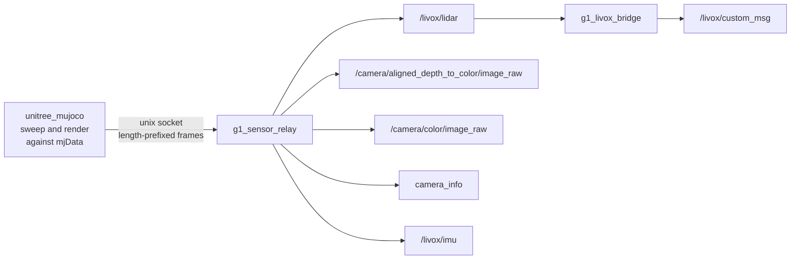

# g1_sensor_relay

Publishes the sensor data sampled inside the patched `unitree_mujoco`. The simulator computes the
LiDAR sweep and the camera render against its own `mjData` and hands finished frames over a local
socket; this node turns them into ROS 2 messages.

`ament_cmake`, C++20. Simulation only.



## Why the split exists

`unitree_sdk2` and `rmw_cyclonedds` both call `dds_create_domain` unconditionally, and CycloneDDS
allows exactly one explicit domain creation per domain id per process. They cannot coexist in
either order. So the simulator links no ROS at all, and this node owns the ROS side.

The sweep itself has to happen inside the simulator because it needs the scene: geometry, meshes
and current pose all live in `mjData` in that process, and no DDS topic carries them. The finished
frame is what crosses the boundary.

## Topics

| Topic | Type | Notes |
|---|---|---|
| `/livox/lidar` | `sensor_msgs/msg/PointCloud2` | Sensor data QoS, so a reliable subscriber sees nothing. |
| `/camera/aligned_depth_to_color/image_raw` | `sensor_msgs/msg/Image` | `32FC1`, metres. Misses are NaN, not 0. |
| `/camera/color/image_raw` | `sensor_msgs/msg/Image` | `rgb8` |
| `/camera/aligned_depth_to_color/camera_info`, `/camera/color/camera_info` | `sensor_msgs/msg/CameraInfo` | Same intrinsics. |
| `~/sensor_pose` | `geometry_msgs/msg/PoseStamped` | Where the simulator says the sensor is. Diagnostic. |
| `/livox/imu` | `sensor_msgs/msg/Imu` | The IMU inside the Mid360, 200 Hz. Reliable, depth 10, matching the real driver. |
| `/livox/custom_msg` | `livox_ros_driver2/msg/CustomMsg` | `g1_livox_bridge` only. Reliable, depth 20, matching the real driver. |

Depth and colour come from one render, so they share a pose, a timestamp and intrinsics by
construction. A real D435i only gets that alignment from its own align-depth-to-colour step, which
is why the depth topic is named as if it had run.

## Parameters

| Parameter | Default | Meaning |
|---|---|---|
| `socket_path` | `/tmp/g1_sensors.sock` | Where the relay listens. The simulator connects to it. |
| `frame_id` | `mid360_link` | Frame for the point cloud. |
| `depth_frame_id` | `camera_depth_optical_frame` | REP-145 optical frame. |
| `color_frame_id` | `camera_color_optical_frame` | REP-145 optical frame. |
| `world_frame_id` | `world` | Frame for the diagnostic sensor pose. |

`imu_topic` (`/livox/imu`) and `imu_frame_id` (`mid360_imu`) name the sensor's own IMU;
`imu_rate_hz` in the simulator's sensor config sets its rate, 200 Hz to match a real Mid360.
`g1_livox_bridge` takes `cloud_topic` and `custom_msg_topic`.

Start order does not matter. The relay listens whenever it comes up and the simulator retries every
cycle, so either process can start, die or restart independently.

The optical frames are not `d435_link`. That is a body frame with x forward, and every depth
consumer assumes the optical convention with z forward, so publishing in the link frame rotates the
cloud 90 degrees.

## Running

The node starts with `sensors:=true`:

```bash
ros2 launch g1_bringup bringup.launch.py sensors:=true rviz:=true
ros2 topic hz /livox/lidar
```

## g1_livox_bridge

A second executable, run only when FAST-LIO is asked for (`odometry:=fast_lio`, via
`g1_state_estimation`'s `fastlio_odometry.launch.py`). It restates the relay's PointCloud2 as
the Livox `CustomMsg` FAST-LIO consumes -- one of the two topics `livox_ros_driver2` publishes
on the robot, so the odometry pipeline downstream is identical in both places. The other,
`/livox/imu`, comes off the socket above.

Every point goes out with `offset_time` zero, which is truthful rather than a shortcut: the
simulator raycasts the whole sweep against a frozen snapshot, so there is no motion inside a
frame for FAST-LIO's undistortion to undo. A real Mid360 sweeps continuously, which is exactly
what this bridge cannot reproduce and why undistortion stays unvalidated until hardware.

## The Mid360's own IMU

FAST-LIO fuses the IMU that shares a housing with the laser, and the simulator models one there:
a MuJoCo site on `torso_link` at `g1_description`'s `mid360_imu` pose, sampled on its own thread
at 200 Hz and sent over this socket. It cannot ride `/lowstate` -- `unitree_hg::LowState` carries
exactly one `imu_state`, matching a robot whose second IMU reports over the sensor's own Ethernet
link.

It used to be the pelvis IMU, and that is a defect worth remembering rather than a simplification.
`waist_yaw`, `waist_roll` and `waist_pitch` lie between pelvis and sensor, the walking policy owns
all three, and they move through 25, 9 and 16 degrees while walking. FAST-LIO takes one constant
lidar-to-IMU extrinsic, so across that chain no value is right: the scan match came apart whenever
the robot turned, and how badly depended on where in its gait it happened to be, which is why the
same configuration scored anywhere between 1 % and 27 % drift.

## Layout

| File | Contents |
|---|---|
| `frame_reader.{hpp,cpp}` | Framing and validation, free of ROS and sockets so the wire format tests without a simulator. |
| `g1_sensor_relay_node.cpp` | The socket, the poll loop and the publishers. |
| `g1_livox_bridge_node.cpp` | The FAST-LIO front end above. |
| `sensor_frame.h` | The wire struct, duplicated on the simulator side. |

The wire format is untrusted input: every length is validated before it is trusted, including the
one multiply that could overflow.

## Tests

```bash
colcon test --packages-select g1_sensor_relay
```

`test_frame_reader` covers the framing, the bounds checks and a drift check that reads both copies
of `sensor_frame.h`. No simulator needed. `g1_bringup`'s `test_lidar_geometry` asserts the
published cloud measures the room it is in.
