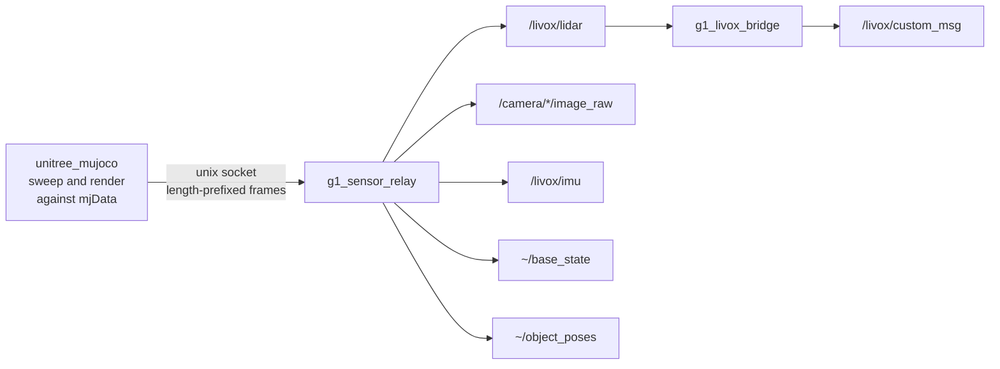

# g1_sensor_relay

Publishes the sensor data sampled inside the patched `unitree_mujoco`. The simulator computes the
LiDAR sweep, the camera render and the Mid360's IMU against its own `mjData` and sends finished
frames over a local socket; this node turns them into ROS 2 messages.

`ament_cmake`, C++20. Simulation only.



## Why the split exists

The simulator process links no ROS. `unitree_sdk2` owns CycloneDDS there, and `rmw_cyclonedds`
cannot share a process with it: both call `dds_create_domain` for the same domain id. The sampling
has to happen inside the simulator, because the scene lives in its `mjData`; only finished frames
cross the socket.

## Topics

| Topic | Type | Notes |
|---|---|---|
| `/livox/lidar` | `sensor_msgs/msg/PointCloud2` | Sensor data QoS, so a reliable subscriber sees nothing. |
| `/camera/aligned_depth_to_color/image_raw` | `sensor_msgs/msg/Image` | `32FC1`, metres. Misses are NaN, not 0. |
| `/camera/color/image_raw` | `sensor_msgs/msg/Image` | `rgb8` |
| `/camera/aligned_depth_to_color/camera_info`, `/camera/color/camera_info` | `sensor_msgs/msg/CameraInfo` | Same intrinsics. |
| `/livox/imu` | `sensor_msgs/msg/Imu` | The IMU inside the Mid360, 200 Hz. Reliable like the real driver, depth 400 because samples arrive in bursts. |
| `~/base_state` | `nav_msgs/msg/Odometry` | Exact pelvis state out of MuJoCo, for `g1_state_estimation`'s ground-truth source. Not `/odom`, because it is truth, not an estimate. |
| `~/object_poses` | `vision_msgs/msg/Detection3DArray` | Raw ground truth in the camera frame. `g1_object_pose_source` turns it into `/objects`. |
| `~/sensor_pose` | `geometry_msgs/msg/PoseStamped` | Where the simulator says the LiDAR is. Diagnostic. |
| `/livox/custom_msg` | `livox_ros_driver2/msg/CustomMsg` | `g1_livox_bridge` only. Reliable, depth 20, matching the real driver. |

Depth and colour come from one render, so they share a pose, a timestamp and intrinsics. A real
D435i gets that alignment from its align-depth-to-colour step, which is why the depth topic is
named as if it had run.

Images are published in the REP-145 optical frames, not `d435_link`: depth consumers assume z
forward, and the body frame would rotate the cloud 90 degrees.

## Parameters

| Parameter | Default | Meaning |
|---|---|---|
| `socket_path` | `/tmp/g1_sensors.sock` | Where the relay listens. `sim.launch.py` sets it from `g1_bringup`'s `sim_sensors.yaml`. |
| `poll_hz` | `500.0` | Socket drain rate. |
| `topic`, `frame_id` | `/livox/lidar`, `mid360_link` | The point cloud. |
| `imu_topic`, `imu_frame_id` | `/livox/imu`, `mid360_imu` | The Mid360's IMU. Its rate is `imu_rate_hz` in the simulator's sensor config. |
| `depth_topic`, `depth_info_topic`, `color_topic`, `info_topic` | As in the topic table | Camera topics. |
| `depth_frame_id`, `color_frame_id` | `camera_depth_optical_frame`, `camera_color_optical_frame` | REP-145 optical frames. |
| `world_frame_id` | `world` | Frame stamped on `~/sensor_pose`. The shipped config sets `odom`, since TF has no `world`. |
| `base_state_frame_id`, `base_state_odom_frame` | `pelvis`, `odom` | Frames stamped on `~/base_state`. |

`g1_livox_bridge` takes `cloud_topic` and `custom_msg_topic`.

Start order does not matter. The relay listens whenever it comes up and the simulator retries every
cycle, so either process can start, die or restart independently.

## Running

```bash
ros2 launch g1_bringup bringup.launch.py sensors:=true rviz:=true
ros2 topic hz /livox/lidar
```

## g1_livox_bridge

A second executable, started by `g1_state_estimation`'s `fastlio_odometry.launch.py` when FAST-LIO
runs in simulation. It restates the relay's PointCloud2 as the Livox `CustomMsg` FAST-LIO consumes,
so the odometry pipeline is identical to the robot's, where `livox_ros_driver2` publishes it.

Every point goes out with `offset_time` zero. That is truthful: the simulator raycasts the whole
sweep against a frozen snapshot, so there is no motion inside a frame to undistort. A real Mid360
sweeps continuously, so undistortion stays unvalidated until hardware.

## The Mid360's own IMU

FAST-LIO fuses the IMU that shares a housing with the laser, and the simulator models one there: a
MuJoCo site on `torso_link` at `g1_description`'s `mid360_imu` pose, sampled on its own thread at
200 Hz. It rides this socket rather than `/lowstate`, because `unitree_hg::LowState` carries exactly
one `imu_state`; the real sensor reports over its own Ethernet link.

It must not be the pelvis IMU. Three waist joints lie between pelvis and sensor, and FAST-LIO takes
one constant lidar-to-IMU extrinsic.

## Object poses

`~/object_poses` carries objects in `camera_color_optical_frame`, as a detector would report them,
so `g1_object_pose_source` runs the same code on the robot. The camera's world pose comes from the
LiDAR's ground-truth pose and the rigid LiDAR-to-camera transform, so it is one sweep stale: a few
centimetres at walking pace.

## Layout

| File | Contents |
|---|---|
| `frame_reader.{hpp,cpp}` | Framing and validation, free of ROS and sockets so the wire format tests without a simulator. |
| `livox_custom_msg.{hpp,cpp}` | PointCloud2 to CustomMsg, split out so the conversion tests without a graph. |
| `g1_sensor_relay_node.cpp` | The socket, the poll loop and the publishers. |
| `g1_livox_bridge_node.cpp` | The FAST-LIO front end above. |
| `sensor_frame.h` | The wire struct, byte-identical to `workspace/vendor/unitree_mujoco/sensor_frame.h`. |

The wire format is untrusted input: every length is validated before it is used, including the one
multiply that could overflow.

## Tests

```bash
colcon test --packages-select g1_sensor_relay
```

`test_frame_reader` covers the framing, the bounds checks, and a drift check that reads both copies
of `sensor_frame.h`. `test_livox_custom_msg` covers the conversion against FAST-LIO's own discard
gates (`line`, the tag bits, `offset_time`) and the miss handling. Neither needs a simulator.
`g1_bringup`'s `test_lidar_geometry` asserts the published cloud measures the room it is in.
