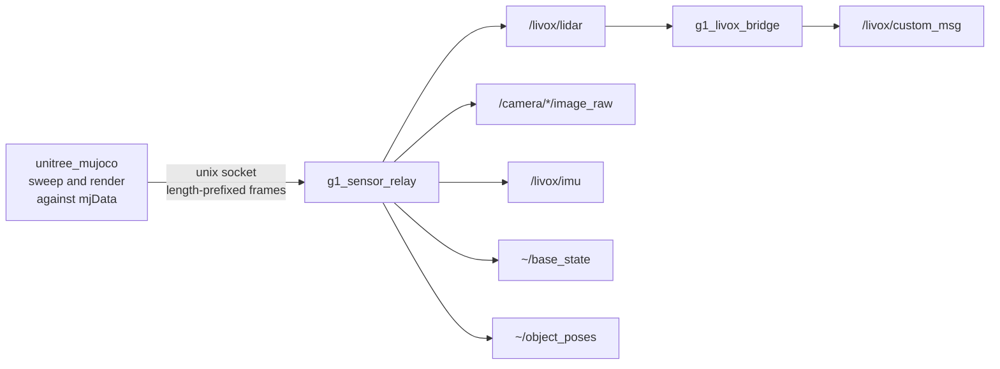

# g1_sensor_relay

Publishes the sensor data sampled inside the patched `unitree_mujoco`. The simulator computes the
LiDAR sweep, the camera renders, the Mid360's IMU, the pelvis state and the object poses against
its own `mjData` and sends finished frames over a local socket; this node turns them into ROS 2
messages.

`ament_cmake`, C++20. Simulation only. Two executables, started by other packages' launch files:
`g1_sensor_relay` by `g1_bringup`'s `sim.launch.py`, `g1_livox_bridge` by `g1_state_estimation`'s
`fastlio_odometry.launch.py`.


```mermaid
flowchart LR
    MJ["unitree_mujoco<br/>sweep and render<br/>against mjData"] -- "unix socket<br/>length-prefixed frames" --> R
    R["g1_sensor_relay"] --> PC["/livox/lidar"]
    R --> D["/camera/*/image_raw"]
    R --> IM["/livox/imu"]
    R --> BS["~/base_state"]
    R --> OP["~/object_poses"]
    PC --> B["g1_livox_bridge"]
    B --> CM["/livox/custom_msg"]
```

## Why the split exists

The simulator process links no ROS. `unitree_sdk2` owns CycloneDDS there, and `rmw_cyclonedds`
cannot share a process with it: both call `dds_create_domain` for the same domain id. The sampling
has to happen inside the simulator, because the scene lives in its `mjData`; only finished frames
cross the socket.

## Topics

| Topic | Type | Notes |
|---|---|---|
| `/livox/lidar` | `sensor_msgs/msg/PointCloud2` | The sweep in `mid360_link`: `x`, `y`, `z` floats only. Misses are NaN. |
| `/camera/aligned_depth_to_color/image_raw` | `sensor_msgs/msg/Image` | The head camera: `32FC1`, metres. Misses are NaN, not 0. |
| `/camera/color/image_raw` | `sensor_msgs/msg/Image` | `rgb8` |
| `/camera/aligned_depth_to_color/camera_info`, `/camera/color/camera_info` | `sensor_msgs/msg/CameraInfo` | Same intrinsics. |
| `/chest_camera/...` | as above | The chest camera, the same four topics, when the simulator renders it (`cameras:=head,chest`). |
| `/livox/imu` | `sensor_msgs/msg/Imu` | The IMU inside the Mid360, 200 Hz. Reliable like the real driver, depth 400 because samples arrive in bursts. |
| `~/base_state` | `nav_msgs/msg/Odometry` | Exact pelvis state out of MuJoCo, for `g1_state_estimation`'s ground-truth source. Not `/odom`, because it is truth, not an estimate. Reliable, depth 50. |
| `~/object_poses`, `~/chest/object_poses` | `vision_msgs/msg/Detection3DArray` | Raw ground truth in each camera's colour frame. `g1_object_pose_source` and the mock detector turn it into `/objects` and masks. |
| `~/sensor_pose` | `geometry_msgs/msg/PoseStamped` | Where the simulator says the LiDAR is, in `world_frame_id`. Read by `test_lidar_geometry` and the RViz configs. |
| `/livox/custom_msg` | `livox_ros_driver2/msg/CustomMsg` | Published by `g1_livox_bridge`, not the relay. Reliable, depth 20, matching the real driver. |

Every other topic uses sensor-data QoS (best effort), so a reliable subscriber sees nothing.

Depth and colour come from one render, so they share a pose, a stamp and intrinsics, as a D435i's
align-depth-to-colour step gives; hence the depth topic's name. The stamp is the render's instant
on this node's clock, as the RealSense driver stamps capture, so cameras rendered from one snapshot
share it.

Images are published in the REP-145 optical frames, not the camera's body link: depth consumers
assume z forward, and the body frame would rotate the cloud 90 degrees. Each depth frame carries
the name of the camera it came from, and the relay publishes it under that camera's topics.

## Parameters

| Parameter | Default | Meaning |
|---|---|---|
| `socket_path` | `/tmp/g1_sensors.sock` | Where the relay listens. `sim.launch.py` sets it from the world's sensor config in `g1_bringup` (`sim_sensors.yaml`, or `sim_sensors_<world>.yaml`), which the simulator reads too. |
| `poll_hz` | `500.0` | Socket drain rate. |
| `topic`, `frame_id` | `/livox/lidar`, `mid360_link` | The point cloud. |
| `imu_topic`, `imu_frame_id` | `/livox/imu`, `mid360_imu` | The Mid360's IMU. Its rate is `imu_rate_hz` in the sensor config. |
| `cameras` | `[head]` | Camera names the simulator may send; the shipped config lists `head` and `chest`. |
| `N.depth_topic`, `N.depth_info_topic`, `N.color_topic`, `N.info_topic` | `/camera/...` for `head`, `/N_camera/...` otherwise | Camera N's topics; `N` is a name from `cameras`, as in `head.depth_topic`. |
| `N.depth_frame_id`, `N.color_frame_id` | `camera_*_optical_frame` for `head`, `N_camera_*_optical_frame` otherwise | REP-145 optical frames. |
| `N.object_poses_topic` | `~/object_poses` for `head`, `~/N/object_poses` otherwise | Ground truth in camera N's colour frame. |
| `world_frame_id` | `world` | Frame stamped on `~/sensor_pose`. The shipped config sets `odom`, since TF has no `world`. |
| `base_state_frame_id`, `base_state_odom_frame` | `pelvis`, `odom` | Frames stamped on `~/base_state`. |

## Running

```bash
ros2 launch g1_bringup bringup.launch.py sensors:=true rviz:=true
ros2 topic hz /livox/lidar
```

Start order does not matter. The relay listens whenever it comes up and the simulator retries every
cycle, so either process can start, die or restart independently.

## g1_livox_bridge

Started when FAST-LIO runs in simulation. It restates the relay's PointCloud2 as the Livox
`CustomMsg` FAST-LIO consumes, so the odometry pipeline is identical to the robot's, where
`livox_ros_driver2` publishes it. It takes `cloud_topic` and `custom_msg_topic`, and drops the
non-finite points, which are misses.

Every point goes out with `offset_time` zero. That is truthful: the simulator raycasts the whole
sweep against a frozen snapshot, so there is no motion inside a frame to undistort.

## The Mid360's own IMU

FAST-LIO fuses the IMU that shares a housing with the laser, and the simulator models one there: a
MuJoCo site on `torso_link` at `g1_description`'s `mid360_imu` pose, sampled on its own thread at
200 Hz. It rides this socket rather than `/lowstate`, because `unitree_hg::LowState` carries exactly
one `imu_state`; the real sensor reports over its own Ethernet link. Why the pelvis IMU cannot stand
in, and what the simulated pipeline leaves unvalidated, is in the
[g1_state_estimation README](../g1_state_estimation/README.md).

## Object poses

`~/object_poses` carries the bodies listed under `object_bodies` in the sensor config, in
`camera_color_optical_frame` (each other camera's topic in its own frame), as a detector would
report them, so `g1_object_pose_source` runs the same code on the robot. The camera's world pose
comes from the LiDAR's ground-truth pose and the rigid LiDAR-to-camera transform, so it is one
sweep stale: a few centimetres at walking pace.

## Wire format

`sensor_frame.h` is the wire struct, byte-identical to the simulator's
`simulate/src/sensor_frame.h` (submodule `workspace/vendor/unitree_mujoco`). `frame_reader` holds
the framing and validation and `livox_custom_msg` the PointCloud2 to CustomMsg conversion; both are
free of ROS and sockets, so they test without a simulator. The wire format is untrusted input:
every length is validated before use, and point, pixel and object counts are capped.

## Tests

```bash
./scripts/manage.sh test g1_sensor_relay
```

`test_frame_reader` covers the framing, the bounds checks, and a drift check that reads both copies
of `sensor_frame.h`. `test_livox_custom_msg` covers the conversion against FAST-LIO's own discard
gates (`line`, the tag bits, `offset_time`) and the miss handling. Neither needs a simulator.
`g1_bringup`'s simulator suites (`./scripts/manage.sh test --sim g1_bringup`) cover the rest:
`test_lidar_geometry` asserts the published cloud measures the room it is in, and
`test_fastlio_odometry` runs the bridge and the IMU end to end.
