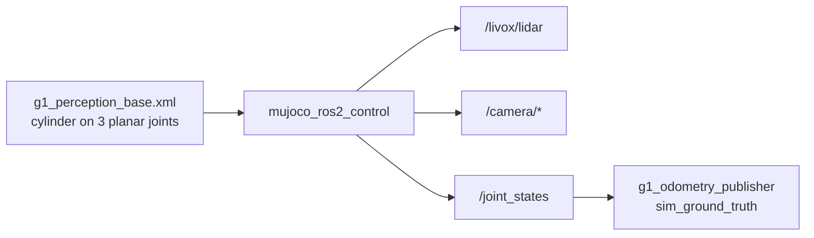

# g1_sim

**Simulation only, and a sandbox rather than the main track.**

A simplified mobile body carrying a 3D LiDAR and an RGB-D camera in MuJoCo, driven through
`mujoco_ros2_control`. The LiDAR and depth camera moved onto the real G1 model in `g1_bringup`
(`sensors:=true`), where perception, arms and locomotion share one simulation.

This package survives because it starts in seconds and needs no walking policy, balance or DDS
bridge, so a sensor question can be answered without touching the timing-critical track.

`ament_cmake`, no compiled code.



## Three conditions keep it from becoming a second stack

It gains no new capability: no Nav2, no MoveIt, no manipulation. New work targets the converged
track. If it goes two milestones unused, it should be deleted.

It also keeps a defect the converged track does not have. The sandbox uses the vendor
`mujoco_3d_lidar` plugin, whose raycast lets a few percent of returns pass through walls. The
converged track hand-rolls its sweep with `mj_ray` and does not carry that bug, so a leak seen here
says nothing about the real track, and a sandbox result must never be used to characterise it.

The two tracks share a ROS domain and must never run at the same time.

## This is not the G1

The body is a deliberately non-physical stand-in: a cylinder on three planar joints, slide-x,
slide-y and hinge-z. It cannot topple and is commanded directly through `ros2_control`. Early
perception work does not need bipedal dynamics, and a 29-DoF humanoid with no balance controller
would only topple or need a weld. Nothing here commands a motor on the G1 model, so no new writer
appears on any low-level channel.

What is real is the sensor mount poses. They come from Unitree's own vendored URDF, with
`torso_link`'s offset from `pelvis` folded in.

| Frame | Mount, relative to `base_link` | Note |
|---|---|---|
| `livox_frame` | xyz `-0.00368 0.00003 0.472434`, rpy `pi 0.05112069 0` | Roll is exactly pi. The Mid360 is mounted upside down on the real G1, and missing that inverts every cloud relative to hardware. |
| `camera_link` | xyz `0.05366 0.01753 0.473870`, rpy `0 0.83077672 0` | Pitched 47.6 degrees down, making it a near-ground manipulation camera rather than a forward-looking navigation one. |

`base_link` spawns at 0.793 m, the G1's pelvis height. That number lives in
`config/sensor_mounts.yaml` and nowhere else, so `odom` is the ground plane rather than a frame
floating at spawn height.

## Scene

An 8 by 8 m room, walls with inner faces at plus or minus 4.0 m, floor at z = 0, and three
obstacles at known poses. Every sensor assertion in the tests is a geometric fact of
`mjcf/g1_perception_base.xml`, so the tests measure something real rather than checking that data
merely arrives.

## Running

```bash
ros2 launch g1_sim perception_sim.launch.py
```

Do not run this while the `unitree_mujoco` track is up.

## Contents

| Path | Purpose |
|---|---|
| `mjcf/g1_perception_base.xml` | The scene and the body. |
| `urdf/g1_perception_base.urdf.xacro` | The matching description with the `ros2_control` block. |
| `config/sensor_mounts.yaml` | Mount poses and the spawn height, in one place. |
| `config/controllers.yaml` | The planar velocity controller. |
| `config/mujoco_plugins.yaml` | LiDAR and camera plugin configuration. |
| `launch/perception_sim.launch.py` | Brings up the simulator, controllers and odometry. |

## Tests

| Test | Needs a simulator | Covers |
|---|---|---|
| `test_perception_sim_bringup` | yes | The graph comes up and the controllers activate. |
| `test_lidar_stream` | yes | The scan measures the room's known walls. |
| `test_camera_stream` | yes | Depth and colour streams, and camera info against the MJCF. |
| `test_odom_ground_truth` | yes | The odometry chain against MuJoCo ground truth. |
| `test_sensor_mount_consistency` | no | The mount config against the MJCF, so the two cannot drift. |

```bash
colcon test --packages-select g1_sim
```

These share the same ctest resource lock as `g1_bringup`'s suites, because two simulators on one
DDS graph is what makes them flaky.
