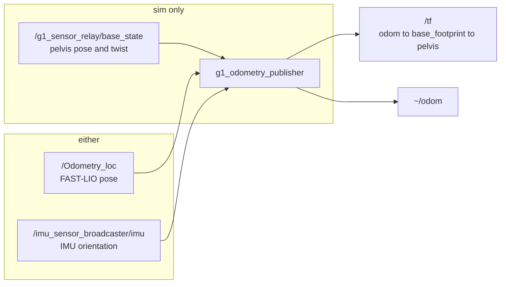

# g1_state_estimation

Publishes `odom -> base_footprint -> pelvis` and `nav_msgs/Odometry` for the G1: from FAST-LIO2 on
the robot and in simulation, or from MuJoCo ground truth in simulation. Also ships
`g1_livox_pointcloud`, the hardware Livox CustomMsg to PointCloud2 converter.

`ament_cmake`, C++20. One lifecycle node, `g1_odometry_publisher`, plus `g1_livox_pointcloud`.



## Odometry source

The real G1 publishes no odometry: its sport-mode state carries only `fsm_id`, `fsm_mode`,
`task_id` and `task_time`. The robot's odometry is LiDAR-inertial, FAST-LIO2 from the vendored
`fast_lio` package, fed by the Mid360 and its built-in IMU.

| `odometry_source` | Behaviour |
|---|---|
| `ground_truth` | Simulation only. Exact pelvis pose and twist from MuJoCo, via `g1_sensor_relay`'s `~/base_state`. No drift, noise or latency. |
| `fast_lio` | FAST-LIO's pose re-referenced into `odom`, with a differenced twist because FAST-LIO leaves it empty. Drifts; `map -> odom` corrects it. Robot and simulation. |
| `hardware` (default) | Refuses to configure and points at `fast_lio`, so a misconfigured bring-up cannot publish fabricated odometry. |

The launch files select `fast_lio`; `ground_truth` isolates a fault to "not the odometry". A refused
source shows up as a failed lifecycle transition. `map -> odom` belongs to localization in
`g1_navigation`.

### How the fast_lio source works

FAST-LIO reports the pose of its IMU (`body`) in the frame that IMU had at startup (`camera_init`).
Neither is gravity-aligned, since the Mid360 is mounted upside down. On the first sample the node
latches `odom` so `base_footprint` starts at (0, 0, yaw 0) on the floor, using the pelvis IMU for
up and `start_height_m` for height. After that, FAST-LIO's motion is re-expressed in `odom` and
offset from `mid360_imu` to the pelvis through TF.

The pelvis IMU remains the gravity reference. FAST-LIO's gravity estimate wanders, a tilting `odom`
lifts distant floor over the costmap's obstacle cut, and AMCL corrects only x, y and yaw. The node
low-passes the tilt difference (`tilt_correction_gain`) rather than substituting the IMU's tilt,
whose newest sample can be a scan period newer than the pose. Heading always comes from the scan
match.

Nothing is published until both a LiDAR pose and an IMU attitude have arrived. The sensor-to-pelvis
TF crosses the three waist joints, so `/joint_states` must carry them or this source publishes
nothing; `joint_state_broadcaster` covers all 29 motors on both tracks.

### The two front ends

```
hardware:  livox_ros_driver2 (CustomMsg mode) --> /livox/custom_msg --> fastlio_mapping
           g1_livox_pointcloud: /livox/custom_msg --> /livox/lidar (PointCloud2)
sim:       g1_sensor_relay --> /livox/lidar --> g1_livox_bridge --> /livox/custom_msg
           g1_sensor_relay --> /livox/imu (the Mid360's own, modelled in the MJCF)
```

FAST-LIO needs the CustomMsg for its per-point timestamps; the costmaps, MoveIt's octomap and
`pointcloud_to_laserscan` read the PointCloud2. The driver emits one format per run, so on hardware
it runs in CustomMsg mode and `g1_livox_pointcloud` republishes, as a separate node so FAST-LIO
failing cannot take `/livox/lidar` with it.

FAST-LIO fuses the Mid360's own IMU on both tracks. It is rigid with the laser, so both configs
carry Livox's published lidar-in-IMU offset and `lidar_body_frame_id` is `mid360_imu`. The pelvis
IMU cannot stand in: three moving waist joints separate it from the sensor, and FAST-LIO takes one
constant extrinsic. `test_sim_extrinsic` checks both.

## Frames

```
odom -> base_footprint -> pelvis
```

`base_footprint` is the REP-105 ground projection Nav2 and slam_toolbox need (x, y, heading, z at
zero); `base_footprint -> pelvis` carries the height and tilt it drops. The pelvis edge hangs off
the footprint rather than off `odom`, and both edges go out in one `sendTransform`, so the chain
cannot be inconsistent.

Past `max_tilt_deg` the last well-conditioned heading is held. The attitude is still published,
because a fallen robot really is tilted.

FAST-LIO's own `camera_init -> body` transform is remapped to `/fastlio/tf`, keeping a second,
disconnected root off `/tf`.

## Parameters

| Parameter | Default | Meaning |
|---|---|---|
| `odometry_source` | `hardware` | See the table above. |
| `odom_frame_id` | `odom` | |
| `base_frame_id` | `base_footprint` | |
| `pelvis_frame_id` | `""` | Empty publishes one edge; naming a link splits it in two. |
| `lidar_body_frame_id` | `""` | `fast_lio` only: the frame FAST-LIO reports the pose of. Empty means the base frame itself. |
| `start_height_m` | `0.0` | `fast_lio` only: body height above the floor at the origin latch. |
| `max_tilt_deg` | `80.0` | Beyond this the heading is held. Must be in (0, 180). |
| `publish_rate_hz` | `50.0` | |
| `publish_odom_msg` | `true` | |
| `source_timeout_ms` | `200.0` | Stop publishing once the sample stamp has not changed for this long. |
| `wall_timeout_ms` | `2000.0` | A second such budget; the tighter one decides. Both run on a steady clock, which a wedged simulator cannot freeze. Non-positive disables either. |
| `tilt_correction_gain` | `0.05` | `fast_lio` only: slerp fraction per LiDAR sample toward the IMU's tilt, about a 2 s time constant at 10 Hz. In [0, 1); `0.0` disables. |
| `pose_covariance`, `twist_covariance` | `1.0e-6` | Diagonal value. Placeholders, not characterisations. |

Shipped configs: `g1_odometry_publisher_converged.yaml` (ground truth),
`g1_odometry_publisher_fastlio.yaml` (LiDAR-inertial), and `fastlio_mid360_hardware.yaml` /
`fastlio_mid360_sim.yaml` for FAST-LIO itself.

Re-measure `start_height_m` on hardware. It is this simulator's standing pelvis height, and a few
centimetres too high lifts floor returns over Nav2's `min_obstacle_height`.

## Running

```bash
ros2 launch g1_bringup bringup.launch.py sensors:=true odometry:=fast_lio
ros2 run tf2_ros tf2_echo odom base_footprint
```

Expect a few seconds of nothing while FAST-LIO initialises and the origin latches.

On the robot, `launch/fastlio_odometry.launch.py` (default `sim:=false`) starts the Livox driver,
the converter, FAST-LIO and this publisher. It needs `robot_state_publisher` and `/joint_states`
already running.

The driver reads this package's `config/mid360_hardware.json`, not the one in the gitignored
`livox_ros_driver2` checkout that `scripts/import-externals.sh` regenerates. Check its addresses
against the robot before the first run.

`scripts/lio_bench` scores FAST-LIO against MuJoCo's pose with nothing else in the loop. It waits
for the robot to stand still, drives open-loop legs, aborts if the robot falls, and writes the
paired trace to `/tmp/lio_bench_trace.csv`:

```bash
ros2 launch g1_bringup bringup.launch.py sensors:=true world:=lio   # fast_lio is the default
ros2 run g1_state_estimation lio_bench                                 # in a second terminal
```

`config/g1_lio_debug.rviz` shows the sweep, the odometry and ground truth in `odom`. FAST-LIO's
own scan, map and path are in `camera_init`, which exists only on `/fastlio/tf`, so they start
disabled. To see them, remap TF, set the fixed frame to `camera_init` and enable them; the map and
path also need `map_en` and `path_en` in the FAST-LIO config:

```bash
rviz2 -d $(ros2 pkg prefix g1_state_estimation)/share/g1_state_estimation/config/g1_lio_debug.rviz \
  --ros-args -r /tf:=/fastlio/tf
```

## What simulation does not validate

The sim track runs the real FAST-LIO binary on the real code path, so the plumbing, the frame math,
the latch and the guards are exercised against exact ground truth. These are not:

| Deferred to hardware | Why sim cannot settle it |
|---|---|
| Motion undistortion | The simulated sweep is an instantaneous raycast, so every `offset_time` is legitimately zero. A real Mid360 sweeps continuously. |
| The non-repetitive scan pattern | The simulator ray-casts a uniform 360x32 grid. Coverage, density and their effect on the scan match all differ. |
| IMU noise and bias | The modelled IMU has no noise model. |
| Livox SDK networking | Nothing opens a socket to a sensor in sim, so `config/mid360_hardware.json` is unexercised. |
| The inverted mount | Modelled in the URDF, never checked against the real unit. |
| `start_height_m` | A property of the robot's stance. Re-measure it. |

Any tuning done against sim FAST-LIO is unvalidated on hardware.

## Tests

```bash
colcon test --packages-select g1_state_estimation
```

| Test | Covers |
|---|---|
| `test_odom_math` | Ground projection and its recomposition, heading extraction, the tilt guard, pose composition and inversion. |
| `test_odometry_publisher_node` | The node itself: source selection, the hardware refusal, the fast_lio latch and twist, frame chains, timeouts. |
| `test_livox_cloud` | The hardware CustomMsg to PointCloud2 conversion, which no sim path reaches. |
| `test_sim_extrinsic` | That both FAST-LIO configs carry Livox's published lidar-in-IMU offset, that the MJCF IMU site matches the URDF, that the sensor is not rigid with the pelvis, and that the mount is inverted. |

None need a simulator. `g1_navigation`'s `test_scan_pipeline` exercises the frame chain against a
live one, and `g1_bringup`'s `test_fastlio_odometry` scores the estimate against ground truth.
