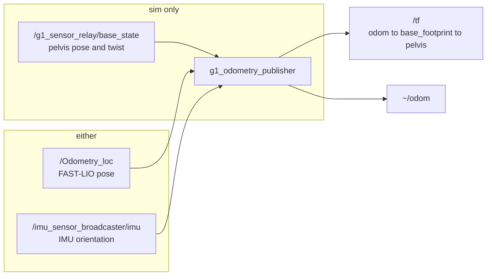

# g1_state_estimation

Publishes `odom` to the robot's base frame, and the TF chain Nav2 and slam_toolbox need.

`ament_cmake`, C++20. One lifecycle node, `g1_odometry_publisher`, plus the hardware-side
`g1_livox_pointcloud` converter.



## Odometry source

The real G1 publishes no odometry. On hardware `/sportmodestate` carries a type holding only
`fsm_id`, `fsm_mode`, `task_id` and `task_time`. No pose, no velocity, and `rt/odommodestate` does
not exist anywhere in Unitree's code. What the robot does have is a Mid360 and an IMU, so the
hardware source is LiDAR-inertial odometry: FAST-LIO2, from the vendored `fast_lio` package.

| `odometry_source` | Behaviour |
|---|---|
| `ground_truth` | The `unitree_mujoco` track. Pose and twist together from the simulator's own pelvis sample, relayed off the sensor socket. Exact MuJoCo state: no drift, no noise, no latency. |
| `fast_lio` | Reads FAST-LIO's `nav_msgs/Odometry`, re-references it into `odom`, and differences the twist FAST-LIO leaves empty. An estimate: it drifts, and `map -> odom` exists to correct it. Runs in sim and on the robot. |
| `hardware` (default) | Refuses to configure, pointing at `fast_lio`. |

`hardware` is the default deliberately. A misconfigured bring-up must never silently emit
fabricated odometry, so every working source has to be opted into.

No `map` to `odom` transform is published. That belongs to localization, in `g1_navigation`.

### How the fast_lio source works

FAST-LIO reports the pose of its IMU (`body`) in the frame that IMU happened to occupy at
startup (`camera_init`). Neither is gravity-aligned on this robot: the Mid360 is mounted upside
down. At the first sample the node latches a correction so `base_footprint` starts at
(0, 0, yaw 0) with the floor at z 0, using the pelvis IMU attitude to find which way is up and
`start_height_m` to find how far up. Everything after is FAST-LIO's motion re-expressed in that
frame, offset from the reporting IMU to the pelvis through TF (`lidar_body_frame_id`).

The pelvis IMU keeps working after the latch, as the gravity reference for roll and pitch.
FAST-LIO carries gravity as an estimated state and lets it wander, and nothing downstream would
notice: AMCL corrects x, y and yaw only, so a slowly tilting `odom` is invisible to it and
lands on the costmap instead, as floor lifted over the obstacle cut. So the node low-passes the
*difference* between the two attitudes and applies it. Only the slow part — substituting the
IMU's tilt outright would pin a fresh IMU sample onto a scan one FAST-LIO period older, and the
pelvis swings several degrees inside a gait cycle, which is more error than the drift being
removed. Heading is never touched: it comes from the scan match, which is what does not drift.

Until both a LiDAR pose and a usable IMU attitude have arrived, nothing is published at all.

**The TF chain from the sensor down to the pelvis crosses the three waist joints**, and it is
looked up per sample rather than cached because the waist moves. On the robot that means
`/joint_states` has to carry `waist_yaw_joint`, `waist_roll_joint` and `waist_pitch_joint`, or
`mid360_imu -> pelvis` never resolves and this source publishes nothing at all. The hardware
component exports all 29 motors, so `joint_state_broadcaster` covers the waist and nothing extra
is needed on either track.

### What the two front ends look like

```
hardware:  livox_ros_driver2 (CustomMsg mode) --> /livox/custom_msg --> fastlio_mapping
           g1_livox_pointcloud: /livox/custom_msg --> /livox/lidar (PointCloud2)
sim:       g1_sensor_relay --> /livox/lidar --> g1_livox_bridge --> /livox/custom_msg
           g1_sensor_relay --> /livox/imu (the Mid360's own, modelled in the MJCF)
```

The driver publishes ONE format per run, and FAST-LIO needs the CustomMsg (per-point
timestamps, for undistorting scans taken mid-stride) while Nav2's costmaps, MoveIt's octomap
and `pointcloud_to_laserscan` all read the PointCloud2 on `/livox/lidar`. So on hardware the
driver runs in CustomMsg mode and `g1_livox_pointcloud` (this package) republishes it;
`/livox/lidar` deliberately does not pass through FAST-LIO, so perception cannot be taken down
by it. In simulation the conversion runs the other way, in `g1_sensor_relay`'s
`g1_livox_bridge`.

The IMU is the Mid360's own on both tracks, and that is the point: rigid with the laser inside one
housing, so the extrinsic is the few-centimetre offset Livox publish, `lidar_body_frame_id` is
`mid360_imu`, and the two configs carry the same numbers. The simulator models it with a MuJoCo
site at that pose (`workspace/patches/unitree_mujoco/006-add-mid360-imu.patch`), sampled at 200 Hz
and relayed by `g1_sensor_relay`.

It was briefly the pelvis IMU instead, since MuJoCo had no sensor in the Mid360. That does not
work here: `waist_yaw`, `waist_roll` and `waist_pitch` lie between pelvis and sensor and the
walking policy drives all three through tens of degrees, so the one constant extrinsic FAST-LIO
accepts was wrong by a different amount every scan. `test_sim_extrinsic` asserts the sim extrinsic
is Livox's published offset and that the URDF chain still contains a movable joint, which is the
reason it has to be.

## Frames

```
odom -> base_footprint -> pelvis
```

Nav2 and slam_toolbox both want a gravity-aligned base frame, and a walking G1 does not have one:
the pelvis rolls and pitches several degrees with the gait, and every sensor frame hangs off it.
`base_footprint` is the REP-105 ground projection, carrying x, y and heading with z pinned to zero,
and `base_footprint` to `pelvis` carries the height and tilt the projection drops.

The pelvis edge is inserted into the chain rather than published as a second edge off `odom`. Two
sibling edges would make every sensor lookup compose two independently published dynamic
transforms, which agree only if they always carry an identical stamp. One chain cannot be
inconsistent even in principle. Both edges go out in a single `sendTransform` call for the same
reason.

Past `max_tilt_deg` the heading extraction is ill-conditioned, so the last well-conditioned heading
is held. Attitude keeps being published unchanged, because a fallen robot really is tilted.

FAST-LIO also broadcasts its own `camera_init -> body` edge. That pair is an orphan tree,
disconnected from `odom`: harmless, and useful when a scan match goes wrong.

## Parameters

| Parameter | Default | Meaning |
|---|---|---|
| `odometry_source` | `hardware` | See the table above. |
| `odom_frame_id` | `odom` | |
| `base_frame_id` | `base_footprint` | |
| `pelvis_frame_id` | `""` | Empty publishes one edge; naming a link splits it in two. |
| `lidar_body_frame_id` | `""` | `fast_lio` only: the frame FAST-LIO reports the pose of. Empty means it already is the base/pelvis frame. |
| `start_height_m` | `0.0` | `fast_lio` only: body height above the floor at the origin latch. |
| `max_tilt_deg` | `80.0` | Beyond this the heading is held. |
| `publish_rate_hz` | `50.0` | |
| `publish_odom_msg` | `true` | |
| `source_timeout_ms` | `200.0` | Stops publishing once the sample stamp has not changed for this long. |
| `wall_timeout_ms` | `2000.0` | The same bound, and the tighter of the two decides. Both are measured on a steady clock, which a wedged simulator cannot freeze. |
| `tilt_correction_gain` | `0.05` | `fast_lio` only: slerp fraction per LiDAR sample toward the IMU's tilt. At ~10 Hz that is a ~2 s time constant. `0.0` disables the correction. |
| `pose_covariance`, `twist_covariance` | `1.0e-6` | Diagonal value. Placeholders, not characterisations. |

Shipped configs: `g1_odometry_publisher_converged.yaml` (sim ground truth),
`g1_odometry_publisher_fastlio.yaml` (LiDAR-inertial), `fastlio_mid360_hardware.yaml` and
`fastlio_mid360_sim.yaml` (FAST-LIO itself).

## Running

Ground-truth odometry comes up with `sensors:=true`; the LiDAR-inertial pipeline with
`odometry:=fast_lio`:

```bash
ros2 launch g1_bringup bringup.launch.py sensors:=true odometry:=fast_lio
ros2 run tf2_ros tf2_echo odom base_footprint
```

Expect a few seconds of nothing while FAST-LIO initialises its IMU and the origin latches.

On the robot, `launch/fastlio_odometry.launch.py` (the default `sim:=false`) starts the Livox
driver, the converter, the waist joint-state publisher, FAST-LIO and this publisher in one go.
The driver reads `config/mid360_hardware.json` **from this package**, not the one inside the
`livox_ros_driver2` checkout: that checkout is gitignored and regenerated by
`scripts/import-externals.sh`, so nothing in it is version-controlled and a robot's IP cannot
live there. Check the addresses in ours against the robot before the first run.

It needs `robot_state_publisher` and the URDF already running; it stages neither.

It is a lifecycle node, and configuration is where the source decision is enforced, so a refusal is
visible as a failed transition rather than a silent absence of transforms.

`scripts/lio_bench` scores the result against MuJoCo's own pose with nothing else in the loop,
and writes the paired trace to `/tmp/lio_bench_trace.csv`. Over ~21 m of walking it measures a
final gap of 1 cm and a worst-case 10 cm, about 0.05 % of path, repeatably across runs. It waits
for the robot to stand still before taking its baseline, and aborts rather than scoring a run
where the robot went over -- both because the spawn is not always quiet, and a run that starts
mid-recovery measures the gait.

When the estimate misbehaves, the first thing to look at is how much of each sweep is finding a
plane in the map. Setting `publish.effect_map_en: true` in the FAST-LIO config makes it publish
those points on `/cloud_effected_1`; the count is the health of the scan match, and it collapses
long before the pose visibly does.

## Height is what this source has to get right

Standing, the estimate holds within ~2 cm of MuJoCo's ground truth over a minute, and walking it
stays within ~10 cm over 21 m. The tighter constraint is **height**, and it is worth knowing why
before touching either of the two numbers that control it.

Nav2's obstacle layer removes the floor with `min_obstacle_height: 0.08` — about 70 % of every
sweep is floor. Believe the pelvis, and with it the LiDAR, sits higher than it does, and floor
returns compute above that cut and are marked as obstacle: concentric rings of them, growing
with range, until no path exists. Two errors stacked to produce exactly that:

- `start_height_m` was a 0.793 nominal against a measured 0.7504 standing pelvis.
- `filter_size_surf` / `filter_size_map` were the reference's 0.5 m, tuned for building-scale
  runs. In one 18 m room that leaves height loose, and the estimate climbed 80–140 mm.

A third, larger error sat underneath both: **the scan was stamped ~35 ms late.** The simulator
snapshots `mjData` at one instant and then raycasts for ~32 ms off the lock, so a cloud stamped
on arrival is labelled well after the instant its points describe, and everything that
transforms it — the costmap's TF lookup, FAST-LIO's IMU integration — uses a pose from the wrong
moment. The relay stamps from the simulator's own capture clock instead, and the IMU rides the
same socket and the same clock mapping, so `common.time_offset_lidar_to_imu` stays `0.0` on both
tracks. Together the three took the median pelvis height error from +54 mm to −5 mm.

`fast_lio` is the default the launch files select. `ground_truth` stays available to isolate a
fault to "not the odometry".

## What simulation does and does not validate

The sim track runs the real FAST-LIO binary on the real code path, so the plumbing, the frame
math, the latch and the guards are all exercised, and the estimate can be compared against
MuJoCo's exact ground truth. What it cannot reach, and what therefore has to be checked on the
robot:

| Deferred to hardware | Why sim cannot settle it |
|---|---|
| Motion undistortion | The simulated sweep is an instantaneous raycast against a frozen `mjData`, so every `offset_time` is legitimately zero and there is nothing to undistort. A real Mid360 sweeps continuously. |
| The non-repetitive scan pattern | The simulator ray-casts a uniform 360x32 grid. Coverage, density and their effect on the scan match all differ. |
| IMU noise and bias | The modelled IMU carries no noise model, deliberately: adding one in the same change would have made the drift numbers unattributable. |
| Livox SDK networking | Nothing opens a socket to a sensor in sim. `config/mid360_hardware.json` is unexercised. |
| The physically inverted unit | Modelled in the URDF, never verified against the real mount. |
| `start_height_m` | 0.750 is this simulator's standing pelvis. It is a property of the robot's stance and must be re-measured. |
| `obstacle_max_range` | 3.0 was derived from attitude error measured here. See `g1_navigation`'s README for how to re-derive it. |
| `waist_kp` / `waist_kd` | The waist is held by `waist_freeze_controller` for the whole session, so nothing else exercises these. See `g1_controllers`' README. |
| The Dex3 state topic | The simulator publishes one of the robot's two. See `g1_hand_interface`'s README. |

Any tuning done against sim FAST-LIO is unvalidated on hardware.

## Tests

| Test | Covers |
|---|---|
| `test_odom_math` | Ground projection and its recomposition, heading extraction, the tilt guard, pose composition and inversion. |
| `test_odometry_publisher_node` | The node itself: source selection, the hardware refusal, the fast_lio latch and twist, frame chains, timeouts. No simulator needed. |
| `test_sim_extrinsic` | That both FAST-LIO configs carry Livox's published lidar-in-IMU offset, that the sensor is still not rigid with the pelvis, and that the mount is actually inverted. |

```bash
colcon test --packages-select g1_state_estimation
```

`g1_navigation`'s `test_scan_pipeline` exercises the frame chain against a live simulator.
