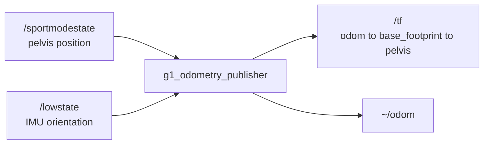

# g1_state_estimation

Publishes `odom` to the robot's base frame, and the TF chain Nav2 and slam_toolbox need.

`ament_cmake`, C++20. One lifecycle node, `g1_odometry_publisher`.



## Odometry source

The real G1 publishes no odometry. On hardware `/sportmodestate` carries a type holding only
`fsm_id`, `fsm_mode`, `task_id` and `task_time`. No pose, no velocity, and `rt/odommodestate` does
not exist anywhere in Unitree's code.

| `odometry_source` | Behaviour |
|---|---|
| `sim_sportmodestate` | The `unitree_mujoco` track. Pelvis position from `/sportmodestate`, full orientation from `/lowstate`'s IMU. |
| `sim_ground_truth` | MuJoCo generalized coordinates from a planar model. No launch selects it since the planar sandbox was removed. |
| `hardware` (default) | Refuses to configure. A real source, leg odometry with an IMU EKF or LiDAR-inertial odometry, is a future milestone. |

`hardware` is the default deliberately. A misconfigured hardware bring-up must never silently emit
fabricated odometry, so simulation is the case that has to opt in.

Both simulation sources are ground truth, not estimates: no drift, no noise, no latency. Nothing
here validates how a real estimator behaves under drift or foot slip, so treat tuning done against
it as unvalidated on hardware.

No `map` to `odom` transform is published. That belongs to SLAM, in `g1_navigation`.

## Frames

Which chain is published depends on `pelvis_frame_id`:

```
pelvis_frame_id: "pelvis"   ->   odom -> base_footprint -> pelvis    (unitree_mujoco track)
pelvis_frame_id: ""         ->   odom -> base_link                   (planar sandbox)
```

Nav2 and slam_toolbox both want a gravity-aligned base frame, and a walking G1 does not have one:
the pelvis rolls and pitches several degrees with the gait, and every sensor frame hangs off it.
`base_footprint` is the REP-105 ground projection, carrying x, y and heading with z pinned to zero,
and `base_footprint` to `pelvis` carries the height and tilt the projection drops.

The pelvis edge is inserted into the chain rather than published as a second edge off `odom`. Two
sibling edges would make every sensor lookup compose two independently published dynamic
transforms, which agree only if they always carry an identical stamp. One chain cannot be
inconsistent even in principle. Both edges go out in a single `sendTransform` call for the same
reason.

Past `max_tilt_deg` the heading extraction is ill-conditioned, so the last well-conditioned heading
is held. Attitude keeps being published unchanged, because a fallen robot really is tilted.

## Parameters

| Parameter | Default | Meaning |
|---|---|---|
| `odometry_source` | `hardware` | See the table above. |
| `odom_frame_id` | `odom` | |
| `base_frame_id` | `base_footprint` | |
| `pelvis_frame_id` | `""` | Empty publishes one edge; naming a link splits it in two. |
| `base_height_m` | `0.0` | Height of the base above the floor, making `odom` the ground plane. |
| `max_tilt_deg` | `80.0` | Beyond this the heading is held. |
| `publish_rate_hz` | `50.0` | |
| `publish_odom_msg` | `true` | |
| `source_timeout_ms` | `200.0` | Source age beyond this stops publishing. |

Shipped config: `g1_odometry_publisher_converged.yaml`, for the `unitree_mujoco` track.

## Running

The node comes up with `sensors:=true`:

```bash
ros2 launch g1_bringup bringup.launch.py sensors:=true
ros2 run tf2_ros tf2_echo odom base_footprint
```

It is a lifecycle node, and configuration is where the source decision is enforced, so a refusal is
visible as a failed transition rather than a silent absence of transforms.

## Tests

None need a simulator.

| Test | Covers |
|---|---|
| `test_odom_math` | Ground projection and its recomposition, heading extraction, the tilt guard. |
| `test_odometry_publisher_node` | The node itself: source selection, the hardware refusal, frame chains, timeouts. |

```bash
colcon test --packages-select g1_state_estimation
```

`g1_navigation`'s `test_scan_pipeline` exercises the frame chain against a live simulator.
